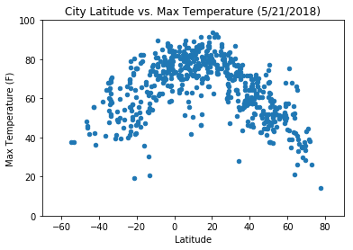
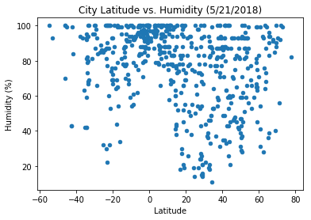
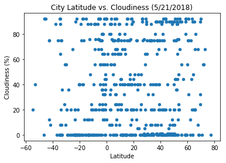
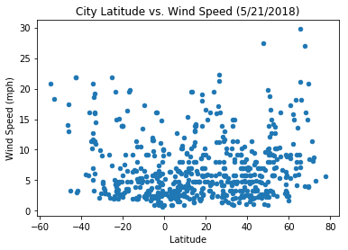

# WeatherPy

### Analysis


```python
# import dependencies
from citipy import citipy
import numpy as np
import pandas as pd
from matplotlib import pyplot as plt
# import openweathermapy as owm
from config import api_key
import requests
```

### Generate Cities List


```python
random_pool_count = 1200
# random latitudes
lat_north = np.random.rand(1,random_pool_count)*90
lat_south = np.random.rand(1,random_pool_count)*(-90)
lats = lat_north + lat_south

# random longtitudes
long_east = np.random.rand(1,random_pool_count)*180
long_west = np.random.rand(1,random_pool_count)*(-180)
longs = long_east + long_west

stacked_locs = np.dstack((lats, longs))

# generate cities list by citipy
cities_locs = stacked_locs[0]
cities = [citipy.nearest_city(lat, long).city_name for lat, long in cities_locs]

# the unique cities
cities = set(cities)

# cities
```


```python
# unique cities
print(f"The number of unique countries: {len(cities)}")
```

    The number of unique countries: 662
    

### Perform API Calls


```python
# settings = {"units":"Imperial", "APPID": api_key}
units = "Imperial"

# create an empty dataframe
# and initalize the columns with empty strings
city_data_pd = pd.DataFrame()
city_data_pd['City'] = ''
city_data_pd['Cloudiness'] = ''
city_data_pd['Country'] = ''
city_data_pd['Date'] = ''
city_data_pd['Humidity'] = ''
city_data_pd['Lat'] = ''
city_data_pd['Lng'] = ''
city_data_pd['Max Temp'] = ''
city_data_pd['Wind Speed'] = ''

# iterate over the cities and make restful api calls
for city_num, city_name in enumerate(cities):
    # make the api call to the query url
    query_url = f"http://api.openweathermap.org/data/2.5/weather?units={units}&APPID={api_key}&q={city_name}"
    resp = requests.get(query_url)
    status_code = resp.status_code
    url = resp.url
    
    # print the log 
    print(f"Processing Record {city_num+1} | {city_name} \n{url}")
    
    # check on the response status code
    if status_code == 200:
        # jsonify the response
        content = resp.json()
        # populate the dataframe
        city_data_pd.loc[city_num, 'City'] = city_name
        city_data_pd.loc[city_num, 'Cloudiness'] = content.get('clouds').get('all')
        city_data_pd.loc[city_num, 'Country'] = content.get('sys').get('country')
        city_data_pd.loc[city_num, 'Date'] = content.get('dt')
        city_data_pd.loc[city_num, 'Humidity'] = content.get('main').get('humidity')
        city_data_pd.loc[city_num, 'Lat'] = content.get('coord').get('lat')
        city_data_pd.loc[city_num, 'Lng'] = content.get('coord').get('lon')
        city_data_pd.loc[city_num, 'Max Temp'] = content.get('main').get('temp_max')
        city_data_pd.loc[city_num, 'Wind Speed'] = content.get('wind').get('speed')
    else:
        print("Failed to get the response!! Remote server is not reachable.")

```

    Processing Record 1 | bathsheba 
    http://api.openweathermap.org/data/2.5/weather?units=Imperial&APPID=f3353447a9945c51f4233c9ddb29c49e&q=bathsheba
    Processing Record 2 | tupiza 
    http://api.openweathermap.org/data/2.5/weather?units=Imperial&APPID=f3353447a9945c51f4233c9ddb29c49e&q=tupiza
    Processing Record 3 | luzhany 
    http://api.openweathermap.org/data/2.5/weather?units=Imperial&APPID=f3353447a9945c51f4233c9ddb29c49e&q=luzhany
    Processing Record 4 | meyungs 
    http://api.openweathermap.org/data/2.5/weather?units=Imperial&APPID=f3353447a9945c51f4233c9ddb29c49e&q=meyungs
    Failed to get the response!! Remote server is not reachable.
    Processing Record 5 | cururupu 
    http://api.openweathermap.org/data/2.5/weather?units=Imperial&APPID=f3353447a9945c51f4233c9ddb29c49e&q=cururupu
    Processing Record 6 | kathua 
    http://api.openweathermap.org/data/2.5/weather?units=Imperial&APPID=f3353447a9945c51f4233c9ddb29c49e&q=kathua
    Processing Record 7 | kidal 
    http://api.openweathermap.org/data/2.5/weather?units=Imperial&APPID=f3353447a9945c51f4233c9ddb29c49e&q=kidal
    Processing Record 8 | kabinda 
    http://api.openweathermap.org/data/2.5/weather?units=Imperial&APPID=f3353447a9945c51f4233c9ddb29c49e&q=kabinda
    Processing Record 9 | yellowknife 
    http://api.openweathermap.org/data/2.5/weather?units=Imperial&APPID=f3353447a9945c51f4233c9ddb29c49e&q=yellowknife
    Processing Record 10 | songjianghe 
    http://api.openweathermap.org/data/2.5/weather?units=Imperial&APPID=f3353447a9945c51f4233c9ddb29c49e&q=songjianghe
    Processing Record 11 | takoradi 
    http://api.openweathermap.org/data/2.5/weather?units=Imperial&APPID=f3353447a9945c51f4233c9ddb29c49e&q=takoradi
    Processing Record 12 | dauriya 
    http://api.openweathermap.org/data/2.5/weather?units=Imperial&APPID=f3353447a9945c51f4233c9ddb29c49e&q=dauriya
    Processing Record 13 | anloga 
    http://api.openweathermap.org/data/2.5/weather?units=Imperial&APPID=f3353447a9945c51f4233c9ddb29c49e&q=anloga
    Processing Record 14 | chapais 
    http://api.openweathermap.org/data/2.5/weather?units=Imperial&APPID=f3353447a9945c51f4233c9ddb29c49e&q=chapais
    Processing Record 15 | ferme-neuve 
    http://api.openweathermap.org/data/2.5/weather?units=Imperial&APPID=f3353447a9945c51f4233c9ddb29c49e&q=ferme-neuve
    Processing Record 16 | gainesville 
    http://api.openweathermap.org/data/2.5/weather?units=Imperial&APPID=f3353447a9945c51f4233c9ddb29c49e&q=gainesville
    Processing Record 17 | cap malheureux 
    http://api.openweathermap.org/data/2.5/weather?units=Imperial&APPID=f3353447a9945c51f4233c9ddb29c49e&q=cap%20malheureux
    Processing Record 18 | santa maria 
    http://api.openweathermap.org/data/2.5/weather?units=Imperial&APPID=f3353447a9945c51f4233c9ddb29c49e&q=santa%20maria
    Processing Record 19 | zhanaozen 
    http://api.openweathermap.org/data/2.5/weather?units=Imperial&APPID=f3353447a9945c51f4233c9ddb29c49e&q=zhanaozen
    Processing Record 20 | abong mbang 
    http://api.openweathermap.org/data/2.5/weather?units=Imperial&APPID=f3353447a9945c51f4233c9ddb29c49e&q=abong%20mbang
    Processing Record 21 | saint-georges 
    http://api.openweathermap.org/data/2.5/weather?units=Imperial&APPID=f3353447a9945c51f4233c9ddb29c49e&q=saint-georges
    Processing Record 22 | linapacan 
    http://api.openweathermap.org/data/2.5/weather?units=Imperial&APPID=f3353447a9945c51f4233c9ddb29c49e&q=linapacan
    Failed to get the response!! Remote server is not reachable.
    Processing Record 23 | hofn 
    http://api.openweathermap.org/data/2.5/weather?units=Imperial&APPID=f3353447a9945c51f4233c9ddb29c49e&q=hofn
    Processing Record 24 | prabumulih 
    http://api.openweathermap.org/data/2.5/weather?units=Imperial&APPID=f3353447a9945c51f4233c9ddb29c49e&q=prabumulih
    Processing Record 25 | jalu 
    http://api.openweathermap.org/data/2.5/weather?units=Imperial&APPID=f3353447a9945c51f4233c9ddb29c49e&q=jalu
    Processing Record 26 | corowa 
    http://api.openweathermap.org/data/2.5/weather?units=Imperial&APPID=f3353447a9945c51f4233c9ddb29c49e&q=corowa
    Processing Record 27 | chyhyryn 
    http://api.openweathermap.org/data/2.5/weather?units=Imperial&APPID=f3353447a9945c51f4233c9ddb29c49e&q=chyhyryn
    Processing Record 28 | santo antonio do taua 
    http://api.openweathermap.org/data/2.5/weather?units=Imperial&APPID=f3353447a9945c51f4233c9ddb29c49e&q=santo%20antonio%20do%20taua
    Processing Record 29 | oussouye 
    http://api.openweathermap.org/data/2.5/weather?units=Imperial&APPID=f3353447a9945c51f4233c9ddb29c49e&q=oussouye
    Processing Record 30 | remedios 
    http://api.openweathermap.org/data/2.5/weather?units=Imperial&APPID=f3353447a9945c51f4233c9ddb29c49e&q=remedios
    Processing Record 31 | bargal 
    http://api.openweathermap.org/data/2.5/weather?units=Imperial&APPID=f3353447a9945c51f4233c9ddb29c49e&q=bargal
    Failed to get the response!! Remote server is not reachable.
    Processing Record 32 | kharan 
    http://api.openweathermap.org/data/2.5/weather?units=Imperial&APPID=f3353447a9945c51f4233c9ddb29c49e&q=kharan
    Processing Record 33 | sabang 
    http://api.openweathermap.org/data/2.5/weather?units=Imperial&APPID=f3353447a9945c51f4233c9ddb29c49e&q=sabang
    Processing Record 34 | marsh harbour 
    http://api.openweathermap.org/data/2.5/weather?units=Imperial&APPID=f3353447a9945c51f4233c9ddb29c49e&q=marsh%20harbour
    Processing Record 35 | luderitz 
    http://api.openweathermap.org/data/2.5/weather?units=Imperial&APPID=f3353447a9945c51f4233c9ddb29c49e&q=luderitz
    Processing Record 36 | grand river south east 
    http://api.openweathermap.org/data/2.5/weather?units=Imperial&APPID=f3353447a9945c51f4233c9ddb29c49e&q=grand%20river%20south%20east
    Failed to get the response!! Remote server is not reachable.
    Processing Record 37 | valley 
    http://api.openweathermap.org/data/2.5/weather?units=Imperial&APPID=f3353447a9945c51f4233c9ddb29c49e&q=valley
    Processing Record 38 | penzance 
    http://api.openweathermap.org/data/2.5/weather?units=Imperial&APPID=f3353447a9945c51f4233c9ddb29c49e&q=penzance
    Processing Record 39 | lebu 
    http://api.openweathermap.org/data/2.5/weather?units=Imperial&APPID=f3353447a9945c51f4233c9ddb29c49e&q=lebu
    Processing Record 40 | tura 
    http://api.openweathermap.org/data/2.5/weather?units=Imperial&APPID=f3353447a9945c51f4233c9ddb29c49e&q=tura
    Processing Record 41 | opuwo 
    http://api.openweathermap.org/data/2.5/weather?units=Imperial&APPID=f3353447a9945c51f4233c9ddb29c49e&q=opuwo
    Processing Record 42 | benguela 
    http://api.openweathermap.org/data/2.5/weather?units=Imperial&APPID=f3353447a9945c51f4233c9ddb29c49e&q=benguela
    Processing Record 43 | tabuk 
    http://api.openweathermap.org/data/2.5/weather?units=Imperial&APPID=f3353447a9945c51f4233c9ddb29c49e&q=tabuk
    Processing Record 44 | catamarca 
    http://api.openweathermap.org/data/2.5/weather?units=Imperial&APPID=f3353447a9945c51f4233c9ddb29c49e&q=catamarca
    Failed to get the response!! Remote server is not reachable.
    Processing Record 45 | wageningen 
    http://api.openweathermap.org/data/2.5/weather?units=Imperial&APPID=f3353447a9945c51f4233c9ddb29c49e&q=wageningen
    Processing Record 46 | mpanda 
    http://api.openweathermap.org/data/2.5/weather?units=Imperial&APPID=f3353447a9945c51f4233c9ddb29c49e&q=mpanda
    Processing Record 47 | muzhi 
    http://api.openweathermap.org/data/2.5/weather?units=Imperial&APPID=f3353447a9945c51f4233c9ddb29c49e&q=muzhi
    Processing Record 48 | nouadhibou 
    http://api.openweathermap.org/data/2.5/weather?units=Imperial&APPID=f3353447a9945c51f4233c9ddb29c49e&q=nouadhibou
    Processing Record 49 | codrington 
    http://api.openweathermap.org/data/2.5/weather?units=Imperial&APPID=f3353447a9945c51f4233c9ddb29c49e&q=codrington
    Processing Record 50 | manoel urbano 
    http://api.openweathermap.org/data/2.5/weather?units=Imperial&APPID=f3353447a9945c51f4233c9ddb29c49e&q=manoel%20urbano
    Processing Record 51 | outjo 
    http://api.openweathermap.org/data/2.5/weather?units=Imperial&APPID=f3353447a9945c51f4233c9ddb29c49e&q=outjo
    Processing Record 52 | shubarshi 
    http://api.openweathermap.org/data/2.5/weather?units=Imperial&APPID=f3353447a9945c51f4233c9ddb29c49e&q=shubarshi
    Processing Record 53 | mataura 
    http://api.openweathermap.org/data/2.5/weather?units=Imperial&APPID=f3353447a9945c51f4233c9ddb29c49e&q=mataura
    Processing Record 54 | mindelo 
    http://api.openweathermap.org/data/2.5/weather?units=Imperial&APPID=f3353447a9945c51f4233c9ddb29c49e&q=mindelo
    Processing Record 55 | walvis bay 
    http://api.openweathermap.org/data/2.5/weather?units=Imperial&APPID=f3353447a9945c51f4233c9ddb29c49e&q=walvis%20bay
    Processing Record 56 | shakawe 
    http://api.openweathermap.org/data/2.5/weather?units=Imperial&APPID=f3353447a9945c51f4233c9ddb29c49e&q=shakawe
    Processing Record 57 | marcona 
    http://api.openweathermap.org/data/2.5/weather?units=Imperial&APPID=f3353447a9945c51f4233c9ddb29c49e&q=marcona
    Failed to get the response!! Remote server is not reachable.
    Processing Record 58 | tiksi 
    http://api.openweathermap.org/data/2.5/weather?units=Imperial&APPID=f3353447a9945c51f4233c9ddb29c49e&q=tiksi
    Processing Record 59 | trincomalee 
    http://api.openweathermap.org/data/2.5/weather?units=Imperial&APPID=f3353447a9945c51f4233c9ddb29c49e&q=trincomalee
    Processing Record 60 | barentsburg 
    http://api.openweathermap.org/data/2.5/weather?units=Imperial&APPID=f3353447a9945c51f4233c9ddb29c49e&q=barentsburg
    Failed to get the response!! Remote server is not reachable.
    Processing Record 61 | pacific grove 
    http://api.openweathermap.org/data/2.5/weather?units=Imperial&APPID=f3353447a9945c51f4233c9ddb29c49e&q=pacific%20grove
    Processing Record 62 | dipkarpaz 
    http://api.openweathermap.org/data/2.5/weather?units=Imperial&APPID=f3353447a9945c51f4233c9ddb29c49e&q=dipkarpaz
    Failed to get the response!! Remote server is not reachable.
    Processing Record 63 | belmonte 
    http://api.openweathermap.org/data/2.5/weather?units=Imperial&APPID=f3353447a9945c51f4233c9ddb29c49e&q=belmonte
    Processing Record 64 | san juan 
    http://api.openweathermap.org/data/2.5/weather?units=Imperial&APPID=f3353447a9945c51f4233c9ddb29c49e&q=san%20juan
    Processing Record 65 | bogo 
    http://api.openweathermap.org/data/2.5/weather?units=Imperial&APPID=f3353447a9945c51f4233c9ddb29c49e&q=bogo
    Processing Record 66 | tukrah 
    http://api.openweathermap.org/data/2.5/weather?units=Imperial&APPID=f3353447a9945c51f4233c9ddb29c49e&q=tukrah
    Failed to get the response!! Remote server is not reachable.
    Processing Record 67 | reconquista 
    http://api.openweathermap.org/data/2.5/weather?units=Imperial&APPID=f3353447a9945c51f4233c9ddb29c49e&q=reconquista
    Processing Record 68 | batagay-alyta 
    http://api.openweathermap.org/data/2.5/weather?units=Imperial&APPID=f3353447a9945c51f4233c9ddb29c49e&q=batagay-alyta
    Processing Record 69 | sackville 
    http://api.openweathermap.org/data/2.5/weather?units=Imperial&APPID=f3353447a9945c51f4233c9ddb29c49e&q=sackville
    Processing Record 70 | panormos 
    http://api.openweathermap.org/data/2.5/weather?units=Imperial&APPID=f3353447a9945c51f4233c9ddb29c49e&q=panormos
    Processing Record 71 | dimbokro 
    http://api.openweathermap.org/data/2.5/weather?units=Imperial&APPID=f3353447a9945c51f4233c9ddb29c49e&q=dimbokro
    Processing Record 72 | sao jose da coroa grande 
    http://api.openweathermap.org/data/2.5/weather?units=Imperial&APPID=f3353447a9945c51f4233c9ddb29c49e&q=sao%20jose%20da%20coroa%20grande
    Processing Record 73 | taolanaro 
    http://api.openweathermap.org/data/2.5/weather?units=Imperial&APPID=f3353447a9945c51f4233c9ddb29c49e&q=taolanaro
    Failed to get the response!! Remote server is not reachable.
    Processing Record 74 | kangaatsiaq 
    http://api.openweathermap.org/data/2.5/weather?units=Imperial&APPID=f3353447a9945c51f4233c9ddb29c49e&q=kangaatsiaq
    Processing Record 75 | kalmunai 
    http://api.openweathermap.org/data/2.5/weather?units=Imperial&APPID=f3353447a9945c51f4233c9ddb29c49e&q=kalmunai
    Processing Record 76 | akureyri 
    http://api.openweathermap.org/data/2.5/weather?units=Imperial&APPID=f3353447a9945c51f4233c9ddb29c49e&q=akureyri
    Processing Record 77 | zhanakorgan 
    http://api.openweathermap.org/data/2.5/weather?units=Imperial&APPID=f3353447a9945c51f4233c9ddb29c49e&q=zhanakorgan
    Processing Record 78 | coroico 
    http://api.openweathermap.org/data/2.5/weather?units=Imperial&APPID=f3353447a9945c51f4233c9ddb29c49e&q=coroico
    Processing Record 79 | caldas novas 
    http://api.openweathermap.org/data/2.5/weather?units=Imperial&APPID=f3353447a9945c51f4233c9ddb29c49e&q=caldas%20novas
    Processing Record 80 | deputatskiy 
    http://api.openweathermap.org/data/2.5/weather?units=Imperial&APPID=f3353447a9945c51f4233c9ddb29c49e&q=deputatskiy
    Processing Record 81 | tayu 
    http://api.openweathermap.org/data/2.5/weather?units=Imperial&APPID=f3353447a9945c51f4233c9ddb29c49e&q=tayu
    Processing Record 82 | mugan 
    http://api.openweathermap.org/data/2.5/weather?units=Imperial&APPID=f3353447a9945c51f4233c9ddb29c49e&q=mugan
    Processing Record 83 | saint-francois 
    http://api.openweathermap.org/data/2.5/weather?units=Imperial&APPID=f3353447a9945c51f4233c9ddb29c49e&q=saint-francois
    Processing Record 84 | hakvik 
    http://api.openweathermap.org/data/2.5/weather?units=Imperial&APPID=f3353447a9945c51f4233c9ddb29c49e&q=hakvik
    Failed to get the response!! Remote server is not reachable.
    Processing Record 85 | aquin 
    http://api.openweathermap.org/data/2.5/weather?units=Imperial&APPID=f3353447a9945c51f4233c9ddb29c49e&q=aquin
    Processing Record 86 | acapulco 
    http://api.openweathermap.org/data/2.5/weather?units=Imperial&APPID=f3353447a9945c51f4233c9ddb29c49e&q=acapulco
    Processing Record 87 | sokolo 
    http://api.openweathermap.org/data/2.5/weather?units=Imperial&APPID=f3353447a9945c51f4233c9ddb29c49e&q=sokolo
    Processing Record 88 | biak 
    http://api.openweathermap.org/data/2.5/weather?units=Imperial&APPID=f3353447a9945c51f4233c9ddb29c49e&q=biak
    Processing Record 89 | mangai 
    http://api.openweathermap.org/data/2.5/weather?units=Imperial&APPID=f3353447a9945c51f4233c9ddb29c49e&q=mangai
    Processing Record 90 | kasongo-lunda 
    http://api.openweathermap.org/data/2.5/weather?units=Imperial&APPID=f3353447a9945c51f4233c9ddb29c49e&q=kasongo-lunda
    Processing Record 91 | mutis 
    http://api.openweathermap.org/data/2.5/weather?units=Imperial&APPID=f3353447a9945c51f4233c9ddb29c49e&q=mutis
    Processing Record 92 | ulladulla 
    http://api.openweathermap.org/data/2.5/weather?units=Imperial&APPID=f3353447a9945c51f4233c9ddb29c49e&q=ulladulla
    Processing Record 93 | wani 
    http://api.openweathermap.org/data/2.5/weather?units=Imperial&APPID=f3353447a9945c51f4233c9ddb29c49e&q=wani
    Processing Record 94 | ibaiti 
    http://api.openweathermap.org/data/2.5/weather?units=Imperial&APPID=f3353447a9945c51f4233c9ddb29c49e&q=ibaiti
    Processing Record 95 | maniitsoq 
    http://api.openweathermap.org/data/2.5/weather?units=Imperial&APPID=f3353447a9945c51f4233c9ddb29c49e&q=maniitsoq
    Processing Record 96 | xichang 
    http://api.openweathermap.org/data/2.5/weather?units=Imperial&APPID=f3353447a9945c51f4233c9ddb29c49e&q=xichang
    Processing Record 97 | santa eulalia del rio 
    http://api.openweathermap.org/data/2.5/weather?units=Imperial&APPID=f3353447a9945c51f4233c9ddb29c49e&q=santa%20eulalia%20del%20rio
    Failed to get the response!! Remote server is not reachable.
    Processing Record 98 | aldan 
    http://api.openweathermap.org/data/2.5/weather?units=Imperial&APPID=f3353447a9945c51f4233c9ddb29c49e&q=aldan
    Processing Record 99 | sug-aksy 
    http://api.openweathermap.org/data/2.5/weather?units=Imperial&APPID=f3353447a9945c51f4233c9ddb29c49e&q=sug-aksy
    Failed to get the response!! Remote server is not reachable.
    Processing Record 100 | bambous virieux 
    http://api.openweathermap.org/data/2.5/weather?units=Imperial&APPID=f3353447a9945c51f4233c9ddb29c49e&q=bambous%20virieux
    Processing Record 101 | iskateley 
    http://api.openweathermap.org/data/2.5/weather?units=Imperial&APPID=f3353447a9945c51f4233c9ddb29c49e&q=iskateley
    Processing Record 102 | mahuta 
    http://api.openweathermap.org/data/2.5/weather?units=Imperial&APPID=f3353447a9945c51f4233c9ddb29c49e&q=mahuta
    Processing Record 103 | tuktoyaktuk 
    http://api.openweathermap.org/data/2.5/weather?units=Imperial&APPID=f3353447a9945c51f4233c9ddb29c49e&q=tuktoyaktuk
    Processing Record 104 | iqaluit 
    http://api.openweathermap.org/data/2.5/weather?units=Imperial&APPID=f3353447a9945c51f4233c9ddb29c49e&q=iqaluit
    Processing Record 105 | aberystwyth 
    http://api.openweathermap.org/data/2.5/weather?units=Imperial&APPID=f3353447a9945c51f4233c9ddb29c49e&q=aberystwyth
    Processing Record 106 | yeppoon 
    http://api.openweathermap.org/data/2.5/weather?units=Imperial&APPID=f3353447a9945c51f4233c9ddb29c49e&q=yeppoon
    Processing Record 107 | honningsvag 
    http://api.openweathermap.org/data/2.5/weather?units=Imperial&APPID=f3353447a9945c51f4233c9ddb29c49e&q=honningsvag
    Processing Record 108 | peniche 
    http://api.openweathermap.org/data/2.5/weather?units=Imperial&APPID=f3353447a9945c51f4233c9ddb29c49e&q=peniche
    Processing Record 109 | luebo 
    http://api.openweathermap.org/data/2.5/weather?units=Imperial&APPID=f3353447a9945c51f4233c9ddb29c49e&q=luebo
    Processing Record 110 | aquiraz 
    http://api.openweathermap.org/data/2.5/weather?units=Imperial&APPID=f3353447a9945c51f4233c9ddb29c49e&q=aquiraz
    Processing Record 111 | dunda 
    http://api.openweathermap.org/data/2.5/weather?units=Imperial&APPID=f3353447a9945c51f4233c9ddb29c49e&q=dunda
    Processing Record 112 | rong kwang 
    http://api.openweathermap.org/data/2.5/weather?units=Imperial&APPID=f3353447a9945c51f4233c9ddb29c49e&q=rong%20kwang
    Processing Record 113 | cibitoke 
    http://api.openweathermap.org/data/2.5/weather?units=Imperial&APPID=f3353447a9945c51f4233c9ddb29c49e&q=cibitoke
    Processing Record 114 | gobabis 
    http://api.openweathermap.org/data/2.5/weather?units=Imperial&APPID=f3353447a9945c51f4233c9ddb29c49e&q=gobabis
    Processing Record 115 | damaturu 
    http://api.openweathermap.org/data/2.5/weather?units=Imperial&APPID=f3353447a9945c51f4233c9ddb29c49e&q=damaturu
    Processing Record 116 | santa branca 
    http://api.openweathermap.org/data/2.5/weather?units=Imperial&APPID=f3353447a9945c51f4233c9ddb29c49e&q=santa%20branca
    Processing Record 117 | saint-joseph 
    http://api.openweathermap.org/data/2.5/weather?units=Imperial&APPID=f3353447a9945c51f4233c9ddb29c49e&q=saint-joseph
    Processing Record 118 | paka 
    http://api.openweathermap.org/data/2.5/weather?units=Imperial&APPID=f3353447a9945c51f4233c9ddb29c49e&q=paka
    Processing Record 119 | attingal 
    http://api.openweathermap.org/data/2.5/weather?units=Imperial&APPID=f3353447a9945c51f4233c9ddb29c49e&q=attingal
    Processing Record 120 | lekoni 
    http://api.openweathermap.org/data/2.5/weather?units=Imperial&APPID=f3353447a9945c51f4233c9ddb29c49e&q=lekoni
    Processing Record 121 | makinsk 
    http://api.openweathermap.org/data/2.5/weather?units=Imperial&APPID=f3353447a9945c51f4233c9ddb29c49e&q=makinsk
    Processing Record 122 | bossangoa 
    http://api.openweathermap.org/data/2.5/weather?units=Imperial&APPID=f3353447a9945c51f4233c9ddb29c49e&q=bossangoa
    Processing Record 123 | awjilah 
    http://api.openweathermap.org/data/2.5/weather?units=Imperial&APPID=f3353447a9945c51f4233c9ddb29c49e&q=awjilah
    Processing Record 124 | durango 
    http://api.openweathermap.org/data/2.5/weather?units=Imperial&APPID=f3353447a9945c51f4233c9ddb29c49e&q=durango
    Processing Record 125 | algiers 
    http://api.openweathermap.org/data/2.5/weather?units=Imperial&APPID=f3353447a9945c51f4233c9ddb29c49e&q=algiers
    Processing Record 126 | berbera 
    http://api.openweathermap.org/data/2.5/weather?units=Imperial&APPID=f3353447a9945c51f4233c9ddb29c49e&q=berbera
    Failed to get the response!! Remote server is not reachable.
    Processing Record 127 | yumen 
    http://api.openweathermap.org/data/2.5/weather?units=Imperial&APPID=f3353447a9945c51f4233c9ddb29c49e&q=yumen
    Processing Record 128 | saskylakh 
    http://api.openweathermap.org/data/2.5/weather?units=Imperial&APPID=f3353447a9945c51f4233c9ddb29c49e&q=saskylakh
    Processing Record 129 | presidente dutra 
    http://api.openweathermap.org/data/2.5/weather?units=Imperial&APPID=f3353447a9945c51f4233c9ddb29c49e&q=presidente%20dutra
    Processing Record 130 | lumby 
    http://api.openweathermap.org/data/2.5/weather?units=Imperial&APPID=f3353447a9945c51f4233c9ddb29c49e&q=lumby
    Processing Record 131 | san rafael del sur 
    http://api.openweathermap.org/data/2.5/weather?units=Imperial&APPID=f3353447a9945c51f4233c9ddb29c49e&q=san%20rafael%20del%20sur
    Processing Record 132 | aden 
    http://api.openweathermap.org/data/2.5/weather?units=Imperial&APPID=f3353447a9945c51f4233c9ddb29c49e&q=aden
    Processing Record 133 | kem 
    http://api.openweathermap.org/data/2.5/weather?units=Imperial&APPID=f3353447a9945c51f4233c9ddb29c49e&q=kem
    Processing Record 134 | hobart 
    http://api.openweathermap.org/data/2.5/weather?units=Imperial&APPID=f3353447a9945c51f4233c9ddb29c49e&q=hobart
    Processing Record 135 | arraial do cabo 
    http://api.openweathermap.org/data/2.5/weather?units=Imperial&APPID=f3353447a9945c51f4233c9ddb29c49e&q=arraial%20do%20cabo
    Processing Record 136 | el balyana 
    http://api.openweathermap.org/data/2.5/weather?units=Imperial&APPID=f3353447a9945c51f4233c9ddb29c49e&q=el%20balyana
    Failed to get the response!! Remote server is not reachable.
    Processing Record 137 | san andres 
    http://api.openweathermap.org/data/2.5/weather?units=Imperial&APPID=f3353447a9945c51f4233c9ddb29c49e&q=san%20andres
    Processing Record 138 | vila do maio 
    http://api.openweathermap.org/data/2.5/weather?units=Imperial&APPID=f3353447a9945c51f4233c9ddb29c49e&q=vila%20do%20maio
    Processing Record 139 | pandharpur 
    http://api.openweathermap.org/data/2.5/weather?units=Imperial&APPID=f3353447a9945c51f4233c9ddb29c49e&q=pandharpur
    Processing Record 140 | mongoumba 
    http://api.openweathermap.org/data/2.5/weather?units=Imperial&APPID=f3353447a9945c51f4233c9ddb29c49e&q=mongoumba
    Processing Record 141 | saint-philippe 
    http://api.openweathermap.org/data/2.5/weather?units=Imperial&APPID=f3353447a9945c51f4233c9ddb29c49e&q=saint-philippe
    Processing Record 142 | praya 
    http://api.openweathermap.org/data/2.5/weather?units=Imperial&APPID=f3353447a9945c51f4233c9ddb29c49e&q=praya
    Processing Record 143 | camacha 
    http://api.openweathermap.org/data/2.5/weather?units=Imperial&APPID=f3353447a9945c51f4233c9ddb29c49e&q=camacha
    Processing Record 144 | riyadh 
    http://api.openweathermap.org/data/2.5/weather?units=Imperial&APPID=f3353447a9945c51f4233c9ddb29c49e&q=riyadh
    Processing Record 145 | lowicz 
    http://api.openweathermap.org/data/2.5/weather?units=Imperial&APPID=f3353447a9945c51f4233c9ddb29c49e&q=lowicz
    Processing Record 146 | urucara 
    http://api.openweathermap.org/data/2.5/weather?units=Imperial&APPID=f3353447a9945c51f4233c9ddb29c49e&q=urucara
    Processing Record 147 | richard toll 
    http://api.openweathermap.org/data/2.5/weather?units=Imperial&APPID=f3353447a9945c51f4233c9ddb29c49e&q=richard%20toll
    Failed to get the response!! Remote server is not reachable.
    Processing Record 148 | vohma 
    http://api.openweathermap.org/data/2.5/weather?units=Imperial&APPID=f3353447a9945c51f4233c9ddb29c49e&q=vohma
    Processing Record 149 | khorinsk 
    http://api.openweathermap.org/data/2.5/weather?units=Imperial&APPID=f3353447a9945c51f4233c9ddb29c49e&q=khorinsk
    Processing Record 150 | thanh hoa 
    http://api.openweathermap.org/data/2.5/weather?units=Imperial&APPID=f3353447a9945c51f4233c9ddb29c49e&q=thanh%20hoa
    Processing Record 151 | sangamner 
    http://api.openweathermap.org/data/2.5/weather?units=Imperial&APPID=f3353447a9945c51f4233c9ddb29c49e&q=sangamner
    Processing Record 152 | birjand 
    http://api.openweathermap.org/data/2.5/weather?units=Imperial&APPID=f3353447a9945c51f4233c9ddb29c49e&q=birjand
    Processing Record 153 | maraa 
    http://api.openweathermap.org/data/2.5/weather?units=Imperial&APPID=f3353447a9945c51f4233c9ddb29c49e&q=maraa
    Processing Record 154 | burns lake 
    http://api.openweathermap.org/data/2.5/weather?units=Imperial&APPID=f3353447a9945c51f4233c9ddb29c49e&q=burns%20lake
    Processing Record 155 | breytovo 
    http://api.openweathermap.org/data/2.5/weather?units=Imperial&APPID=f3353447a9945c51f4233c9ddb29c49e&q=breytovo
    Processing Record 156 | carutapera 
    http://api.openweathermap.org/data/2.5/weather?units=Imperial&APPID=f3353447a9945c51f4233c9ddb29c49e&q=carutapera
    Processing Record 157 | labuhan 
    http://api.openweathermap.org/data/2.5/weather?units=Imperial&APPID=f3353447a9945c51f4233c9ddb29c49e&q=labuhan
    Processing Record 158 | kawalu 
    http://api.openweathermap.org/data/2.5/weather?units=Imperial&APPID=f3353447a9945c51f4233c9ddb29c49e&q=kawalu
    Processing Record 159 | shelburne 
    http://api.openweathermap.org/data/2.5/weather?units=Imperial&APPID=f3353447a9945c51f4233c9ddb29c49e&q=shelburne
    Processing Record 160 | hithadhoo 
    http://api.openweathermap.org/data/2.5/weather?units=Imperial&APPID=f3353447a9945c51f4233c9ddb29c49e&q=hithadhoo
    Processing Record 161 | mersing 
    http://api.openweathermap.org/data/2.5/weather?units=Imperial&APPID=f3353447a9945c51f4233c9ddb29c49e&q=mersing
    Processing Record 162 | upernavik 
    http://api.openweathermap.org/data/2.5/weather?units=Imperial&APPID=f3353447a9945c51f4233c9ddb29c49e&q=upernavik
    Processing Record 163 | casablanca 
    http://api.openweathermap.org/data/2.5/weather?units=Imperial&APPID=f3353447a9945c51f4233c9ddb29c49e&q=casablanca
    Processing Record 164 | saint anthony 
    http://api.openweathermap.org/data/2.5/weather?units=Imperial&APPID=f3353447a9945c51f4233c9ddb29c49e&q=saint%20anthony
    Processing Record 165 | lazaro cardenas 
    http://api.openweathermap.org/data/2.5/weather?units=Imperial&APPID=f3353447a9945c51f4233c9ddb29c49e&q=lazaro%20cardenas
    Processing Record 166 | iralaya 
    http://api.openweathermap.org/data/2.5/weather?units=Imperial&APPID=f3353447a9945c51f4233c9ddb29c49e&q=iralaya
    Processing Record 167 | beidao 
    http://api.openweathermap.org/data/2.5/weather?units=Imperial&APPID=f3353447a9945c51f4233c9ddb29c49e&q=beidao
    Processing Record 168 | bodden town 
    http://api.openweathermap.org/data/2.5/weather?units=Imperial&APPID=f3353447a9945c51f4233c9ddb29c49e&q=bodden%20town
    Processing Record 169 | finschhafen 
    http://api.openweathermap.org/data/2.5/weather?units=Imperial&APPID=f3353447a9945c51f4233c9ddb29c49e&q=finschhafen
    Processing Record 170 | agadez 
    http://api.openweathermap.org/data/2.5/weather?units=Imperial&APPID=f3353447a9945c51f4233c9ddb29c49e&q=agadez
    Processing Record 171 | bredasdorp 
    http://api.openweathermap.org/data/2.5/weather?units=Imperial&APPID=f3353447a9945c51f4233c9ddb29c49e&q=bredasdorp
    Processing Record 172 | sampit 
    http://api.openweathermap.org/data/2.5/weather?units=Imperial&APPID=f3353447a9945c51f4233c9ddb29c49e&q=sampit
    Processing Record 173 | marawi 
    http://api.openweathermap.org/data/2.5/weather?units=Imperial&APPID=f3353447a9945c51f4233c9ddb29c49e&q=marawi
    Processing Record 174 | tarabuco 
    http://api.openweathermap.org/data/2.5/weather?units=Imperial&APPID=f3353447a9945c51f4233c9ddb29c49e&q=tarabuco
    Processing Record 175 | varhaug 
    http://api.openweathermap.org/data/2.5/weather?units=Imperial&APPID=f3353447a9945c51f4233c9ddb29c49e&q=varhaug
    Processing Record 176 | kodiak 
    http://api.openweathermap.org/data/2.5/weather?units=Imperial&APPID=f3353447a9945c51f4233c9ddb29c49e&q=kodiak
    Processing Record 177 | indian head 
    http://api.openweathermap.org/data/2.5/weather?units=Imperial&APPID=f3353447a9945c51f4233c9ddb29c49e&q=indian%20head
    Processing Record 178 | port hardy 
    http://api.openweathermap.org/data/2.5/weather?units=Imperial&APPID=f3353447a9945c51f4233c9ddb29c49e&q=port%20hardy
    Processing Record 179 | dakar 
    http://api.openweathermap.org/data/2.5/weather?units=Imperial&APPID=f3353447a9945c51f4233c9ddb29c49e&q=dakar
    Processing Record 180 | krasnoselkup 
    http://api.openweathermap.org/data/2.5/weather?units=Imperial&APPID=f3353447a9945c51f4233c9ddb29c49e&q=krasnoselkup
    Failed to get the response!! Remote server is not reachable.
    Processing Record 181 | marzuq 
    http://api.openweathermap.org/data/2.5/weather?units=Imperial&APPID=f3353447a9945c51f4233c9ddb29c49e&q=marzuq
    Processing Record 182 | torbay 
    http://api.openweathermap.org/data/2.5/weather?units=Imperial&APPID=f3353447a9945c51f4233c9ddb29c49e&q=torbay
    Processing Record 183 | usinsk 
    http://api.openweathermap.org/data/2.5/weather?units=Imperial&APPID=f3353447a9945c51f4233c9ddb29c49e&q=usinsk
    Processing Record 184 | henties bay 
    http://api.openweathermap.org/data/2.5/weather?units=Imperial&APPID=f3353447a9945c51f4233c9ddb29c49e&q=henties%20bay
    Processing Record 185 | tonj 
    http://api.openweathermap.org/data/2.5/weather?units=Imperial&APPID=f3353447a9945c51f4233c9ddb29c49e&q=tonj
    Failed to get the response!! Remote server is not reachable.
    Processing Record 186 | mudyuga 
    http://api.openweathermap.org/data/2.5/weather?units=Imperial&APPID=f3353447a9945c51f4233c9ddb29c49e&q=mudyuga
    Failed to get the response!! Remote server is not reachable.
    Processing Record 187 | saint george 
    http://api.openweathermap.org/data/2.5/weather?units=Imperial&APPID=f3353447a9945c51f4233c9ddb29c49e&q=saint%20george
    Processing Record 188 | umm lajj 
    http://api.openweathermap.org/data/2.5/weather?units=Imperial&APPID=f3353447a9945c51f4233c9ddb29c49e&q=umm%20lajj
    Processing Record 189 | aras 
    http://api.openweathermap.org/data/2.5/weather?units=Imperial&APPID=f3353447a9945c51f4233c9ddb29c49e&q=aras
    Processing Record 190 | bantry 
    http://api.openweathermap.org/data/2.5/weather?units=Imperial&APPID=f3353447a9945c51f4233c9ddb29c49e&q=bantry
    Failed to get the response!! Remote server is not reachable.
    Processing Record 191 | vila velha 
    http://api.openweathermap.org/data/2.5/weather?units=Imperial&APPID=f3353447a9945c51f4233c9ddb29c49e&q=vila%20velha
    Processing Record 192 | shihezi 
    http://api.openweathermap.org/data/2.5/weather?units=Imperial&APPID=f3353447a9945c51f4233c9ddb29c49e&q=shihezi
    Processing Record 193 | palenque 
    http://api.openweathermap.org/data/2.5/weather?units=Imperial&APPID=f3353447a9945c51f4233c9ddb29c49e&q=palenque
    Processing Record 194 | skibbereen 
    http://api.openweathermap.org/data/2.5/weather?units=Imperial&APPID=f3353447a9945c51f4233c9ddb29c49e&q=skibbereen
    Processing Record 195 | bindi 
    http://api.openweathermap.org/data/2.5/weather?units=Imperial&APPID=f3353447a9945c51f4233c9ddb29c49e&q=bindi
    Processing Record 196 | cape town 
    http://api.openweathermap.org/data/2.5/weather?units=Imperial&APPID=f3353447a9945c51f4233c9ddb29c49e&q=cape%20town
    Processing Record 197 | pisco 
    http://api.openweathermap.org/data/2.5/weather?units=Imperial&APPID=f3353447a9945c51f4233c9ddb29c49e&q=pisco
    Processing Record 198 | praia 
    http://api.openweathermap.org/data/2.5/weather?units=Imperial&APPID=f3353447a9945c51f4233c9ddb29c49e&q=praia
    Processing Record 199 | tokonou 
    http://api.openweathermap.org/data/2.5/weather?units=Imperial&APPID=f3353447a9945c51f4233c9ddb29c49e&q=tokonou
    Processing Record 200 | banposh 
    http://api.openweathermap.org/data/2.5/weather?units=Imperial&APPID=f3353447a9945c51f4233c9ddb29c49e&q=banposh
    Processing Record 201 | wahran 
    http://api.openweathermap.org/data/2.5/weather?units=Imperial&APPID=f3353447a9945c51f4233c9ddb29c49e&q=wahran
    Failed to get the response!! Remote server is not reachable.
    Processing Record 202 | lasa 
    http://api.openweathermap.org/data/2.5/weather?units=Imperial&APPID=f3353447a9945c51f4233c9ddb29c49e&q=lasa
    Processing Record 203 | dekoa 
    http://api.openweathermap.org/data/2.5/weather?units=Imperial&APPID=f3353447a9945c51f4233c9ddb29c49e&q=dekoa
    Failed to get the response!! Remote server is not reachable.
    Processing Record 204 | ponta do sol 
    http://api.openweathermap.org/data/2.5/weather?units=Imperial&APPID=f3353447a9945c51f4233c9ddb29c49e&q=ponta%20do%20sol
    Processing Record 205 | winneba 
    http://api.openweathermap.org/data/2.5/weather?units=Imperial&APPID=f3353447a9945c51f4233c9ddb29c49e&q=winneba
    Processing Record 206 | mimongo 
    http://api.openweathermap.org/data/2.5/weather?units=Imperial&APPID=f3353447a9945c51f4233c9ddb29c49e&q=mimongo
    Processing Record 207 | georgetown 
    http://api.openweathermap.org/data/2.5/weather?units=Imperial&APPID=f3353447a9945c51f4233c9ddb29c49e&q=georgetown
    Processing Record 208 | tautira 
    http://api.openweathermap.org/data/2.5/weather?units=Imperial&APPID=f3353447a9945c51f4233c9ddb29c49e&q=tautira
    Processing Record 209 | bluefield 
    http://api.openweathermap.org/data/2.5/weather?units=Imperial&APPID=f3353447a9945c51f4233c9ddb29c49e&q=bluefield
    Processing Record 210 | san patricio 
    http://api.openweathermap.org/data/2.5/weather?units=Imperial&APPID=f3353447a9945c51f4233c9ddb29c49e&q=san%20patricio
    Processing Record 211 | micheweni 
    http://api.openweathermap.org/data/2.5/weather?units=Imperial&APPID=f3353447a9945c51f4233c9ddb29c49e&q=micheweni
    Processing Record 212 | tibati 
    http://api.openweathermap.org/data/2.5/weather?units=Imperial&APPID=f3353447a9945c51f4233c9ddb29c49e&q=tibati
    Processing Record 213 | shambu 
    http://api.openweathermap.org/data/2.5/weather?units=Imperial&APPID=f3353447a9945c51f4233c9ddb29c49e&q=shambu
    Processing Record 214 | bandarbeyla 
    http://api.openweathermap.org/data/2.5/weather?units=Imperial&APPID=f3353447a9945c51f4233c9ddb29c49e&q=bandarbeyla
    Processing Record 215 | prattville 
    http://api.openweathermap.org/data/2.5/weather?units=Imperial&APPID=f3353447a9945c51f4233c9ddb29c49e&q=prattville
    Processing Record 216 | businga 
    http://api.openweathermap.org/data/2.5/weather?units=Imperial&APPID=f3353447a9945c51f4233c9ddb29c49e&q=businga
    Processing Record 217 | punta arenas 
    http://api.openweathermap.org/data/2.5/weather?units=Imperial&APPID=f3353447a9945c51f4233c9ddb29c49e&q=punta%20arenas
    Processing Record 218 | nouakchott 
    http://api.openweathermap.org/data/2.5/weather?units=Imperial&APPID=f3353447a9945c51f4233c9ddb29c49e&q=nouakchott
    Processing Record 219 | yokadouma 
    http://api.openweathermap.org/data/2.5/weather?units=Imperial&APPID=f3353447a9945c51f4233c9ddb29c49e&q=yokadouma
    Processing Record 220 | matara 
    http://api.openweathermap.org/data/2.5/weather?units=Imperial&APPID=f3353447a9945c51f4233c9ddb29c49e&q=matara
    Processing Record 221 | hirara 
    http://api.openweathermap.org/data/2.5/weather?units=Imperial&APPID=f3353447a9945c51f4233c9ddb29c49e&q=hirara
    Processing Record 222 | liverpool 
    http://api.openweathermap.org/data/2.5/weather?units=Imperial&APPID=f3353447a9945c51f4233c9ddb29c49e&q=liverpool
    Processing Record 223 | simpang 
    http://api.openweathermap.org/data/2.5/weather?units=Imperial&APPID=f3353447a9945c51f4233c9ddb29c49e&q=simpang
    Processing Record 224 | pochutla 
    http://api.openweathermap.org/data/2.5/weather?units=Imperial&APPID=f3353447a9945c51f4233c9ddb29c49e&q=pochutla
    Processing Record 225 | gua musang 
    http://api.openweathermap.org/data/2.5/weather?units=Imperial&APPID=f3353447a9945c51f4233c9ddb29c49e&q=gua%20musang
    Processing Record 226 | rabo de peixe 
    http://api.openweathermap.org/data/2.5/weather?units=Imperial&APPID=f3353447a9945c51f4233c9ddb29c49e&q=rabo%20de%20peixe
    Processing Record 227 | aflu 
    http://api.openweathermap.org/data/2.5/weather?units=Imperial&APPID=f3353447a9945c51f4233c9ddb29c49e&q=aflu
    Failed to get the response!! Remote server is not reachable.
    Processing Record 228 | minab 
    http://api.openweathermap.org/data/2.5/weather?units=Imperial&APPID=f3353447a9945c51f4233c9ddb29c49e&q=minab
    Processing Record 229 | den helder 
    http://api.openweathermap.org/data/2.5/weather?units=Imperial&APPID=f3353447a9945c51f4233c9ddb29c49e&q=den%20helder
    Processing Record 230 | kathmandu 
    http://api.openweathermap.org/data/2.5/weather?units=Imperial&APPID=f3353447a9945c51f4233c9ddb29c49e&q=kathmandu
    Processing Record 231 | yarada 
    http://api.openweathermap.org/data/2.5/weather?units=Imperial&APPID=f3353447a9945c51f4233c9ddb29c49e&q=yarada
    Processing Record 232 | mount gambier 
    http://api.openweathermap.org/data/2.5/weather?units=Imperial&APPID=f3353447a9945c51f4233c9ddb29c49e&q=mount%20gambier
    Processing Record 233 | haines junction 
    http://api.openweathermap.org/data/2.5/weather?units=Imperial&APPID=f3353447a9945c51f4233c9ddb29c49e&q=haines%20junction
    Processing Record 234 | vaovai 
    http://api.openweathermap.org/data/2.5/weather?units=Imperial&APPID=f3353447a9945c51f4233c9ddb29c49e&q=vaovai
    Failed to get the response!! Remote server is not reachable.
    Processing Record 235 | tacoronte 
    http://api.openweathermap.org/data/2.5/weather?units=Imperial&APPID=f3353447a9945c51f4233c9ddb29c49e&q=tacoronte
    Processing Record 236 | tlahualilo 
    http://api.openweathermap.org/data/2.5/weather?units=Imperial&APPID=f3353447a9945c51f4233c9ddb29c49e&q=tlahualilo
    Failed to get the response!! Remote server is not reachable.
    Processing Record 237 | vale 
    http://api.openweathermap.org/data/2.5/weather?units=Imperial&APPID=f3353447a9945c51f4233c9ddb29c49e&q=vale
    Processing Record 238 | guarapari 
    http://api.openweathermap.org/data/2.5/weather?units=Imperial&APPID=f3353447a9945c51f4233c9ddb29c49e&q=guarapari
    Processing Record 239 | almeirim 
    http://api.openweathermap.org/data/2.5/weather?units=Imperial&APPID=f3353447a9945c51f4233c9ddb29c49e&q=almeirim
    Processing Record 240 | omboue 
    http://api.openweathermap.org/data/2.5/weather?units=Imperial&APPID=f3353447a9945c51f4233c9ddb29c49e&q=omboue
    Processing Record 241 | general bravo 
    http://api.openweathermap.org/data/2.5/weather?units=Imperial&APPID=f3353447a9945c51f4233c9ddb29c49e&q=general%20bravo
    Processing Record 242 | khorramabad 
    http://api.openweathermap.org/data/2.5/weather?units=Imperial&APPID=f3353447a9945c51f4233c9ddb29c49e&q=khorramabad
    Processing Record 243 | mwinilunga 
    http://api.openweathermap.org/data/2.5/weather?units=Imperial&APPID=f3353447a9945c51f4233c9ddb29c49e&q=mwinilunga
    Processing Record 244 | hilo 
    http://api.openweathermap.org/data/2.5/weather?units=Imperial&APPID=f3353447a9945c51f4233c9ddb29c49e&q=hilo
    Processing Record 245 | tuy hoa 
    http://api.openweathermap.org/data/2.5/weather?units=Imperial&APPID=f3353447a9945c51f4233c9ddb29c49e&q=tuy%20hoa
    Processing Record 246 | filadelfia 
    http://api.openweathermap.org/data/2.5/weather?units=Imperial&APPID=f3353447a9945c51f4233c9ddb29c49e&q=filadelfia
    Processing Record 247 | machali 
    http://api.openweathermap.org/data/2.5/weather?units=Imperial&APPID=f3353447a9945c51f4233c9ddb29c49e&q=machali
    Failed to get the response!! Remote server is not reachable.
    Processing Record 248 | ushuaia 
    http://api.openweathermap.org/data/2.5/weather?units=Imperial&APPID=f3353447a9945c51f4233c9ddb29c49e&q=ushuaia
    Processing Record 249 | cidreira 
    http://api.openweathermap.org/data/2.5/weather?units=Imperial&APPID=f3353447a9945c51f4233c9ddb29c49e&q=cidreira
    Processing Record 250 | pahrump 
    http://api.openweathermap.org/data/2.5/weather?units=Imperial&APPID=f3353447a9945c51f4233c9ddb29c49e&q=pahrump
    Processing Record 251 | koungou 
    http://api.openweathermap.org/data/2.5/weather?units=Imperial&APPID=f3353447a9945c51f4233c9ddb29c49e&q=koungou
    Failed to get the response!! Remote server is not reachable.
    Processing Record 252 | toulepleu 
    http://api.openweathermap.org/data/2.5/weather?units=Imperial&APPID=f3353447a9945c51f4233c9ddb29c49e&q=toulepleu
    Failed to get the response!! Remote server is not reachable.
    Processing Record 253 | karkaralinsk 
    http://api.openweathermap.org/data/2.5/weather?units=Imperial&APPID=f3353447a9945c51f4233c9ddb29c49e&q=karkaralinsk
    Failed to get the response!! Remote server is not reachable.
    Processing Record 254 | khash 
    http://api.openweathermap.org/data/2.5/weather?units=Imperial&APPID=f3353447a9945c51f4233c9ddb29c49e&q=khash
    Processing Record 255 | maragogi 
    http://api.openweathermap.org/data/2.5/weather?units=Imperial&APPID=f3353447a9945c51f4233c9ddb29c49e&q=maragogi
    Processing Record 256 | tuatapere 
    http://api.openweathermap.org/data/2.5/weather?units=Imperial&APPID=f3353447a9945c51f4233c9ddb29c49e&q=tuatapere
    Processing Record 257 | mitsamiouli 
    http://api.openweathermap.org/data/2.5/weather?units=Imperial&APPID=f3353447a9945c51f4233c9ddb29c49e&q=mitsamiouli
    Processing Record 258 | najran 
    http://api.openweathermap.org/data/2.5/weather?units=Imperial&APPID=f3353447a9945c51f4233c9ddb29c49e&q=najran
    Processing Record 259 | balimo 
    http://api.openweathermap.org/data/2.5/weather?units=Imperial&APPID=f3353447a9945c51f4233c9ddb29c49e&q=balimo
    Failed to get the response!! Remote server is not reachable.
    Processing Record 260 | guiyang 
    http://api.openweathermap.org/data/2.5/weather?units=Imperial&APPID=f3353447a9945c51f4233c9ddb29c49e&q=guiyang
    Processing Record 261 | palabuhanratu 
    http://api.openweathermap.org/data/2.5/weather?units=Imperial&APPID=f3353447a9945c51f4233c9ddb29c49e&q=palabuhanratu
    Failed to get the response!! Remote server is not reachable.
    Processing Record 262 | fenoarivo 
    http://api.openweathermap.org/data/2.5/weather?units=Imperial&APPID=f3353447a9945c51f4233c9ddb29c49e&q=fenoarivo
    Processing Record 263 | baculin 
    http://api.openweathermap.org/data/2.5/weather?units=Imperial&APPID=f3353447a9945c51f4233c9ddb29c49e&q=baculin
    Processing Record 264 | jamestown 
    http://api.openweathermap.org/data/2.5/weather?units=Imperial&APPID=f3353447a9945c51f4233c9ddb29c49e&q=jamestown
    Processing Record 265 | muisne 
    http://api.openweathermap.org/data/2.5/weather?units=Imperial&APPID=f3353447a9945c51f4233c9ddb29c49e&q=muisne
    Processing Record 266 | culpeper 
    http://api.openweathermap.org/data/2.5/weather?units=Imperial&APPID=f3353447a9945c51f4233c9ddb29c49e&q=culpeper
    Processing Record 267 | ajdabiya 
    http://api.openweathermap.org/data/2.5/weather?units=Imperial&APPID=f3353447a9945c51f4233c9ddb29c49e&q=ajdabiya
    Processing Record 268 | khalandritsa 
    http://api.openweathermap.org/data/2.5/weather?units=Imperial&APPID=f3353447a9945c51f4233c9ddb29c49e&q=khalandritsa
    Failed to get the response!! Remote server is not reachable.
    Processing Record 269 | emirdag 
    http://api.openweathermap.org/data/2.5/weather?units=Imperial&APPID=f3353447a9945c51f4233c9ddb29c49e&q=emirdag
    Processing Record 270 | waddan 
    http://api.openweathermap.org/data/2.5/weather?units=Imperial&APPID=f3353447a9945c51f4233c9ddb29c49e&q=waddan
    Processing Record 271 | yermakovskoye 
    http://api.openweathermap.org/data/2.5/weather?units=Imperial&APPID=f3353447a9945c51f4233c9ddb29c49e&q=yermakovskoye
    Processing Record 272 | umzimvubu 
    http://api.openweathermap.org/data/2.5/weather?units=Imperial&APPID=f3353447a9945c51f4233c9ddb29c49e&q=umzimvubu
    Failed to get the response!! Remote server is not reachable.
    Processing Record 273 | bengkulu 
    http://api.openweathermap.org/data/2.5/weather?units=Imperial&APPID=f3353447a9945c51f4233c9ddb29c49e&q=bengkulu
    Failed to get the response!! Remote server is not reachable.
    Processing Record 274 | katsuura 
    http://api.openweathermap.org/data/2.5/weather?units=Imperial&APPID=f3353447a9945c51f4233c9ddb29c49e&q=katsuura
    Processing Record 275 | uarini 
    http://api.openweathermap.org/data/2.5/weather?units=Imperial&APPID=f3353447a9945c51f4233c9ddb29c49e&q=uarini
    Processing Record 276 | mae hong son 
    http://api.openweathermap.org/data/2.5/weather?units=Imperial&APPID=f3353447a9945c51f4233c9ddb29c49e&q=mae%20hong%20son
    Processing Record 277 | buta 
    http://api.openweathermap.org/data/2.5/weather?units=Imperial&APPID=f3353447a9945c51f4233c9ddb29c49e&q=buta
    Processing Record 278 | moyale 
    http://api.openweathermap.org/data/2.5/weather?units=Imperial&APPID=f3353447a9945c51f4233c9ddb29c49e&q=moyale
    Processing Record 279 | yulara 
    http://api.openweathermap.org/data/2.5/weather?units=Imperial&APPID=f3353447a9945c51f4233c9ddb29c49e&q=yulara
    Processing Record 280 | beloha 
    http://api.openweathermap.org/data/2.5/weather?units=Imperial&APPID=f3353447a9945c51f4233c9ddb29c49e&q=beloha
    Processing Record 281 | tasiilaq 
    http://api.openweathermap.org/data/2.5/weather?units=Imperial&APPID=f3353447a9945c51f4233c9ddb29c49e&q=tasiilaq
    Processing Record 282 | kaduna 
    http://api.openweathermap.org/data/2.5/weather?units=Imperial&APPID=f3353447a9945c51f4233c9ddb29c49e&q=kaduna
    Processing Record 283 | crawfordsville 
    http://api.openweathermap.org/data/2.5/weather?units=Imperial&APPID=f3353447a9945c51f4233c9ddb29c49e&q=crawfordsville
    Processing Record 284 | port hawkesbury 
    http://api.openweathermap.org/data/2.5/weather?units=Imperial&APPID=f3353447a9945c51f4233c9ddb29c49e&q=port%20hawkesbury
    Processing Record 285 | payo 
    http://api.openweathermap.org/data/2.5/weather?units=Imperial&APPID=f3353447a9945c51f4233c9ddb29c49e&q=payo
    Processing Record 286 | bonga 
    http://api.openweathermap.org/data/2.5/weather?units=Imperial&APPID=f3353447a9945c51f4233c9ddb29c49e&q=bonga
    Processing Record 287 | qaanaaq 
    http://api.openweathermap.org/data/2.5/weather?units=Imperial&APPID=f3353447a9945c51f4233c9ddb29c49e&q=qaanaaq
    Processing Record 288 | sault sainte marie 
    http://api.openweathermap.org/data/2.5/weather?units=Imperial&APPID=f3353447a9945c51f4233c9ddb29c49e&q=sault%20sainte%20marie
    Processing Record 289 | derazhnya 
    http://api.openweathermap.org/data/2.5/weather?units=Imperial&APPID=f3353447a9945c51f4233c9ddb29c49e&q=derazhnya
    Processing Record 290 | zabid 
    http://api.openweathermap.org/data/2.5/weather?units=Imperial&APPID=f3353447a9945c51f4233c9ddb29c49e&q=zabid
    Processing Record 291 | itarema 
    http://api.openweathermap.org/data/2.5/weather?units=Imperial&APPID=f3353447a9945c51f4233c9ddb29c49e&q=itarema
    Processing Record 292 | kibara 
    http://api.openweathermap.org/data/2.5/weather?units=Imperial&APPID=f3353447a9945c51f4233c9ddb29c49e&q=kibara
    Processing Record 293 | fereydun kenar 
    http://api.openweathermap.org/data/2.5/weather?units=Imperial&APPID=f3353447a9945c51f4233c9ddb29c49e&q=fereydun%20kenar
    Processing Record 294 | mar del plata 
    http://api.openweathermap.org/data/2.5/weather?units=Imperial&APPID=f3353447a9945c51f4233c9ddb29c49e&q=mar%20del%20plata
    Processing Record 295 | vao 
    http://api.openweathermap.org/data/2.5/weather?units=Imperial&APPID=f3353447a9945c51f4233c9ddb29c49e&q=vao
    Processing Record 296 | acarau 
    http://api.openweathermap.org/data/2.5/weather?units=Imperial&APPID=f3353447a9945c51f4233c9ddb29c49e&q=acarau
    Failed to get the response!! Remote server is not reachable.
    Processing Record 297 | harper 
    http://api.openweathermap.org/data/2.5/weather?units=Imperial&APPID=f3353447a9945c51f4233c9ddb29c49e&q=harper
    Processing Record 298 | okha 
    http://api.openweathermap.org/data/2.5/weather?units=Imperial&APPID=f3353447a9945c51f4233c9ddb29c49e&q=okha
    Processing Record 299 | kaura namoda 
    http://api.openweathermap.org/data/2.5/weather?units=Imperial&APPID=f3353447a9945c51f4233c9ddb29c49e&q=kaura%20namoda
    Processing Record 300 | khorixas 
    http://api.openweathermap.org/data/2.5/weather?units=Imperial&APPID=f3353447a9945c51f4233c9ddb29c49e&q=khorixas
    Processing Record 301 | touros 
    http://api.openweathermap.org/data/2.5/weather?units=Imperial&APPID=f3353447a9945c51f4233c9ddb29c49e&q=touros
    Processing Record 302 | puerto ayora 
    http://api.openweathermap.org/data/2.5/weather?units=Imperial&APPID=f3353447a9945c51f4233c9ddb29c49e&q=puerto%20ayora
    Processing Record 303 | avarua 
    http://api.openweathermap.org/data/2.5/weather?units=Imperial&APPID=f3353447a9945c51f4233c9ddb29c49e&q=avarua
    Processing Record 304 | chukhloma 
    http://api.openweathermap.org/data/2.5/weather?units=Imperial&APPID=f3353447a9945c51f4233c9ddb29c49e&q=chukhloma
    Processing Record 305 | fenoarivo atsinanana 
    http://api.openweathermap.org/data/2.5/weather?units=Imperial&APPID=f3353447a9945c51f4233c9ddb29c49e&q=fenoarivo%20atsinanana
    Processing Record 306 | candido de abreu 
    http://api.openweathermap.org/data/2.5/weather?units=Imperial&APPID=f3353447a9945c51f4233c9ddb29c49e&q=candido%20de%20abreu
    Processing Record 307 | tual 
    http://api.openweathermap.org/data/2.5/weather?units=Imperial&APPID=f3353447a9945c51f4233c9ddb29c49e&q=tual
    Processing Record 308 | kigoma 
    http://api.openweathermap.org/data/2.5/weather?units=Imperial&APPID=f3353447a9945c51f4233c9ddb29c49e&q=kigoma
    Processing Record 309 | sao filipe 
    http://api.openweathermap.org/data/2.5/weather?units=Imperial&APPID=f3353447a9945c51f4233c9ddb29c49e&q=sao%20filipe
    Processing Record 310 | chokwe 
    http://api.openweathermap.org/data/2.5/weather?units=Imperial&APPID=f3353447a9945c51f4233c9ddb29c49e&q=chokwe
    Failed to get the response!! Remote server is not reachable.
    Processing Record 311 | belawan 
    http://api.openweathermap.org/data/2.5/weather?units=Imperial&APPID=f3353447a9945c51f4233c9ddb29c49e&q=belawan
    Processing Record 312 | sept-iles 
    http://api.openweathermap.org/data/2.5/weather?units=Imperial&APPID=f3353447a9945c51f4233c9ddb29c49e&q=sept-iles
    Processing Record 313 | sainte-maxime 
    http://api.openweathermap.org/data/2.5/weather?units=Imperial&APPID=f3353447a9945c51f4233c9ddb29c49e&q=sainte-maxime
    Processing Record 314 | plastun 
    http://api.openweathermap.org/data/2.5/weather?units=Imperial&APPID=f3353447a9945c51f4233c9ddb29c49e&q=plastun
    Processing Record 315 | mahebourg 
    http://api.openweathermap.org/data/2.5/weather?units=Imperial&APPID=f3353447a9945c51f4233c9ddb29c49e&q=mahebourg
    Processing Record 316 | louisbourg 
    http://api.openweathermap.org/data/2.5/weather?units=Imperial&APPID=f3353447a9945c51f4233c9ddb29c49e&q=louisbourg
    Failed to get the response!! Remote server is not reachable.
    Processing Record 317 | kishtwar 
    http://api.openweathermap.org/data/2.5/weather?units=Imperial&APPID=f3353447a9945c51f4233c9ddb29c49e&q=kishtwar
    Processing Record 318 | caraballeda 
    http://api.openweathermap.org/data/2.5/weather?units=Imperial&APPID=f3353447a9945c51f4233c9ddb29c49e&q=caraballeda
    Processing Record 319 | albany 
    http://api.openweathermap.org/data/2.5/weather?units=Imperial&APPID=f3353447a9945c51f4233c9ddb29c49e&q=albany
    Processing Record 320 | ngukurr 
    http://api.openweathermap.org/data/2.5/weather?units=Imperial&APPID=f3353447a9945c51f4233c9ddb29c49e&q=ngukurr
    Failed to get the response!! Remote server is not reachable.
    Processing Record 321 | bentiu 
    http://api.openweathermap.org/data/2.5/weather?units=Imperial&APPID=f3353447a9945c51f4233c9ddb29c49e&q=bentiu
    Failed to get the response!! Remote server is not reachable.
    Processing Record 322 | belle glade 
    http://api.openweathermap.org/data/2.5/weather?units=Imperial&APPID=f3353447a9945c51f4233c9ddb29c49e&q=belle%20glade
    Processing Record 323 | buraydah 
    http://api.openweathermap.org/data/2.5/weather?units=Imperial&APPID=f3353447a9945c51f4233c9ddb29c49e&q=buraydah
    Processing Record 324 | cabo san lucas 
    http://api.openweathermap.org/data/2.5/weather?units=Imperial&APPID=f3353447a9945c51f4233c9ddb29c49e&q=cabo%20san%20lucas
    Processing Record 325 | lorengau 
    http://api.openweathermap.org/data/2.5/weather?units=Imperial&APPID=f3353447a9945c51f4233c9ddb29c49e&q=lorengau
    Processing Record 326 | griffith 
    http://api.openweathermap.org/data/2.5/weather?units=Imperial&APPID=f3353447a9945c51f4233c9ddb29c49e&q=griffith
    Processing Record 327 | kourou 
    http://api.openweathermap.org/data/2.5/weather?units=Imperial&APPID=f3353447a9945c51f4233c9ddb29c49e&q=kourou
    Processing Record 328 | sioux lookout 
    http://api.openweathermap.org/data/2.5/weather?units=Imperial&APPID=f3353447a9945c51f4233c9ddb29c49e&q=sioux%20lookout
    Processing Record 329 | eagle pass 
    http://api.openweathermap.org/data/2.5/weather?units=Imperial&APPID=f3353447a9945c51f4233c9ddb29c49e&q=eagle%20pass
    Processing Record 330 | languyan 
    http://api.openweathermap.org/data/2.5/weather?units=Imperial&APPID=f3353447a9945c51f4233c9ddb29c49e&q=languyan
    Processing Record 331 | migori 
    http://api.openweathermap.org/data/2.5/weather?units=Imperial&APPID=f3353447a9945c51f4233c9ddb29c49e&q=migori
    Processing Record 332 | rockland 
    http://api.openweathermap.org/data/2.5/weather?units=Imperial&APPID=f3353447a9945c51f4233c9ddb29c49e&q=rockland
    Processing Record 333 | jumla 
    http://api.openweathermap.org/data/2.5/weather?units=Imperial&APPID=f3353447a9945c51f4233c9ddb29c49e&q=jumla
    Processing Record 334 | laguna 
    http://api.openweathermap.org/data/2.5/weather?units=Imperial&APPID=f3353447a9945c51f4233c9ddb29c49e&q=laguna
    Processing Record 335 | fairbanks 
    http://api.openweathermap.org/data/2.5/weather?units=Imperial&APPID=f3353447a9945c51f4233c9ddb29c49e&q=fairbanks
    Processing Record 336 | cabo rojo 
    http://api.openweathermap.org/data/2.5/weather?units=Imperial&APPID=f3353447a9945c51f4233c9ddb29c49e&q=cabo%20rojo
    Processing Record 337 | maunabo 
    http://api.openweathermap.org/data/2.5/weather?units=Imperial&APPID=f3353447a9945c51f4233c9ddb29c49e&q=maunabo
    Processing Record 338 | oshnaviyeh 
    http://api.openweathermap.org/data/2.5/weather?units=Imperial&APPID=f3353447a9945c51f4233c9ddb29c49e&q=oshnaviyeh
    Processing Record 339 | karakendzha 
    http://api.openweathermap.org/data/2.5/weather?units=Imperial&APPID=f3353447a9945c51f4233c9ddb29c49e&q=karakendzha
    Failed to get the response!! Remote server is not reachable.
    Processing Record 340 | saleaula 
    http://api.openweathermap.org/data/2.5/weather?units=Imperial&APPID=f3353447a9945c51f4233c9ddb29c49e&q=saleaula
    Failed to get the response!! Remote server is not reachable.
    Processing Record 341 | bokoro 
    http://api.openweathermap.org/data/2.5/weather?units=Imperial&APPID=f3353447a9945c51f4233c9ddb29c49e&q=bokoro
    Failed to get the response!! Remote server is not reachable.
    Processing Record 342 | bontang 
    http://api.openweathermap.org/data/2.5/weather?units=Imperial&APPID=f3353447a9945c51f4233c9ddb29c49e&q=bontang
    Processing Record 343 | talara 
    http://api.openweathermap.org/data/2.5/weather?units=Imperial&APPID=f3353447a9945c51f4233c9ddb29c49e&q=talara
    Processing Record 344 | tiebissou 
    http://api.openweathermap.org/data/2.5/weather?units=Imperial&APPID=f3353447a9945c51f4233c9ddb29c49e&q=tiebissou
    Processing Record 345 | tuggurt 
    http://api.openweathermap.org/data/2.5/weather?units=Imperial&APPID=f3353447a9945c51f4233c9ddb29c49e&q=tuggurt
    Failed to get the response!! Remote server is not reachable.
    Processing Record 346 | hellvik 
    http://api.openweathermap.org/data/2.5/weather?units=Imperial&APPID=f3353447a9945c51f4233c9ddb29c49e&q=hellvik
    Processing Record 347 | saurimo 
    http://api.openweathermap.org/data/2.5/weather?units=Imperial&APPID=f3353447a9945c51f4233c9ddb29c49e&q=saurimo
    Processing Record 348 | tiznit 
    http://api.openweathermap.org/data/2.5/weather?units=Imperial&APPID=f3353447a9945c51f4233c9ddb29c49e&q=tiznit
    Processing Record 349 | mogadishu 
    http://api.openweathermap.org/data/2.5/weather?units=Imperial&APPID=f3353447a9945c51f4233c9ddb29c49e&q=mogadishu
    Processing Record 350 | kasungu 
    http://api.openweathermap.org/data/2.5/weather?units=Imperial&APPID=f3353447a9945c51f4233c9ddb29c49e&q=kasungu
    Processing Record 351 | gulu 
    http://api.openweathermap.org/data/2.5/weather?units=Imperial&APPID=f3353447a9945c51f4233c9ddb29c49e&q=gulu
    Processing Record 352 | guilin 
    http://api.openweathermap.org/data/2.5/weather?units=Imperial&APPID=f3353447a9945c51f4233c9ddb29c49e&q=guilin
    Processing Record 353 | yerani 
    http://api.openweathermap.org/data/2.5/weather?units=Imperial&APPID=f3353447a9945c51f4233c9ddb29c49e&q=yerani
    Failed to get the response!! Remote server is not reachable.
    Processing Record 354 | umm durman 
    http://api.openweathermap.org/data/2.5/weather?units=Imperial&APPID=f3353447a9945c51f4233c9ddb29c49e&q=umm%20durman
    Failed to get the response!! Remote server is not reachable.
    Processing Record 355 | inhambane 
    http://api.openweathermap.org/data/2.5/weather?units=Imperial&APPID=f3353447a9945c51f4233c9ddb29c49e&q=inhambane
    Processing Record 356 | freetown 
    http://api.openweathermap.org/data/2.5/weather?units=Imperial&APPID=f3353447a9945c51f4233c9ddb29c49e&q=freetown
    Processing Record 357 | lafia 
    http://api.openweathermap.org/data/2.5/weather?units=Imperial&APPID=f3353447a9945c51f4233c9ddb29c49e&q=lafia
    Processing Record 358 | salinopolis 
    http://api.openweathermap.org/data/2.5/weather?units=Imperial&APPID=f3353447a9945c51f4233c9ddb29c49e&q=salinopolis
    Processing Record 359 | waw 
    http://api.openweathermap.org/data/2.5/weather?units=Imperial&APPID=f3353447a9945c51f4233c9ddb29c49e&q=waw
    Failed to get the response!! Remote server is not reachable.
    Processing Record 360 | rikitea 
    http://api.openweathermap.org/data/2.5/weather?units=Imperial&APPID=f3353447a9945c51f4233c9ddb29c49e&q=rikitea
    Processing Record 361 | kenitra 
    http://api.openweathermap.org/data/2.5/weather?units=Imperial&APPID=f3353447a9945c51f4233c9ddb29c49e&q=kenitra
    Processing Record 362 | metsavan 
    http://api.openweathermap.org/data/2.5/weather?units=Imperial&APPID=f3353447a9945c51f4233c9ddb29c49e&q=metsavan
    Processing Record 363 | alice springs 
    http://api.openweathermap.org/data/2.5/weather?units=Imperial&APPID=f3353447a9945c51f4233c9ddb29c49e&q=alice%20springs
    Processing Record 364 | changping 
    http://api.openweathermap.org/data/2.5/weather?units=Imperial&APPID=f3353447a9945c51f4233c9ddb29c49e&q=changping
    Processing Record 365 | marau 
    http://api.openweathermap.org/data/2.5/weather?units=Imperial&APPID=f3353447a9945c51f4233c9ddb29c49e&q=marau
    Processing Record 366 | dutse 
    http://api.openweathermap.org/data/2.5/weather?units=Imperial&APPID=f3353447a9945c51f4233c9ddb29c49e&q=dutse
    Processing Record 367 | maghama 
    http://api.openweathermap.org/data/2.5/weather?units=Imperial&APPID=f3353447a9945c51f4233c9ddb29c49e&q=maghama
    Failed to get the response!! Remote server is not reachable.
    Processing Record 368 | kirakira 
    http://api.openweathermap.org/data/2.5/weather?units=Imperial&APPID=f3353447a9945c51f4233c9ddb29c49e&q=kirakira
    Processing Record 369 | hualmay 
    http://api.openweathermap.org/data/2.5/weather?units=Imperial&APPID=f3353447a9945c51f4233c9ddb29c49e&q=hualmay
    Processing Record 370 | cambyreta 
    http://api.openweathermap.org/data/2.5/weather?units=Imperial&APPID=f3353447a9945c51f4233c9ddb29c49e&q=cambyreta
    Failed to get the response!! Remote server is not reachable.
    Processing Record 371 | coahuayana 
    http://api.openweathermap.org/data/2.5/weather?units=Imperial&APPID=f3353447a9945c51f4233c9ddb29c49e&q=coahuayana
    Processing Record 372 | husavik 
    http://api.openweathermap.org/data/2.5/weather?units=Imperial&APPID=f3353447a9945c51f4233c9ddb29c49e&q=husavik
    Processing Record 373 | yarmouth 
    http://api.openweathermap.org/data/2.5/weather?units=Imperial&APPID=f3353447a9945c51f4233c9ddb29c49e&q=yarmouth
    Processing Record 374 | korcula 
    http://api.openweathermap.org/data/2.5/weather?units=Imperial&APPID=f3353447a9945c51f4233c9ddb29c49e&q=korcula
    Processing Record 375 | qasigiannguit 
    http://api.openweathermap.org/data/2.5/weather?units=Imperial&APPID=f3353447a9945c51f4233c9ddb29c49e&q=qasigiannguit
    Processing Record 376 | severo-kurilsk 
    http://api.openweathermap.org/data/2.5/weather?units=Imperial&APPID=f3353447a9945c51f4233c9ddb29c49e&q=severo-kurilsk
    Processing Record 377 | caravelas 
    http://api.openweathermap.org/data/2.5/weather?units=Imperial&APPID=f3353447a9945c51f4233c9ddb29c49e&q=caravelas
    Processing Record 378 | chuy 
    http://api.openweathermap.org/data/2.5/weather?units=Imperial&APPID=f3353447a9945c51f4233c9ddb29c49e&q=chuy
    Processing Record 379 | thompson 
    http://api.openweathermap.org/data/2.5/weather?units=Imperial&APPID=f3353447a9945c51f4233c9ddb29c49e&q=thompson
    Processing Record 380 | kutum 
    http://api.openweathermap.org/data/2.5/weather?units=Imperial&APPID=f3353447a9945c51f4233c9ddb29c49e&q=kutum
    Processing Record 381 | mangaluru 
    http://api.openweathermap.org/data/2.5/weather?units=Imperial&APPID=f3353447a9945c51f4233c9ddb29c49e&q=mangaluru
    Processing Record 382 | cayenne 
    http://api.openweathermap.org/data/2.5/weather?units=Imperial&APPID=f3353447a9945c51f4233c9ddb29c49e&q=cayenne
    Processing Record 383 | salalah 
    http://api.openweathermap.org/data/2.5/weather?units=Imperial&APPID=f3353447a9945c51f4233c9ddb29c49e&q=salalah
    Processing Record 384 | qandala 
    http://api.openweathermap.org/data/2.5/weather?units=Imperial&APPID=f3353447a9945c51f4233c9ddb29c49e&q=qandala
    Processing Record 385 | dashitou 
    http://api.openweathermap.org/data/2.5/weather?units=Imperial&APPID=f3353447a9945c51f4233c9ddb29c49e&q=dashitou
    Processing Record 386 | chicama 
    http://api.openweathermap.org/data/2.5/weather?units=Imperial&APPID=f3353447a9945c51f4233c9ddb29c49e&q=chicama
    Processing Record 387 | pacocha 
    http://api.openweathermap.org/data/2.5/weather?units=Imperial&APPID=f3353447a9945c51f4233c9ddb29c49e&q=pacocha
    Processing Record 388 | kenai 
    http://api.openweathermap.org/data/2.5/weather?units=Imperial&APPID=f3353447a9945c51f4233c9ddb29c49e&q=kenai
    Processing Record 389 | gat 
    http://api.openweathermap.org/data/2.5/weather?units=Imperial&APPID=f3353447a9945c51f4233c9ddb29c49e&q=gat
    Processing Record 390 | gazojak 
    http://api.openweathermap.org/data/2.5/weather?units=Imperial&APPID=f3353447a9945c51f4233c9ddb29c49e&q=gazojak
    Processing Record 391 | haradok 
    http://api.openweathermap.org/data/2.5/weather?units=Imperial&APPID=f3353447a9945c51f4233c9ddb29c49e&q=haradok
    Processing Record 392 | santa cruz 
    http://api.openweathermap.org/data/2.5/weather?units=Imperial&APPID=f3353447a9945c51f4233c9ddb29c49e&q=santa%20cruz
    Processing Record 393 | moengo 
    http://api.openweathermap.org/data/2.5/weather?units=Imperial&APPID=f3353447a9945c51f4233c9ddb29c49e&q=moengo
    Processing Record 394 | northam 
    http://api.openweathermap.org/data/2.5/weather?units=Imperial&APPID=f3353447a9945c51f4233c9ddb29c49e&q=northam
    Processing Record 395 | dasoguz 
    http://api.openweathermap.org/data/2.5/weather?units=Imperial&APPID=f3353447a9945c51f4233c9ddb29c49e&q=dasoguz
    Processing Record 396 | maymyo 
    http://api.openweathermap.org/data/2.5/weather?units=Imperial&APPID=f3353447a9945c51f4233c9ddb29c49e&q=maymyo
    Processing Record 397 | puerto narino 
    http://api.openweathermap.org/data/2.5/weather?units=Imperial&APPID=f3353447a9945c51f4233c9ddb29c49e&q=puerto%20narino
    Processing Record 398 | guara 
    http://api.openweathermap.org/data/2.5/weather?units=Imperial&APPID=f3353447a9945c51f4233c9ddb29c49e&q=guara
    Processing Record 399 | pandan 
    http://api.openweathermap.org/data/2.5/weather?units=Imperial&APPID=f3353447a9945c51f4233c9ddb29c49e&q=pandan
    Processing Record 400 | kudahuvadhoo 
    http://api.openweathermap.org/data/2.5/weather?units=Imperial&APPID=f3353447a9945c51f4233c9ddb29c49e&q=kudahuvadhoo
    Processing Record 401 | bocas del toro 
    http://api.openweathermap.org/data/2.5/weather?units=Imperial&APPID=f3353447a9945c51f4233c9ddb29c49e&q=bocas%20del%20toro
    Processing Record 402 | camopi 
    http://api.openweathermap.org/data/2.5/weather?units=Imperial&APPID=f3353447a9945c51f4233c9ddb29c49e&q=camopi
    Processing Record 403 | airai 
    http://api.openweathermap.org/data/2.5/weather?units=Imperial&APPID=f3353447a9945c51f4233c9ddb29c49e&q=airai
    Processing Record 404 | jacareacanga 
    http://api.openweathermap.org/data/2.5/weather?units=Imperial&APPID=f3353447a9945c51f4233c9ddb29c49e&q=jacareacanga
    Processing Record 405 | castro 
    http://api.openweathermap.org/data/2.5/weather?units=Imperial&APPID=f3353447a9945c51f4233c9ddb29c49e&q=castro
    Processing Record 406 | gizo 
    http://api.openweathermap.org/data/2.5/weather?units=Imperial&APPID=f3353447a9945c51f4233c9ddb29c49e&q=gizo
    Processing Record 407 | tiarei 
    http://api.openweathermap.org/data/2.5/weather?units=Imperial&APPID=f3353447a9945c51f4233c9ddb29c49e&q=tiarei
    Processing Record 408 | kapaa 
    http://api.openweathermap.org/data/2.5/weather?units=Imperial&APPID=f3353447a9945c51f4233c9ddb29c49e&q=kapaa
    Processing Record 409 | illoqqortoormiut 
    http://api.openweathermap.org/data/2.5/weather?units=Imperial&APPID=f3353447a9945c51f4233c9ddb29c49e&q=illoqqortoormiut
    Failed to get the response!! Remote server is not reachable.
    Processing Record 410 | constitucion 
    http://api.openweathermap.org/data/2.5/weather?units=Imperial&APPID=f3353447a9945c51f4233c9ddb29c49e&q=constitucion
    Processing Record 411 | ambilobe 
    http://api.openweathermap.org/data/2.5/weather?units=Imperial&APPID=f3353447a9945c51f4233c9ddb29c49e&q=ambilobe
    Processing Record 412 | the valley 
    http://api.openweathermap.org/data/2.5/weather?units=Imperial&APPID=f3353447a9945c51f4233c9ddb29c49e&q=the%20valley
    Processing Record 413 | port lincoln 
    http://api.openweathermap.org/data/2.5/weather?units=Imperial&APPID=f3353447a9945c51f4233c9ddb29c49e&q=port%20lincoln
    Processing Record 414 | cordoba 
    http://api.openweathermap.org/data/2.5/weather?units=Imperial&APPID=f3353447a9945c51f4233c9ddb29c49e&q=cordoba
    Processing Record 415 | te anau 
    http://api.openweathermap.org/data/2.5/weather?units=Imperial&APPID=f3353447a9945c51f4233c9ddb29c49e&q=te%20anau
    Processing Record 416 | adrar 
    http://api.openweathermap.org/data/2.5/weather?units=Imperial&APPID=f3353447a9945c51f4233c9ddb29c49e&q=adrar
    Processing Record 417 | la romana 
    http://api.openweathermap.org/data/2.5/weather?units=Imperial&APPID=f3353447a9945c51f4233c9ddb29c49e&q=la%20romana
    Processing Record 418 | sao gabriel 
    http://api.openweathermap.org/data/2.5/weather?units=Imperial&APPID=f3353447a9945c51f4233c9ddb29c49e&q=sao%20gabriel
    Processing Record 419 | betsiamites 
    http://api.openweathermap.org/data/2.5/weather?units=Imperial&APPID=f3353447a9945c51f4233c9ddb29c49e&q=betsiamites
    Processing Record 420 | ribeira brava 
    http://api.openweathermap.org/data/2.5/weather?units=Imperial&APPID=f3353447a9945c51f4233c9ddb29c49e&q=ribeira%20brava
    Processing Record 421 | kavaratti 
    http://api.openweathermap.org/data/2.5/weather?units=Imperial&APPID=f3353447a9945c51f4233c9ddb29c49e&q=kavaratti
    Processing Record 422 | sloboda 
    http://api.openweathermap.org/data/2.5/weather?units=Imperial&APPID=f3353447a9945c51f4233c9ddb29c49e&q=sloboda
    Processing Record 423 | puerto carreno 
    http://api.openweathermap.org/data/2.5/weather?units=Imperial&APPID=f3353447a9945c51f4233c9ddb29c49e&q=puerto%20carreno
    Processing Record 424 | talnakh 
    http://api.openweathermap.org/data/2.5/weather?units=Imperial&APPID=f3353447a9945c51f4233c9ddb29c49e&q=talnakh
    Processing Record 425 | soyo 
    http://api.openweathermap.org/data/2.5/weather?units=Imperial&APPID=f3353447a9945c51f4233c9ddb29c49e&q=soyo
    Processing Record 426 | port-gentil 
    http://api.openweathermap.org/data/2.5/weather?units=Imperial&APPID=f3353447a9945c51f4233c9ddb29c49e&q=port-gentil
    Processing Record 427 | bud 
    http://api.openweathermap.org/data/2.5/weather?units=Imperial&APPID=f3353447a9945c51f4233c9ddb29c49e&q=bud
    Processing Record 428 | rocha 
    http://api.openweathermap.org/data/2.5/weather?units=Imperial&APPID=f3353447a9945c51f4233c9ddb29c49e&q=rocha
    Processing Record 429 | bosaso 
    http://api.openweathermap.org/data/2.5/weather?units=Imperial&APPID=f3353447a9945c51f4233c9ddb29c49e&q=bosaso
    Processing Record 430 | barawe 
    http://api.openweathermap.org/data/2.5/weather?units=Imperial&APPID=f3353447a9945c51f4233c9ddb29c49e&q=barawe
    Failed to get the response!! Remote server is not reachable.
    Processing Record 431 | faya 
    http://api.openweathermap.org/data/2.5/weather?units=Imperial&APPID=f3353447a9945c51f4233c9ddb29c49e&q=faya
    Processing Record 432 | luanshya 
    http://api.openweathermap.org/data/2.5/weather?units=Imperial&APPID=f3353447a9945c51f4233c9ddb29c49e&q=luanshya
    Processing Record 433 | praia da vitoria 
    http://api.openweathermap.org/data/2.5/weather?units=Imperial&APPID=f3353447a9945c51f4233c9ddb29c49e&q=praia%20da%20vitoria
    Processing Record 434 | guerrero negro 
    http://api.openweathermap.org/data/2.5/weather?units=Imperial&APPID=f3353447a9945c51f4233c9ddb29c49e&q=guerrero%20negro
    Processing Record 435 | turayf 
    http://api.openweathermap.org/data/2.5/weather?units=Imperial&APPID=f3353447a9945c51f4233c9ddb29c49e&q=turayf
    Processing Record 436 | klaksvik 
    http://api.openweathermap.org/data/2.5/weather?units=Imperial&APPID=f3353447a9945c51f4233c9ddb29c49e&q=klaksvik
    Processing Record 437 | lircay 
    http://api.openweathermap.org/data/2.5/weather?units=Imperial&APPID=f3353447a9945c51f4233c9ddb29c49e&q=lircay
    Processing Record 438 | broome 
    http://api.openweathermap.org/data/2.5/weather?units=Imperial&APPID=f3353447a9945c51f4233c9ddb29c49e&q=broome
    Processing Record 439 | maceio 
    http://api.openweathermap.org/data/2.5/weather?units=Imperial&APPID=f3353447a9945c51f4233c9ddb29c49e&q=maceio
    Processing Record 440 | ancud 
    http://api.openweathermap.org/data/2.5/weather?units=Imperial&APPID=f3353447a9945c51f4233c9ddb29c49e&q=ancud
    Processing Record 441 | lilongwe 
    http://api.openweathermap.org/data/2.5/weather?units=Imperial&APPID=f3353447a9945c51f4233c9ddb29c49e&q=lilongwe
    Processing Record 442 | ixtapa 
    http://api.openweathermap.org/data/2.5/weather?units=Imperial&APPID=f3353447a9945c51f4233c9ddb29c49e&q=ixtapa
    Processing Record 443 | victoria 
    http://api.openweathermap.org/data/2.5/weather?units=Imperial&APPID=f3353447a9945c51f4233c9ddb29c49e&q=victoria
    Processing Record 444 | sechura 
    http://api.openweathermap.org/data/2.5/weather?units=Imperial&APPID=f3353447a9945c51f4233c9ddb29c49e&q=sechura
    Processing Record 445 | cairns 
    http://api.openweathermap.org/data/2.5/weather?units=Imperial&APPID=f3353447a9945c51f4233c9ddb29c49e&q=cairns
    Processing Record 446 | chongwe 
    http://api.openweathermap.org/data/2.5/weather?units=Imperial&APPID=f3353447a9945c51f4233c9ddb29c49e&q=chongwe
    Processing Record 447 | quebec 
    http://api.openweathermap.org/data/2.5/weather?units=Imperial&APPID=f3353447a9945c51f4233c9ddb29c49e&q=quebec
    Processing Record 448 | amapa 
    http://api.openweathermap.org/data/2.5/weather?units=Imperial&APPID=f3353447a9945c51f4233c9ddb29c49e&q=amapa
    Processing Record 449 | port alfred 
    http://api.openweathermap.org/data/2.5/weather?units=Imperial&APPID=f3353447a9945c51f4233c9ddb29c49e&q=port%20alfred
    Processing Record 450 | kologriv 
    http://api.openweathermap.org/data/2.5/weather?units=Imperial&APPID=f3353447a9945c51f4233c9ddb29c49e&q=kologriv
    Processing Record 451 | natal 
    http://api.openweathermap.org/data/2.5/weather?units=Imperial&APPID=f3353447a9945c51f4233c9ddb29c49e&q=natal
    Processing Record 452 | nivala 
    http://api.openweathermap.org/data/2.5/weather?units=Imperial&APPID=f3353447a9945c51f4233c9ddb29c49e&q=nivala
    Processing Record 453 | attawapiskat 
    http://api.openweathermap.org/data/2.5/weather?units=Imperial&APPID=f3353447a9945c51f4233c9ddb29c49e&q=attawapiskat
    Failed to get the response!! Remote server is not reachable.
    Processing Record 454 | port elizabeth 
    http://api.openweathermap.org/data/2.5/weather?units=Imperial&APPID=f3353447a9945c51f4233c9ddb29c49e&q=port%20elizabeth
    Processing Record 455 | bealanana 
    http://api.openweathermap.org/data/2.5/weather?units=Imperial&APPID=f3353447a9945c51f4233c9ddb29c49e&q=bealanana
    Processing Record 456 | tabou 
    http://api.openweathermap.org/data/2.5/weather?units=Imperial&APPID=f3353447a9945c51f4233c9ddb29c49e&q=tabou
    Processing Record 457 | jeremie 
    http://api.openweathermap.org/data/2.5/weather?units=Imperial&APPID=f3353447a9945c51f4233c9ddb29c49e&q=jeremie
    Processing Record 458 | bam 
    http://api.openweathermap.org/data/2.5/weather?units=Imperial&APPID=f3353447a9945c51f4233c9ddb29c49e&q=bam
    Processing Record 459 | itai 
    http://api.openweathermap.org/data/2.5/weather?units=Imperial&APPID=f3353447a9945c51f4233c9ddb29c49e&q=itai
    Processing Record 460 | tingrela 
    http://api.openweathermap.org/data/2.5/weather?units=Imperial&APPID=f3353447a9945c51f4233c9ddb29c49e&q=tingrela
    Failed to get the response!! Remote server is not reachable.
    Processing Record 461 | show low 
    http://api.openweathermap.org/data/2.5/weather?units=Imperial&APPID=f3353447a9945c51f4233c9ddb29c49e&q=show%20low
    Processing Record 462 | richards bay 
    http://api.openweathermap.org/data/2.5/weather?units=Imperial&APPID=f3353447a9945c51f4233c9ddb29c49e&q=richards%20bay
    Processing Record 463 | camocim de sao felix 
    http://api.openweathermap.org/data/2.5/weather?units=Imperial&APPID=f3353447a9945c51f4233c9ddb29c49e&q=camocim%20de%20sao%20felix
    Processing Record 464 | bolungarvik 
    http://api.openweathermap.org/data/2.5/weather?units=Imperial&APPID=f3353447a9945c51f4233c9ddb29c49e&q=bolungarvik
    Failed to get the response!! Remote server is not reachable.
    Processing Record 465 | mitu 
    http://api.openweathermap.org/data/2.5/weather?units=Imperial&APPID=f3353447a9945c51f4233c9ddb29c49e&q=mitu
    Processing Record 466 | evenskjaer 
    http://api.openweathermap.org/data/2.5/weather?units=Imperial&APPID=f3353447a9945c51f4233c9ddb29c49e&q=evenskjaer
    Failed to get the response!! Remote server is not reachable.
    Processing Record 467 | panjab 
    http://api.openweathermap.org/data/2.5/weather?units=Imperial&APPID=f3353447a9945c51f4233c9ddb29c49e&q=panjab
    Processing Record 468 | puerto del rosario 
    http://api.openweathermap.org/data/2.5/weather?units=Imperial&APPID=f3353447a9945c51f4233c9ddb29c49e&q=puerto%20del%20rosario
    Processing Record 469 | yinchuan 
    http://api.openweathermap.org/data/2.5/weather?units=Imperial&APPID=f3353447a9945c51f4233c9ddb29c49e&q=yinchuan
    Processing Record 470 | santa isabel 
    http://api.openweathermap.org/data/2.5/weather?units=Imperial&APPID=f3353447a9945c51f4233c9ddb29c49e&q=santa%20isabel
    Processing Record 471 | pokrovsk-uralskiy 
    http://api.openweathermap.org/data/2.5/weather?units=Imperial&APPID=f3353447a9945c51f4233c9ddb29c49e&q=pokrovsk-uralskiy
    Failed to get the response!! Remote server is not reachable.
    Processing Record 472 | miranda de ebro 
    http://api.openweathermap.org/data/2.5/weather?units=Imperial&APPID=f3353447a9945c51f4233c9ddb29c49e&q=miranda%20de%20ebro
    Processing Record 473 | arlit 
    http://api.openweathermap.org/data/2.5/weather?units=Imperial&APPID=f3353447a9945c51f4233c9ddb29c49e&q=arlit
    Processing Record 474 | calabozo 
    http://api.openweathermap.org/data/2.5/weather?units=Imperial&APPID=f3353447a9945c51f4233c9ddb29c49e&q=calabozo
    Processing Record 475 | tsihombe 
    http://api.openweathermap.org/data/2.5/weather?units=Imperial&APPID=f3353447a9945c51f4233c9ddb29c49e&q=tsihombe
    Failed to get the response!! Remote server is not reachable.
    Processing Record 476 | tommot 
    http://api.openweathermap.org/data/2.5/weather?units=Imperial&APPID=f3353447a9945c51f4233c9ddb29c49e&q=tommot
    Processing Record 477 | nola 
    http://api.openweathermap.org/data/2.5/weather?units=Imperial&APPID=f3353447a9945c51f4233c9ddb29c49e&q=nola
    Processing Record 478 | grand gaube 
    http://api.openweathermap.org/data/2.5/weather?units=Imperial&APPID=f3353447a9945c51f4233c9ddb29c49e&q=grand%20gaube
    Processing Record 479 | mehran 
    http://api.openweathermap.org/data/2.5/weather?units=Imperial&APPID=f3353447a9945c51f4233c9ddb29c49e&q=mehran
    Processing Record 480 | korla 
    http://api.openweathermap.org/data/2.5/weather?units=Imperial&APPID=f3353447a9945c51f4233c9ddb29c49e&q=korla
    Failed to get the response!! Remote server is not reachable.
    Processing Record 481 | manavalakurichi 
    http://api.openweathermap.org/data/2.5/weather?units=Imperial&APPID=f3353447a9945c51f4233c9ddb29c49e&q=manavalakurichi
    Processing Record 482 | ribeira grande 
    http://api.openweathermap.org/data/2.5/weather?units=Imperial&APPID=f3353447a9945c51f4233c9ddb29c49e&q=ribeira%20grande
    Processing Record 483 | faanui 
    http://api.openweathermap.org/data/2.5/weather?units=Imperial&APPID=f3353447a9945c51f4233c9ddb29c49e&q=faanui
    Processing Record 484 | caxias 
    http://api.openweathermap.org/data/2.5/weather?units=Imperial&APPID=f3353447a9945c51f4233c9ddb29c49e&q=caxias
    Processing Record 485 | kunnamkulam 
    http://api.openweathermap.org/data/2.5/weather?units=Imperial&APPID=f3353447a9945c51f4233c9ddb29c49e&q=kunnamkulam
    Processing Record 486 | mazyr 
    http://api.openweathermap.org/data/2.5/weather?units=Imperial&APPID=f3353447a9945c51f4233c9ddb29c49e&q=mazyr
    Processing Record 487 | davila 
    http://api.openweathermap.org/data/2.5/weather?units=Imperial&APPID=f3353447a9945c51f4233c9ddb29c49e&q=davila
    Processing Record 488 | bubaque 
    http://api.openweathermap.org/data/2.5/weather?units=Imperial&APPID=f3353447a9945c51f4233c9ddb29c49e&q=bubaque
    Processing Record 489 | belushya guba 
    http://api.openweathermap.org/data/2.5/weather?units=Imperial&APPID=f3353447a9945c51f4233c9ddb29c49e&q=belushya%20guba
    Failed to get the response!! Remote server is not reachable.
    Processing Record 490 | kuryk 
    http://api.openweathermap.org/data/2.5/weather?units=Imperial&APPID=f3353447a9945c51f4233c9ddb29c49e&q=kuryk
    Processing Record 491 | matay 
    http://api.openweathermap.org/data/2.5/weather?units=Imperial&APPID=f3353447a9945c51f4233c9ddb29c49e&q=matay
    Processing Record 492 | lagoa 
    http://api.openweathermap.org/data/2.5/weather?units=Imperial&APPID=f3353447a9945c51f4233c9ddb29c49e&q=lagoa
    Processing Record 493 | ilhabela 
    http://api.openweathermap.org/data/2.5/weather?units=Imperial&APPID=f3353447a9945c51f4233c9ddb29c49e&q=ilhabela
    Processing Record 494 | east london 
    http://api.openweathermap.org/data/2.5/weather?units=Imperial&APPID=f3353447a9945c51f4233c9ddb29c49e&q=east%20london
    Processing Record 495 | mandiana 
    http://api.openweathermap.org/data/2.5/weather?units=Imperial&APPID=f3353447a9945c51f4233c9ddb29c49e&q=mandiana
    Processing Record 496 | gejiu 
    http://api.openweathermap.org/data/2.5/weather?units=Imperial&APPID=f3353447a9945c51f4233c9ddb29c49e&q=gejiu
    Processing Record 497 | aketi 
    http://api.openweathermap.org/data/2.5/weather?units=Imperial&APPID=f3353447a9945c51f4233c9ddb29c49e&q=aketi
    Processing Record 498 | filingue 
    http://api.openweathermap.org/data/2.5/weather?units=Imperial&APPID=f3353447a9945c51f4233c9ddb29c49e&q=filingue
    Processing Record 499 | hit 
    http://api.openweathermap.org/data/2.5/weather?units=Imperial&APPID=f3353447a9945c51f4233c9ddb29c49e&q=hit
    Processing Record 500 | tahta 
    http://api.openweathermap.org/data/2.5/weather?units=Imperial&APPID=f3353447a9945c51f4233c9ddb29c49e&q=tahta
    Failed to get the response!! Remote server is not reachable.
    Processing Record 501 | atuona 
    http://api.openweathermap.org/data/2.5/weather?units=Imperial&APPID=f3353447a9945c51f4233c9ddb29c49e&q=atuona
    Processing Record 502 | vestmannaeyjar 
    http://api.openweathermap.org/data/2.5/weather?units=Imperial&APPID=f3353447a9945c51f4233c9ddb29c49e&q=vestmannaeyjar
    Processing Record 503 | flinders 
    http://api.openweathermap.org/data/2.5/weather?units=Imperial&APPID=f3353447a9945c51f4233c9ddb29c49e&q=flinders
    Processing Record 504 | wundanyi 
    http://api.openweathermap.org/data/2.5/weather?units=Imperial&APPID=f3353447a9945c51f4233c9ddb29c49e&q=wundanyi
    Processing Record 505 | garden city 
    http://api.openweathermap.org/data/2.5/weather?units=Imperial&APPID=f3353447a9945c51f4233c9ddb29c49e&q=garden%20city
    Processing Record 506 | moranbah 
    http://api.openweathermap.org/data/2.5/weather?units=Imperial&APPID=f3353447a9945c51f4233c9ddb29c49e&q=moranbah
    Processing Record 507 | karakol 
    http://api.openweathermap.org/data/2.5/weather?units=Imperial&APPID=f3353447a9945c51f4233c9ddb29c49e&q=karakol
    Processing Record 508 | lamu 
    http://api.openweathermap.org/data/2.5/weather?units=Imperial&APPID=f3353447a9945c51f4233c9ddb29c49e&q=lamu
    Processing Record 509 | mukhtolovo 
    http://api.openweathermap.org/data/2.5/weather?units=Imperial&APPID=f3353447a9945c51f4233c9ddb29c49e&q=mukhtolovo
    Processing Record 510 | malazgirt 
    http://api.openweathermap.org/data/2.5/weather?units=Imperial&APPID=f3353447a9945c51f4233c9ddb29c49e&q=malazgirt
    Processing Record 511 | san pablo 
    http://api.openweathermap.org/data/2.5/weather?units=Imperial&APPID=f3353447a9945c51f4233c9ddb29c49e&q=san%20pablo
    Processing Record 512 | mecca 
    http://api.openweathermap.org/data/2.5/weather?units=Imperial&APPID=f3353447a9945c51f4233c9ddb29c49e&q=mecca
    Processing Record 513 | fort nelson 
    http://api.openweathermap.org/data/2.5/weather?units=Imperial&APPID=f3353447a9945c51f4233c9ddb29c49e&q=fort%20nelson
    Processing Record 514 | balkhash 
    http://api.openweathermap.org/data/2.5/weather?units=Imperial&APPID=f3353447a9945c51f4233c9ddb29c49e&q=balkhash
    Processing Record 515 | mweka 
    http://api.openweathermap.org/data/2.5/weather?units=Imperial&APPID=f3353447a9945c51f4233c9ddb29c49e&q=mweka
    Processing Record 516 | mantua 
    http://api.openweathermap.org/data/2.5/weather?units=Imperial&APPID=f3353447a9945c51f4233c9ddb29c49e&q=mantua
    Processing Record 517 | hay river 
    http://api.openweathermap.org/data/2.5/weather?units=Imperial&APPID=f3353447a9945c51f4233c9ddb29c49e&q=hay%20river
    Processing Record 518 | bozova 
    http://api.openweathermap.org/data/2.5/weather?units=Imperial&APPID=f3353447a9945c51f4233c9ddb29c49e&q=bozova
    Processing Record 519 | santiago de cuba 
    http://api.openweathermap.org/data/2.5/weather?units=Imperial&APPID=f3353447a9945c51f4233c9ddb29c49e&q=santiago%20de%20cuba
    Processing Record 520 | simao 
    http://api.openweathermap.org/data/2.5/weather?units=Imperial&APPID=f3353447a9945c51f4233c9ddb29c49e&q=simao
    Processing Record 521 | bonthe 
    http://api.openweathermap.org/data/2.5/weather?units=Imperial&APPID=f3353447a9945c51f4233c9ddb29c49e&q=bonthe
    Processing Record 522 | fortuna 
    http://api.openweathermap.org/data/2.5/weather?units=Imperial&APPID=f3353447a9945c51f4233c9ddb29c49e&q=fortuna
    Processing Record 523 | mushie 
    http://api.openweathermap.org/data/2.5/weather?units=Imperial&APPID=f3353447a9945c51f4233c9ddb29c49e&q=mushie
    Processing Record 524 | oka 
    http://api.openweathermap.org/data/2.5/weather?units=Imperial&APPID=f3353447a9945c51f4233c9ddb29c49e&q=oka
    Processing Record 525 | swedru 
    http://api.openweathermap.org/data/2.5/weather?units=Imperial&APPID=f3353447a9945c51f4233c9ddb29c49e&q=swedru
    Processing Record 526 | monrovia 
    http://api.openweathermap.org/data/2.5/weather?units=Imperial&APPID=f3353447a9945c51f4233c9ddb29c49e&q=monrovia
    Processing Record 527 | puerto escondido 
    http://api.openweathermap.org/data/2.5/weather?units=Imperial&APPID=f3353447a9945c51f4233c9ddb29c49e&q=puerto%20escondido
    Processing Record 528 | robertsport 
    http://api.openweathermap.org/data/2.5/weather?units=Imperial&APPID=f3353447a9945c51f4233c9ddb29c49e&q=robertsport
    Processing Record 529 | barreirinhas 
    http://api.openweathermap.org/data/2.5/weather?units=Imperial&APPID=f3353447a9945c51f4233c9ddb29c49e&q=barreirinhas
    Processing Record 530 | tefe 
    http://api.openweathermap.org/data/2.5/weather?units=Imperial&APPID=f3353447a9945c51f4233c9ddb29c49e&q=tefe
    Processing Record 531 | gariaband 
    http://api.openweathermap.org/data/2.5/weather?units=Imperial&APPID=f3353447a9945c51f4233c9ddb29c49e&q=gariaband
    Processing Record 532 | alta floresta 
    http://api.openweathermap.org/data/2.5/weather?units=Imperial&APPID=f3353447a9945c51f4233c9ddb29c49e&q=alta%20floresta
    Processing Record 533 | kneza 
    http://api.openweathermap.org/data/2.5/weather?units=Imperial&APPID=f3353447a9945c51f4233c9ddb29c49e&q=kneza
    Failed to get the response!! Remote server is not reachable.
    Processing Record 534 | puerto leguizamo 
    http://api.openweathermap.org/data/2.5/weather?units=Imperial&APPID=f3353447a9945c51f4233c9ddb29c49e&q=puerto%20leguizamo
    Processing Record 535 | rodrigues alves 
    http://api.openweathermap.org/data/2.5/weather?units=Imperial&APPID=f3353447a9945c51f4233c9ddb29c49e&q=rodrigues%20alves
    Processing Record 536 | champerico 
    http://api.openweathermap.org/data/2.5/weather?units=Imperial&APPID=f3353447a9945c51f4233c9ddb29c49e&q=champerico
    Processing Record 537 | vilhena 
    http://api.openweathermap.org/data/2.5/weather?units=Imperial&APPID=f3353447a9945c51f4233c9ddb29c49e&q=vilhena
    Processing Record 538 | raga 
    http://api.openweathermap.org/data/2.5/weather?units=Imperial&APPID=f3353447a9945c51f4233c9ddb29c49e&q=raga
    Failed to get the response!! Remote server is not reachable.
    Processing Record 539 | pundaguitan 
    http://api.openweathermap.org/data/2.5/weather?units=Imperial&APPID=f3353447a9945c51f4233c9ddb29c49e&q=pundaguitan
    Processing Record 540 | benghazi 
    http://api.openweathermap.org/data/2.5/weather?units=Imperial&APPID=f3353447a9945c51f4233c9ddb29c49e&q=benghazi
    Processing Record 541 | waqqas 
    http://api.openweathermap.org/data/2.5/weather?units=Imperial&APPID=f3353447a9945c51f4233c9ddb29c49e&q=waqqas
    Processing Record 542 | udhampur 
    http://api.openweathermap.org/data/2.5/weather?units=Imperial&APPID=f3353447a9945c51f4233c9ddb29c49e&q=udhampur
    Processing Record 543 | barabai 
    http://api.openweathermap.org/data/2.5/weather?units=Imperial&APPID=f3353447a9945c51f4233c9ddb29c49e&q=barabai
    Processing Record 544 | tocopilla 
    http://api.openweathermap.org/data/2.5/weather?units=Imperial&APPID=f3353447a9945c51f4233c9ddb29c49e&q=tocopilla
    Processing Record 545 | carbonia 
    http://api.openweathermap.org/data/2.5/weather?units=Imperial&APPID=f3353447a9945c51f4233c9ddb29c49e&q=carbonia
    Processing Record 546 | usogorsk 
    http://api.openweathermap.org/data/2.5/weather?units=Imperial&APPID=f3353447a9945c51f4233c9ddb29c49e&q=usogorsk
    Processing Record 547 | daniel flores 
    http://api.openweathermap.org/data/2.5/weather?units=Imperial&APPID=f3353447a9945c51f4233c9ddb29c49e&q=daniel%20flores
    Processing Record 548 | templin 
    http://api.openweathermap.org/data/2.5/weather?units=Imperial&APPID=f3353447a9945c51f4233c9ddb29c49e&q=templin
    Processing Record 549 | kruisfontein 
    http://api.openweathermap.org/data/2.5/weather?units=Imperial&APPID=f3353447a9945c51f4233c9ddb29c49e&q=kruisfontein
    Processing Record 550 | tumannyy 
    http://api.openweathermap.org/data/2.5/weather?units=Imperial&APPID=f3353447a9945c51f4233c9ddb29c49e&q=tumannyy
    Failed to get the response!! Remote server is not reachable.
    Processing Record 551 | padang 
    http://api.openweathermap.org/data/2.5/weather?units=Imperial&APPID=f3353447a9945c51f4233c9ddb29c49e&q=padang
    Processing Record 552 | bokspits 
    http://api.openweathermap.org/data/2.5/weather?units=Imperial&APPID=f3353447a9945c51f4233c9ddb29c49e&q=bokspits
    Failed to get the response!! Remote server is not reachable.
    Processing Record 553 | new norfolk 
    http://api.openweathermap.org/data/2.5/weather?units=Imperial&APPID=f3353447a9945c51f4233c9ddb29c49e&q=new%20norfolk
    Processing Record 554 | taganak 
    http://api.openweathermap.org/data/2.5/weather?units=Imperial&APPID=f3353447a9945c51f4233c9ddb29c49e&q=taganak
    Processing Record 555 | itambe 
    http://api.openweathermap.org/data/2.5/weather?units=Imperial&APPID=f3353447a9945c51f4233c9ddb29c49e&q=itambe
    Processing Record 556 | kabanjahe 
    http://api.openweathermap.org/data/2.5/weather?units=Imperial&APPID=f3353447a9945c51f4233c9ddb29c49e&q=kabanjahe
    Processing Record 557 | sol-iletsk 
    http://api.openweathermap.org/data/2.5/weather?units=Imperial&APPID=f3353447a9945c51f4233c9ddb29c49e&q=sol-iletsk
    Processing Record 558 | camabatela 
    http://api.openweathermap.org/data/2.5/weather?units=Imperial&APPID=f3353447a9945c51f4233c9ddb29c49e&q=camabatela
    Processing Record 559 | oistins 
    http://api.openweathermap.org/data/2.5/weather?units=Imperial&APPID=f3353447a9945c51f4233c9ddb29c49e&q=oistins
    Processing Record 560 | toora-khem 
    http://api.openweathermap.org/data/2.5/weather?units=Imperial&APPID=f3353447a9945c51f4233c9ddb29c49e&q=toora-khem
    Processing Record 561 | san ignacio 
    http://api.openweathermap.org/data/2.5/weather?units=Imperial&APPID=f3353447a9945c51f4233c9ddb29c49e&q=san%20ignacio
    Processing Record 562 | yei 
    http://api.openweathermap.org/data/2.5/weather?units=Imperial&APPID=f3353447a9945c51f4233c9ddb29c49e&q=yei
    Failed to get the response!! Remote server is not reachable.
    Processing Record 563 | mkushi 
    http://api.openweathermap.org/data/2.5/weather?units=Imperial&APPID=f3353447a9945c51f4233c9ddb29c49e&q=mkushi
    Processing Record 564 | bernardino de campos 
    http://api.openweathermap.org/data/2.5/weather?units=Imperial&APPID=f3353447a9945c51f4233c9ddb29c49e&q=bernardino%20de%20campos
    Processing Record 565 | fuente palmera 
    http://api.openweathermap.org/data/2.5/weather?units=Imperial&APPID=f3353447a9945c51f4233c9ddb29c49e&q=fuente%20palmera
    Processing Record 566 | kiama 
    http://api.openweathermap.org/data/2.5/weather?units=Imperial&APPID=f3353447a9945c51f4233c9ddb29c49e&q=kiama
    Processing Record 567 | ilebo 
    http://api.openweathermap.org/data/2.5/weather?units=Imperial&APPID=f3353447a9945c51f4233c9ddb29c49e&q=ilebo
    Processing Record 568 | north platte 
    http://api.openweathermap.org/data/2.5/weather?units=Imperial&APPID=f3353447a9945c51f4233c9ddb29c49e&q=north%20platte
    Processing Record 569 | narasannapeta 
    http://api.openweathermap.org/data/2.5/weather?units=Imperial&APPID=f3353447a9945c51f4233c9ddb29c49e&q=narasannapeta
    Processing Record 570 | esperance 
    http://api.openweathermap.org/data/2.5/weather?units=Imperial&APPID=f3353447a9945c51f4233c9ddb29c49e&q=esperance
    Processing Record 571 | dingle 
    http://api.openweathermap.org/data/2.5/weather?units=Imperial&APPID=f3353447a9945c51f4233c9ddb29c49e&q=dingle
    Processing Record 572 | acajutla 
    http://api.openweathermap.org/data/2.5/weather?units=Imperial&APPID=f3353447a9945c51f4233c9ddb29c49e&q=acajutla
    Processing Record 573 | pilar 
    http://api.openweathermap.org/data/2.5/weather?units=Imperial&APPID=f3353447a9945c51f4233c9ddb29c49e&q=pilar
    Processing Record 574 | konde 
    http://api.openweathermap.org/data/2.5/weather?units=Imperial&APPID=f3353447a9945c51f4233c9ddb29c49e&q=konde
    Failed to get the response!! Remote server is not reachable.
    Processing Record 575 | tawnat 
    http://api.openweathermap.org/data/2.5/weather?units=Imperial&APPID=f3353447a9945c51f4233c9ddb29c49e&q=tawnat
    Failed to get the response!! Remote server is not reachable.
    Processing Record 576 | mabaruma 
    http://api.openweathermap.org/data/2.5/weather?units=Imperial&APPID=f3353447a9945c51f4233c9ddb29c49e&q=mabaruma
    Processing Record 577 | mananjary 
    http://api.openweathermap.org/data/2.5/weather?units=Imperial&APPID=f3353447a9945c51f4233c9ddb29c49e&q=mananjary
    Processing Record 578 | rundu 
    http://api.openweathermap.org/data/2.5/weather?units=Imperial&APPID=f3353447a9945c51f4233c9ddb29c49e&q=rundu
    Processing Record 579 | orangeburg 
    http://api.openweathermap.org/data/2.5/weather?units=Imperial&APPID=f3353447a9945c51f4233c9ddb29c49e&q=orangeburg
    Processing Record 580 | preston 
    http://api.openweathermap.org/data/2.5/weather?units=Imperial&APPID=f3353447a9945c51f4233c9ddb29c49e&q=preston
    Processing Record 581 | muscatine 
    http://api.openweathermap.org/data/2.5/weather?units=Imperial&APPID=f3353447a9945c51f4233c9ddb29c49e&q=muscatine
    Processing Record 582 | oudtshoorn 
    http://api.openweathermap.org/data/2.5/weather?units=Imperial&APPID=f3353447a9945c51f4233c9ddb29c49e&q=oudtshoorn
    Processing Record 583 | dalbandin 
    http://api.openweathermap.org/data/2.5/weather?units=Imperial&APPID=f3353447a9945c51f4233c9ddb29c49e&q=dalbandin
    Processing Record 584 | goderich 
    http://api.openweathermap.org/data/2.5/weather?units=Imperial&APPID=f3353447a9945c51f4233c9ddb29c49e&q=goderich
    Processing Record 585 | sentyabrskiy 
    http://api.openweathermap.org/data/2.5/weather?units=Imperial&APPID=f3353447a9945c51f4233c9ddb29c49e&q=sentyabrskiy
    Failed to get the response!! Remote server is not reachable.
    Processing Record 586 | prince rupert 
    http://api.openweathermap.org/data/2.5/weather?units=Imperial&APPID=f3353447a9945c51f4233c9ddb29c49e&q=prince%20rupert
    Processing Record 587 | haverfordwest 
    http://api.openweathermap.org/data/2.5/weather?units=Imperial&APPID=f3353447a9945c51f4233c9ddb29c49e&q=haverfordwest
    Processing Record 588 | springbok 
    http://api.openweathermap.org/data/2.5/weather?units=Imperial&APPID=f3353447a9945c51f4233c9ddb29c49e&q=springbok
    Processing Record 589 | nata 
    http://api.openweathermap.org/data/2.5/weather?units=Imperial&APPID=f3353447a9945c51f4233c9ddb29c49e&q=nata
    Processing Record 590 | popondetta 
    http://api.openweathermap.org/data/2.5/weather?units=Imperial&APPID=f3353447a9945c51f4233c9ddb29c49e&q=popondetta
    Processing Record 591 | rezina 
    http://api.openweathermap.org/data/2.5/weather?units=Imperial&APPID=f3353447a9945c51f4233c9ddb29c49e&q=rezina
    Processing Record 592 | chake chake 
    http://api.openweathermap.org/data/2.5/weather?units=Imperial&APPID=f3353447a9945c51f4233c9ddb29c49e&q=chake%20chake
    Processing Record 593 | ust-karsk 
    http://api.openweathermap.org/data/2.5/weather?units=Imperial&APPID=f3353447a9945c51f4233c9ddb29c49e&q=ust-karsk
    Processing Record 594 | butaritari 
    http://api.openweathermap.org/data/2.5/weather?units=Imperial&APPID=f3353447a9945c51f4233c9ddb29c49e&q=butaritari
    Processing Record 595 | paragominas 
    http://api.openweathermap.org/data/2.5/weather?units=Imperial&APPID=f3353447a9945c51f4233c9ddb29c49e&q=paragominas
    Processing Record 596 | namibe 
    http://api.openweathermap.org/data/2.5/weather?units=Imperial&APPID=f3353447a9945c51f4233c9ddb29c49e&q=namibe
    Processing Record 597 | zachagansk 
    http://api.openweathermap.org/data/2.5/weather?units=Imperial&APPID=f3353447a9945c51f4233c9ddb29c49e&q=zachagansk
    Failed to get the response!! Remote server is not reachable.
    Processing Record 598 | telhara 
    http://api.openweathermap.org/data/2.5/weather?units=Imperial&APPID=f3353447a9945c51f4233c9ddb29c49e&q=telhara
    Processing Record 599 | tidore 
    http://api.openweathermap.org/data/2.5/weather?units=Imperial&APPID=f3353447a9945c51f4233c9ddb29c49e&q=tidore
    Failed to get the response!! Remote server is not reachable.
    Processing Record 600 | saldanha 
    http://api.openweathermap.org/data/2.5/weather?units=Imperial&APPID=f3353447a9945c51f4233c9ddb29c49e&q=saldanha
    Processing Record 601 | hermanus 
    http://api.openweathermap.org/data/2.5/weather?units=Imperial&APPID=f3353447a9945c51f4233c9ddb29c49e&q=hermanus
    Processing Record 602 | jimma 
    http://api.openweathermap.org/data/2.5/weather?units=Imperial&APPID=f3353447a9945c51f4233c9ddb29c49e&q=jimma
    Processing Record 603 | sao jose de ribamar 
    http://api.openweathermap.org/data/2.5/weather?units=Imperial&APPID=f3353447a9945c51f4233c9ddb29c49e&q=sao%20jose%20de%20ribamar
    Processing Record 604 | bitam 
    http://api.openweathermap.org/data/2.5/weather?units=Imperial&APPID=f3353447a9945c51f4233c9ddb29c49e&q=bitam
    Processing Record 605 | campbell river 
    http://api.openweathermap.org/data/2.5/weather?units=Imperial&APPID=f3353447a9945c51f4233c9ddb29c49e&q=campbell%20river
    Processing Record 606 | maridi 
    http://api.openweathermap.org/data/2.5/weather?units=Imperial&APPID=f3353447a9945c51f4233c9ddb29c49e&q=maridi
    Failed to get the response!! Remote server is not reachable.
    Processing Record 607 | balikpapan 
    http://api.openweathermap.org/data/2.5/weather?units=Imperial&APPID=f3353447a9945c51f4233c9ddb29c49e&q=balikpapan
    Processing Record 608 | awbari 
    http://api.openweathermap.org/data/2.5/weather?units=Imperial&APPID=f3353447a9945c51f4233c9ddb29c49e&q=awbari
    Processing Record 609 | lobito 
    http://api.openweathermap.org/data/2.5/weather?units=Imperial&APPID=f3353447a9945c51f4233c9ddb29c49e&q=lobito
    Processing Record 610 | diego de almagro 
    http://api.openweathermap.org/data/2.5/weather?units=Imperial&APPID=f3353447a9945c51f4233c9ddb29c49e&q=diego%20de%20almagro
    Processing Record 611 | darnah 
    http://api.openweathermap.org/data/2.5/weather?units=Imperial&APPID=f3353447a9945c51f4233c9ddb29c49e&q=darnah
    Processing Record 612 | duz 
    http://api.openweathermap.org/data/2.5/weather?units=Imperial&APPID=f3353447a9945c51f4233c9ddb29c49e&q=duz
    Failed to get the response!! Remote server is not reachable.
    Processing Record 613 | kodinsk 
    http://api.openweathermap.org/data/2.5/weather?units=Imperial&APPID=f3353447a9945c51f4233c9ddb29c49e&q=kodinsk
    Processing Record 614 | odweyne 
    http://api.openweathermap.org/data/2.5/weather?units=Imperial&APPID=f3353447a9945c51f4233c9ddb29c49e&q=odweyne
    Failed to get the response!! Remote server is not reachable.
    Processing Record 615 | quilmana 
    http://api.openweathermap.org/data/2.5/weather?units=Imperial&APPID=f3353447a9945c51f4233c9ddb29c49e&q=quilmana
    Processing Record 616 | zheleznodorozhnyy 
    http://api.openweathermap.org/data/2.5/weather?units=Imperial&APPID=f3353447a9945c51f4233c9ddb29c49e&q=zheleznodorozhnyy
    Processing Record 617 | lensk 
    http://api.openweathermap.org/data/2.5/weather?units=Imperial&APPID=f3353447a9945c51f4233c9ddb29c49e&q=lensk
    Processing Record 618 | redmond 
    http://api.openweathermap.org/data/2.5/weather?units=Imperial&APPID=f3353447a9945c51f4233c9ddb29c49e&q=redmond
    Processing Record 619 | middle island 
    http://api.openweathermap.org/data/2.5/weather?units=Imperial&APPID=f3353447a9945c51f4233c9ddb29c49e&q=middle%20island
    Processing Record 620 | caluquembe 
    http://api.openweathermap.org/data/2.5/weather?units=Imperial&APPID=f3353447a9945c51f4233c9ddb29c49e&q=caluquembe
    Processing Record 621 | metu 
    http://api.openweathermap.org/data/2.5/weather?units=Imperial&APPID=f3353447a9945c51f4233c9ddb29c49e&q=metu
    Failed to get the response!! Remote server is not reachable.
    Processing Record 622 | clearwater 
    http://api.openweathermap.org/data/2.5/weather?units=Imperial&APPID=f3353447a9945c51f4233c9ddb29c49e&q=clearwater
    Processing Record 623 | vila franca do campo 
    http://api.openweathermap.org/data/2.5/weather?units=Imperial&APPID=f3353447a9945c51f4233c9ddb29c49e&q=vila%20franca%20do%20campo
    Processing Record 624 | iquique 
    http://api.openweathermap.org/data/2.5/weather?units=Imperial&APPID=f3353447a9945c51f4233c9ddb29c49e&q=iquique
    Processing Record 625 | terrace bay 
    http://api.openweathermap.org/data/2.5/weather?units=Imperial&APPID=f3353447a9945c51f4233c9ddb29c49e&q=terrace%20bay
    Processing Record 626 | porto novo 
    http://api.openweathermap.org/data/2.5/weather?units=Imperial&APPID=f3353447a9945c51f4233c9ddb29c49e&q=porto%20novo
    Processing Record 627 | hovd 
    http://api.openweathermap.org/data/2.5/weather?units=Imperial&APPID=f3353447a9945c51f4233c9ddb29c49e&q=hovd
    Processing Record 628 | palora 
    http://api.openweathermap.org/data/2.5/weather?units=Imperial&APPID=f3353447a9945c51f4233c9ddb29c49e&q=palora
    Processing Record 629 | busselton 
    http://api.openweathermap.org/data/2.5/weather?units=Imperial&APPID=f3353447a9945c51f4233c9ddb29c49e&q=busselton
    Processing Record 630 | luau 
    http://api.openweathermap.org/data/2.5/weather?units=Imperial&APPID=f3353447a9945c51f4233c9ddb29c49e&q=luau
    Processing Record 631 | port blair 
    http://api.openweathermap.org/data/2.5/weather?units=Imperial&APPID=f3353447a9945c51f4233c9ddb29c49e&q=port%20blair
    Processing Record 632 | barcelos 
    http://api.openweathermap.org/data/2.5/weather?units=Imperial&APPID=f3353447a9945c51f4233c9ddb29c49e&q=barcelos
    Processing Record 633 | lai 
    http://api.openweathermap.org/data/2.5/weather?units=Imperial&APPID=f3353447a9945c51f4233c9ddb29c49e&q=lai
    Processing Record 634 | nantucket 
    http://api.openweathermap.org/data/2.5/weather?units=Imperial&APPID=f3353447a9945c51f4233c9ddb29c49e&q=nantucket
    Processing Record 635 | conde 
    http://api.openweathermap.org/data/2.5/weather?units=Imperial&APPID=f3353447a9945c51f4233c9ddb29c49e&q=conde
    Processing Record 636 | kassala 
    http://api.openweathermap.org/data/2.5/weather?units=Imperial&APPID=f3353447a9945c51f4233c9ddb29c49e&q=kassala
    Processing Record 637 | genhe 
    http://api.openweathermap.org/data/2.5/weather?units=Imperial&APPID=f3353447a9945c51f4233c9ddb29c49e&q=genhe
    Processing Record 638 | guangzhou 
    http://api.openweathermap.org/data/2.5/weather?units=Imperial&APPID=f3353447a9945c51f4233c9ddb29c49e&q=guangzhou
    Processing Record 639 | ormara 
    http://api.openweathermap.org/data/2.5/weather?units=Imperial&APPID=f3353447a9945c51f4233c9ddb29c49e&q=ormara
    Processing Record 640 | trinidad 
    http://api.openweathermap.org/data/2.5/weather?units=Imperial&APPID=f3353447a9945c51f4233c9ddb29c49e&q=trinidad
    Processing Record 641 | kochi 
    http://api.openweathermap.org/data/2.5/weather?units=Imperial&APPID=f3353447a9945c51f4233c9ddb29c49e&q=kochi
    Processing Record 642 | aljezur 
    http://api.openweathermap.org/data/2.5/weather?units=Imperial&APPID=f3353447a9945c51f4233c9ddb29c49e&q=aljezur
    Processing Record 643 | nikolskoye 
    http://api.openweathermap.org/data/2.5/weather?units=Imperial&APPID=f3353447a9945c51f4233c9ddb29c49e&q=nikolskoye
    Processing Record 644 | skjervoy 
    http://api.openweathermap.org/data/2.5/weather?units=Imperial&APPID=f3353447a9945c51f4233c9ddb29c49e&q=skjervoy
    Processing Record 645 | ayorou 
    http://api.openweathermap.org/data/2.5/weather?units=Imperial&APPID=f3353447a9945c51f4233c9ddb29c49e&q=ayorou
    Processing Record 646 | los llanos de aridane 
    http://api.openweathermap.org/data/2.5/weather?units=Imperial&APPID=f3353447a9945c51f4233c9ddb29c49e&q=los%20llanos%20de%20aridane
    Processing Record 647 | tyrma 
    http://api.openweathermap.org/data/2.5/weather?units=Imperial&APPID=f3353447a9945c51f4233c9ddb29c49e&q=tyrma
    Processing Record 648 | mutsamudu 
    http://api.openweathermap.org/data/2.5/weather?units=Imperial&APPID=f3353447a9945c51f4233c9ddb29c49e&q=mutsamudu
    Failed to get the response!! Remote server is not reachable.
    Processing Record 649 | gorom-gorom 
    http://api.openweathermap.org/data/2.5/weather?units=Imperial&APPID=f3353447a9945c51f4233c9ddb29c49e&q=gorom-gorom
    Processing Record 650 | altamira 
    http://api.openweathermap.org/data/2.5/weather?units=Imperial&APPID=f3353447a9945c51f4233c9ddb29c49e&q=altamira
    Processing Record 651 | kijang 
    http://api.openweathermap.org/data/2.5/weather?units=Imperial&APPID=f3353447a9945c51f4233c9ddb29c49e&q=kijang
    Processing Record 652 | geraldton 
    http://api.openweathermap.org/data/2.5/weather?units=Imperial&APPID=f3353447a9945c51f4233c9ddb29c49e&q=geraldton
    Processing Record 653 | norman wells 
    http://api.openweathermap.org/data/2.5/weather?units=Imperial&APPID=f3353447a9945c51f4233c9ddb29c49e&q=norman%20wells
    Processing Record 654 | paamiut 
    http://api.openweathermap.org/data/2.5/weather?units=Imperial&APPID=f3353447a9945c51f4233c9ddb29c49e&q=paamiut
    Processing Record 655 | hambantota 
    http://api.openweathermap.org/data/2.5/weather?units=Imperial&APPID=f3353447a9945c51f4233c9ddb29c49e&q=hambantota
    Processing Record 656 | namangan 
    http://api.openweathermap.org/data/2.5/weather?units=Imperial&APPID=f3353447a9945c51f4233c9ddb29c49e&q=namangan
    Processing Record 657 | carnarvon 
    http://api.openweathermap.org/data/2.5/weather?units=Imperial&APPID=f3353447a9945c51f4233c9ddb29c49e&q=carnarvon
    Processing Record 658 | koshurnikovo 
    http://api.openweathermap.org/data/2.5/weather?units=Imperial&APPID=f3353447a9945c51f4233c9ddb29c49e&q=koshurnikovo
    Processing Record 659 | coulihaut 
    http://api.openweathermap.org/data/2.5/weather?units=Imperial&APPID=f3353447a9945c51f4233c9ddb29c49e&q=coulihaut
    Failed to get the response!! Remote server is not reachable.
    Processing Record 660 | sao joao da barra 
    http://api.openweathermap.org/data/2.5/weather?units=Imperial&APPID=f3353447a9945c51f4233c9ddb29c49e&q=sao%20joao%20da%20barra
    Processing Record 661 | shenjiamen 
    http://api.openweathermap.org/data/2.5/weather?units=Imperial&APPID=f3353447a9945c51f4233c9ddb29c49e&q=shenjiamen
    Processing Record 662 | northfield 
    http://api.openweathermap.org/data/2.5/weather?units=Imperial&APPID=f3353447a9945c51f4233c9ddb29c49e&q=northfield
    


```python
# Statistics of the city data frame
city_data_pd.count()
```


    City          587
    Cloudiness    587
    Country       587
    Date          587
    Humidity      587
    Lat           587
    Lng           587
    Max Temp      587
    Wind Speed    587
    dtype: int64


```python
# drop the nan's
city_data_pd = city_data_pd.dropna()
city_data_pd.count()
```


    City          587
    Cloudiness    587
    Country       587
    Date          587
    Humidity      587
    Lat           587
    Lng           587
    Max Temp      587
    Wind Speed    587
    dtype: int64


```python
# Visualize the city data frame
city_data_pd.head(30)
```


<div>
<style scoped>
    .dataframe tbody tr th:only-of-type {
        vertical-align: middle;
    }

    .dataframe tbody tr th {
        vertical-align: top;
    }

    .dataframe thead th {
        text-align: right;
    }
</style>
<table border="1" class="dataframe">
  <thead>
    <tr style="text-align: right;">
      <th></th>
      <th>City</th>
      <th>Cloudiness</th>
      <th>Country</th>
      <th>Date</th>
      <th>Humidity</th>
      <th>Lat</th>
      <th>Lng</th>
      <th>Max Temp</th>
      <th>Wind Speed</th>
    </tr>
  </thead>
  <tbody>
    <tr>
      <th>0</th>
      <td>bathsheba</td>
      <td>40</td>
      <td>BB</td>
      <td>1526958000</td>
      <td>83</td>
      <td>13.22</td>
      <td>-59.52</td>
      <td>77</td>
      <td>19.46</td>
    </tr>
    <tr>
      <th>1</th>
      <td>tupiza</td>
      <td>0</td>
      <td>BO</td>
      <td>1526959861</td>
      <td>53</td>
      <td>-21.44</td>
      <td>-65.72</td>
      <td>19.33</td>
      <td>2.57</td>
    </tr>
    <tr>
      <th>2</th>
      <td>luzhany</td>
      <td>0</td>
      <td>UA</td>
      <td>1526956200</td>
      <td>93</td>
      <td>48.36</td>
      <td>25.77</td>
      <td>48.2</td>
      <td>6.71</td>
    </tr>
    <tr>
      <th>4</th>
      <td>cururupu</td>
      <td>32</td>
      <td>BR</td>
      <td>1526959862</td>
      <td>92</td>
      <td>-1.82</td>
      <td>-44.87</td>
      <td>76.84</td>
      <td>4.36</td>
    </tr>
    <tr>
      <th>5</th>
      <td>kathua</td>
      <td>8</td>
      <td>IN</td>
      <td>1526959854</td>
      <td>19</td>
      <td>32.38</td>
      <td>75.52</td>
      <td>86.83</td>
      <td>4.14</td>
    </tr>
    <tr>
      <th>6</th>
      <td>kidal</td>
      <td>92</td>
      <td>ML</td>
      <td>1526959862</td>
      <td>21</td>
      <td>18.44</td>
      <td>1.41</td>
      <td>86.65</td>
      <td>3.69</td>
    </tr>
    <tr>
      <th>7</th>
      <td>kabinda</td>
      <td>68</td>
      <td>CD</td>
      <td>1526959863</td>
      <td>96</td>
      <td>-6.14</td>
      <td>24.49</td>
      <td>67.93</td>
      <td>4.92</td>
    </tr>
    <tr>
      <th>8</th>
      <td>yellowknife</td>
      <td>75</td>
      <td>CA</td>
      <td>1526954400</td>
      <td>28</td>
      <td>62.45</td>
      <td>-114.38</td>
      <td>68</td>
      <td>14.99</td>
    </tr>
    <tr>
      <th>9</th>
      <td>songjianghe</td>
      <td>92</td>
      <td>CN</td>
      <td>1526959863</td>
      <td>63</td>
      <td>42.18</td>
      <td>127.48</td>
      <td>59.92</td>
      <td>9.73</td>
    </tr>
    <tr>
      <th>10</th>
      <td>takoradi</td>
      <td>0</td>
      <td>GH</td>
      <td>1526959863</td>
      <td>100</td>
      <td>4.89</td>
      <td>-1.75</td>
      <td>79.18</td>
      <td>5.7</td>
    </tr>
    <tr>
      <th>11</th>
      <td>dauriya</td>
      <td>0</td>
      <td>RU</td>
      <td>1526959864</td>
      <td>47</td>
      <td>49.93</td>
      <td>116.85</td>
      <td>45.7</td>
      <td>19.8</td>
    </tr>
    <tr>
      <th>12</th>
      <td>anloga</td>
      <td>40</td>
      <td>GH</td>
      <td>1526958000</td>
      <td>88</td>
      <td>5.79</td>
      <td>0.9</td>
      <td>80.6</td>
      <td>3.36</td>
    </tr>
    <tr>
      <th>13</th>
      <td>chapais</td>
      <td>90</td>
      <td>CA</td>
      <td>1526954400</td>
      <td>31</td>
      <td>49.78</td>
      <td>-74.86</td>
      <td>48.2</td>
      <td>4.7</td>
    </tr>
    <tr>
      <th>14</th>
      <td>ferme-neuve</td>
      <td>8</td>
      <td>CA</td>
      <td>1526959864</td>
      <td>81</td>
      <td>46.70</td>
      <td>-75.45</td>
      <td>50.11</td>
      <td>2.13</td>
    </tr>
    <tr>
      <th>15</th>
      <td>gainesville</td>
      <td>90</td>
      <td>US</td>
      <td>1526957700</td>
      <td>83</td>
      <td>29.65</td>
      <td>-82.33</td>
      <td>71.6</td>
      <td>5.82</td>
    </tr>
    <tr>
      <th>16</th>
      <td>cap malheureux</td>
      <td>40</td>
      <td>MU</td>
      <td>1526954400</td>
      <td>69</td>
      <td>-19.98</td>
      <td>57.61</td>
      <td>75.2</td>
      <td>13.87</td>
    </tr>
    <tr>
      <th>17</th>
      <td>santa maria</td>
      <td>20</td>
      <td>BR</td>
      <td>1526954400</td>
      <td>100</td>
      <td>-29.69</td>
      <td>-53.81</td>
      <td>48.2</td>
      <td>4.47</td>
    </tr>
    <tr>
      <th>18</th>
      <td>zhanaozen</td>
      <td>0</td>
      <td>KZ</td>
      <td>1526959866</td>
      <td>26</td>
      <td>43.35</td>
      <td>52.85</td>
      <td>70.9</td>
      <td>7.61</td>
    </tr>
    <tr>
      <th>19</th>
      <td>abong mbang</td>
      <td>76</td>
      <td>CM</td>
      <td>1526959866</td>
      <td>97</td>
      <td>3.98</td>
      <td>13.18</td>
      <td>67.21</td>
      <td>1.01</td>
    </tr>
    <tr>
      <th>20</th>
      <td>saint-georges</td>
      <td>0</td>
      <td>CA</td>
      <td>1526959867</td>
      <td>46</td>
      <td>46.12</td>
      <td>-70.67</td>
      <td>51.28</td>
      <td>4.7</td>
    </tr>
    <tr>
      <th>22</th>
      <td>hofn</td>
      <td>48</td>
      <td>IS</td>
      <td>1526959867</td>
      <td>99</td>
      <td>64.25</td>
      <td>-15.21</td>
      <td>42.1</td>
      <td>13.53</td>
    </tr>
    <tr>
      <th>23</th>
      <td>prabumulih</td>
      <td>20</td>
      <td>ID</td>
      <td>1526959867</td>
      <td>71</td>
      <td>-3.50</td>
      <td>104.19</td>
      <td>88</td>
      <td>5.37</td>
    </tr>
    <tr>
      <th>24</th>
      <td>jalu</td>
      <td>8</td>
      <td>LY</td>
      <td>1526959868</td>
      <td>21</td>
      <td>29.03</td>
      <td>21.55</td>
      <td>82.96</td>
      <td>11.74</td>
    </tr>
    <tr>
      <th>25</th>
      <td>corowa</td>
      <td>75</td>
      <td>AU</td>
      <td>1526958000</td>
      <td>63</td>
      <td>-36.00</td>
      <td>146.39</td>
      <td>64.4</td>
      <td>16.11</td>
    </tr>
    <tr>
      <th>26</th>
      <td>chyhyryn</td>
      <td>0</td>
      <td>UA</td>
      <td>1526959868</td>
      <td>87</td>
      <td>49.08</td>
      <td>32.67</td>
      <td>50.11</td>
      <td>3.36</td>
    </tr>
    <tr>
      <th>27</th>
      <td>santo antonio do taua</td>
      <td>0</td>
      <td>BR</td>
      <td>1526958000</td>
      <td>94</td>
      <td>-1.15</td>
      <td>-48.13</td>
      <td>77</td>
      <td>3.36</td>
    </tr>
    <tr>
      <th>28</th>
      <td>oussouye</td>
      <td>0</td>
      <td>SN</td>
      <td>1526958000</td>
      <td>94</td>
      <td>12.49</td>
      <td>-16.54</td>
      <td>71.6</td>
      <td>6.93</td>
    </tr>
    <tr>
      <th>29</th>
      <td>remedios</td>
      <td>75</td>
      <td>CU</td>
      <td>1526957640</td>
      <td>94</td>
      <td>22.50</td>
      <td>-79.55</td>
      <td>73.4</td>
      <td>5.82</td>
    </tr>
    <tr>
      <th>31</th>
      <td>kharan</td>
      <td>0</td>
      <td>PK</td>
      <td>1526959869</td>
      <td>15</td>
      <td>28.58</td>
      <td>65.42</td>
      <td>67.3</td>
      <td>4.14</td>
    </tr>
    <tr>
      <th>32</th>
      <td>sabang</td>
      <td>64</td>
      <td>PH</td>
      <td>1526959870</td>
      <td>86</td>
      <td>13.72</td>
      <td>123.58</td>
      <td>86.02</td>
      <td>4.7</td>
    </tr>
  </tbody>
</table>
</div>


### Latitude vs Temperature Plot 


```python
city_data_pd['Max Temp'] = pd.to_numeric(city_data_pd['Max Temp'])
ax = city_data_pd.plot.scatter(x='Lat',y='Max Temp',marker='o')
ax.set_title("City Latitude vs. Max Temperature (5/21/2018)")
ax.set_ylabel("Max Temperature (F)")
ax.set_xlabel("Latitude")
ax.set_xlim(-70, 90)
ax.set_ylim(0,100)
```


    (0, 100)





### Latitude vs. Humidity Plot


```python
city_data_pd['Humidity'] = pd.to_numeric(city_data_pd['Humidity'])
ax = city_data_pd.plot.scatter(x='Lat',y='Humidity',marker='o')
ax.set_title("City Latitude vs. Humidity (5/21/2018)")
ax.set_ylabel("Humidity (%)")
ax.set_xlabel("Latitude")
```


    Text(0.5,0,'Latitude')





### Latitude vs. Cloudiness Plot


```python
city_data_pd['Cloudiness'] = pd.to_numeric(city_data_pd['Cloudiness'])
ax = city_data_pd.plot.scatter(x='Lat',y='Cloudiness',marker='o')
ax.set_title("City Latitude vs. Cloudiness (5/21/2018)")
ax.set_ylabel("Cloudiness (%)")
ax.set_xlabel("Latitude")
```


    Text(0.5,0,'Latitude')





### Latitude vs. Wind Speed Plot


```python
city_data_pd['Wind Speed'] = pd.to_numeric(city_data_pd['Wind Speed'])
ax = city_data_pd.plot.scatter(x='Lat',y='Wind Speed',marker='o')
ax.set_title("City Latitude vs. Wind Speed (5/21/2018)")
ax.set_ylabel("Wind Speed (mph)")
ax.set_xlabel("Latitude")
```


    Text(0.5,0,'Latitude')




