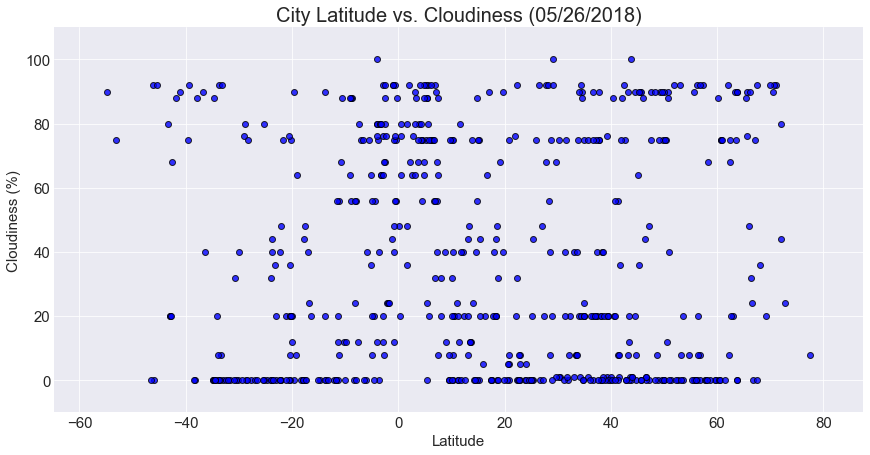

# WeatherPy

## Analysis
#### Observed trend 1: At this time (5/26) on the earth, the cities with the highest temperature are around 20 degrees north latitude.
#### Observed trend 2: Compared to cities in other latitudes, cities near to the equator ( 10 degrees south latitude to 10 degrees north latitude) tend to have the highest humidity. 
#### Observed trend 3: Compare the cloudiness chart and the wind speed chart, it appears that the cloudiness has a correlation with the wind speed. Some cities with the wind speed lowers than 5 mph tend to have the lowest cloudiness in percent.


```python
# import dependencies
from citipy import citipy
import numpy as np
import pandas as pd
from matplotlib import pyplot as plt
import openweathermapy as owm
from config import api_key
import requests
import seaborn as sns
from datetime import datetime
# set the style
sns.set_style("darkgrid")
tick_size, label_size,title_size = 15, 15, 20
# current date
created_on = datetime.today().strftime("%m/%d/%Y")
```

### Generate Cities List


```python
random_pool_count = 1200
# random latitudes
lat_north = np.random.rand(1,random_pool_count)*90
lat_south = np.random.rand(1,random_pool_count)*(-90)
lats = lat_north + lat_south

# random longtitudes
long_east = np.random.rand(1,random_pool_count)*180
long_west = np.random.rand(1,random_pool_count)*(-180)
longs = long_east + long_west

stacked_locs = np.dstack((lats, longs))

# generate cities list by citipy
cities_locs = stacked_locs[0]
cities = [citipy.nearest_city(lat, long).city_name for lat, long in cities_locs]

# get the unique cities
cities = set(cities)

```


```python
# unique cities
print(f"The number of unique countries: {len(cities)}")
```

    The number of unique countries: 630
    

### Perform API Calls

#### Approach #1 - by using Openweathermap wrapper.


```python
settings = {"units":"Imperial", "APPID": api_key}
units = "Imperial"

# create an empty dataframe
column_names = ['City','Cloudiness','Country','Date','Humidity','Lat','Lng','Max Temp','Wind Speed']
city_data_pd = pd.DataFrame(columns=column_names)

# extracting format
extract = ['name','clouds.all','sys.country','dt','main.humidity','coord.lat','coord.lon','main.temp_max','wind.speed']

print("-"*20+'\n'+"Beginning Data Retrieval.\n"+"-"*20)

for city_index, city_name in enumerate(cities):
    # create the url even though the wrapper does not need it
    url = owm.BASE_URL + 'weather?' + 'units={units}&APPID={APPID}&q={city_name}'
    query_url = url.format(city_name=city_name, **settings)
    
    # print the log
    print(f"Processing Record {city_index+1} | {city_name} \n{query_url}")

    # get the data
    try:
        data = owm.get_current(city_name,**settings)
        city_data_pd.loc[city_index, column_names] = data(*extract)
    except:
        print("Failed to get the response from the remote server!!")
        
print("-"*20+'\n'+"Data Retrieval Completed.\n"+"-"*20)
```

    --------------------
    Beginning Data Retrieval.
    --------------------
    Processing Record 1 | airai 
    http://api.openweathermap.org/data/2.5/weather?units=Imperial&APPID=f3353447a9945c51f4233c9ddb29c49e&q=airai
    Processing Record 2 | sayyan 
    http://api.openweathermap.org/data/2.5/weather?units=Imperial&APPID=f3353447a9945c51f4233c9ddb29c49e&q=sayyan
    Processing Record 3 | torbay 
    http://api.openweathermap.org/data/2.5/weather?units=Imperial&APPID=f3353447a9945c51f4233c9ddb29c49e&q=torbay
    Processing Record 4 | bolshegrivskoye 
    http://api.openweathermap.org/data/2.5/weather?units=Imperial&APPID=f3353447a9945c51f4233c9ddb29c49e&q=bolshegrivskoye
    Failed to get the response from the remote server!!
    Processing Record 5 | xining 
    http://api.openweathermap.org/data/2.5/weather?units=Imperial&APPID=f3353447a9945c51f4233c9ddb29c49e&q=xining
    Processing Record 6 | saint-pierre 
    http://api.openweathermap.org/data/2.5/weather?units=Imperial&APPID=f3353447a9945c51f4233c9ddb29c49e&q=saint-pierre
    Processing Record 7 | uinskoye 
    http://api.openweathermap.org/data/2.5/weather?units=Imperial&APPID=f3353447a9945c51f4233c9ddb29c49e&q=uinskoye
    Processing Record 8 | iracoubo 
    http://api.openweathermap.org/data/2.5/weather?units=Imperial&APPID=f3353447a9945c51f4233c9ddb29c49e&q=iracoubo
    Processing Record 9 | road town 
    http://api.openweathermap.org/data/2.5/weather?units=Imperial&APPID=f3353447a9945c51f4233c9ddb29c49e&q=road town
    Processing Record 10 | san cristobal 
    http://api.openweathermap.org/data/2.5/weather?units=Imperial&APPID=f3353447a9945c51f4233c9ddb29c49e&q=san cristobal
    Processing Record 11 | mananjary 
    http://api.openweathermap.org/data/2.5/weather?units=Imperial&APPID=f3353447a9945c51f4233c9ddb29c49e&q=mananjary
    Processing Record 12 | zhigansk 
    http://api.openweathermap.org/data/2.5/weather?units=Imperial&APPID=f3353447a9945c51f4233c9ddb29c49e&q=zhigansk
    Processing Record 13 | east london 
    http://api.openweathermap.org/data/2.5/weather?units=Imperial&APPID=f3353447a9945c51f4233c9ddb29c49e&q=east london
    Processing Record 14 | phan rang 
    http://api.openweathermap.org/data/2.5/weather?units=Imperial&APPID=f3353447a9945c51f4233c9ddb29c49e&q=phan rang
    Failed to get the response from the remote server!!
    Processing Record 15 | ouesso 
    http://api.openweathermap.org/data/2.5/weather?units=Imperial&APPID=f3353447a9945c51f4233c9ddb29c49e&q=ouesso
    Processing Record 16 | vila franca do campo 
    http://api.openweathermap.org/data/2.5/weather?units=Imperial&APPID=f3353447a9945c51f4233c9ddb29c49e&q=vila franca do campo
    Processing Record 17 | mitsamiouli 
    http://api.openweathermap.org/data/2.5/weather?units=Imperial&APPID=f3353447a9945c51f4233c9ddb29c49e&q=mitsamiouli
    Processing Record 18 | pacific grove 
    http://api.openweathermap.org/data/2.5/weather?units=Imperial&APPID=f3353447a9945c51f4233c9ddb29c49e&q=pacific grove
    Processing Record 19 | banda aceh 
    http://api.openweathermap.org/data/2.5/weather?units=Imperial&APPID=f3353447a9945c51f4233c9ddb29c49e&q=banda aceh
    Processing Record 20 | grootfontein 
    http://api.openweathermap.org/data/2.5/weather?units=Imperial&APPID=f3353447a9945c51f4233c9ddb29c49e&q=grootfontein
    Processing Record 21 | pakwach 
    http://api.openweathermap.org/data/2.5/weather?units=Imperial&APPID=f3353447a9945c51f4233c9ddb29c49e&q=pakwach
    Failed to get the response from the remote server!!
    Processing Record 22 | la dolorita 
    http://api.openweathermap.org/data/2.5/weather?units=Imperial&APPID=f3353447a9945c51f4233c9ddb29c49e&q=la dolorita
    Processing Record 23 | codrington 
    http://api.openweathermap.org/data/2.5/weather?units=Imperial&APPID=f3353447a9945c51f4233c9ddb29c49e&q=codrington
    Processing Record 24 | saldanha 
    http://api.openweathermap.org/data/2.5/weather?units=Imperial&APPID=f3353447a9945c51f4233c9ddb29c49e&q=saldanha
    Processing Record 25 | cabo san lucas 
    http://api.openweathermap.org/data/2.5/weather?units=Imperial&APPID=f3353447a9945c51f4233c9ddb29c49e&q=cabo san lucas
    Processing Record 26 | inhapim 
    http://api.openweathermap.org/data/2.5/weather?units=Imperial&APPID=f3353447a9945c51f4233c9ddb29c49e&q=inhapim
    Processing Record 27 | ancud 
    http://api.openweathermap.org/data/2.5/weather?units=Imperial&APPID=f3353447a9945c51f4233c9ddb29c49e&q=ancud
    Processing Record 28 | abu zabad 
    http://api.openweathermap.org/data/2.5/weather?units=Imperial&APPID=f3353447a9945c51f4233c9ddb29c49e&q=abu zabad
    Processing Record 29 | boysun 
    http://api.openweathermap.org/data/2.5/weather?units=Imperial&APPID=f3353447a9945c51f4233c9ddb29c49e&q=boysun
    Processing Record 30 | sao filipe 
    http://api.openweathermap.org/data/2.5/weather?units=Imperial&APPID=f3353447a9945c51f4233c9ddb29c49e&q=sao filipe
    Processing Record 31 | henties bay 
    http://api.openweathermap.org/data/2.5/weather?units=Imperial&APPID=f3353447a9945c51f4233c9ddb29c49e&q=henties bay
    Processing Record 32 | teguldet 
    http://api.openweathermap.org/data/2.5/weather?units=Imperial&APPID=f3353447a9945c51f4233c9ddb29c49e&q=teguldet
    Processing Record 33 | kathu 
    http://api.openweathermap.org/data/2.5/weather?units=Imperial&APPID=f3353447a9945c51f4233c9ddb29c49e&q=kathu
    Processing Record 34 | urucara 
    http://api.openweathermap.org/data/2.5/weather?units=Imperial&APPID=f3353447a9945c51f4233c9ddb29c49e&q=urucara
    Processing Record 35 | soyo 
    http://api.openweathermap.org/data/2.5/weather?units=Imperial&APPID=f3353447a9945c51f4233c9ddb29c49e&q=soyo
    Processing Record 36 | verkhnyaya inta 
    http://api.openweathermap.org/data/2.5/weather?units=Imperial&APPID=f3353447a9945c51f4233c9ddb29c49e&q=verkhnyaya inta
    Processing Record 37 | port alfred 
    http://api.openweathermap.org/data/2.5/weather?units=Imperial&APPID=f3353447a9945c51f4233c9ddb29c49e&q=port alfred
    Processing Record 38 | meyungs 
    http://api.openweathermap.org/data/2.5/weather?units=Imperial&APPID=f3353447a9945c51f4233c9ddb29c49e&q=meyungs
    Failed to get the response from the remote server!!
    Processing Record 39 | palmer 
    http://api.openweathermap.org/data/2.5/weather?units=Imperial&APPID=f3353447a9945c51f4233c9ddb29c49e&q=palmer
    Processing Record 40 | sibiti 
    http://api.openweathermap.org/data/2.5/weather?units=Imperial&APPID=f3353447a9945c51f4233c9ddb29c49e&q=sibiti
    Processing Record 41 | padang 
    http://api.openweathermap.org/data/2.5/weather?units=Imperial&APPID=f3353447a9945c51f4233c9ddb29c49e&q=padang
    Processing Record 42 | mehamn 
    http://api.openweathermap.org/data/2.5/weather?units=Imperial&APPID=f3353447a9945c51f4233c9ddb29c49e&q=mehamn
    Processing Record 43 | corabia 
    http://api.openweathermap.org/data/2.5/weather?units=Imperial&APPID=f3353447a9945c51f4233c9ddb29c49e&q=corabia
    Processing Record 44 | boyolangu 
    http://api.openweathermap.org/data/2.5/weather?units=Imperial&APPID=f3353447a9945c51f4233c9ddb29c49e&q=boyolangu
    Processing Record 45 | santa lucia 
    http://api.openweathermap.org/data/2.5/weather?units=Imperial&APPID=f3353447a9945c51f4233c9ddb29c49e&q=santa lucia
    Processing Record 46 | kupang 
    http://api.openweathermap.org/data/2.5/weather?units=Imperial&APPID=f3353447a9945c51f4233c9ddb29c49e&q=kupang
    Processing Record 47 | denpasar 
    http://api.openweathermap.org/data/2.5/weather?units=Imperial&APPID=f3353447a9945c51f4233c9ddb29c49e&q=denpasar
    Processing Record 48 | bud 
    http://api.openweathermap.org/data/2.5/weather?units=Imperial&APPID=f3353447a9945c51f4233c9ddb29c49e&q=bud
    Processing Record 49 | kloulklubed 
    http://api.openweathermap.org/data/2.5/weather?units=Imperial&APPID=f3353447a9945c51f4233c9ddb29c49e&q=kloulklubed
    Processing Record 50 | sembe 
    http://api.openweathermap.org/data/2.5/weather?units=Imperial&APPID=f3353447a9945c51f4233c9ddb29c49e&q=sembe
    Failed to get the response from the remote server!!
    Processing Record 51 | westpunt 
    http://api.openweathermap.org/data/2.5/weather?units=Imperial&APPID=f3353447a9945c51f4233c9ddb29c49e&q=westpunt
    Failed to get the response from the remote server!!
    Processing Record 52 | bardiyah 
    http://api.openweathermap.org/data/2.5/weather?units=Imperial&APPID=f3353447a9945c51f4233c9ddb29c49e&q=bardiyah
    Failed to get the response from the remote server!!
    Processing Record 53 | mexico 
    http://api.openweathermap.org/data/2.5/weather?units=Imperial&APPID=f3353447a9945c51f4233c9ddb29c49e&q=mexico
    Processing Record 54 | grand river south east 
    http://api.openweathermap.org/data/2.5/weather?units=Imperial&APPID=f3353447a9945c51f4233c9ddb29c49e&q=grand river south east
    Failed to get the response from the remote server!!
    Processing Record 55 | olafsvik 
    http://api.openweathermap.org/data/2.5/weather?units=Imperial&APPID=f3353447a9945c51f4233c9ddb29c49e&q=olafsvik
    Failed to get the response from the remote server!!
    Processing Record 56 | midyat 
    http://api.openweathermap.org/data/2.5/weather?units=Imperial&APPID=f3353447a9945c51f4233c9ddb29c49e&q=midyat
    Processing Record 57 | cervo 
    http://api.openweathermap.org/data/2.5/weather?units=Imperial&APPID=f3353447a9945c51f4233c9ddb29c49e&q=cervo
    Processing Record 58 | bolshaya chernigovka 
    http://api.openweathermap.org/data/2.5/weather?units=Imperial&APPID=f3353447a9945c51f4233c9ddb29c49e&q=bolshaya chernigovka
    Failed to get the response from the remote server!!
    Processing Record 59 | port hedland 
    http://api.openweathermap.org/data/2.5/weather?units=Imperial&APPID=f3353447a9945c51f4233c9ddb29c49e&q=port hedland
    Processing Record 60 | sao lourenco do oeste 
    http://api.openweathermap.org/data/2.5/weather?units=Imperial&APPID=f3353447a9945c51f4233c9ddb29c49e&q=sao lourenco do oeste
    Failed to get the response from the remote server!!
    Processing Record 61 | rognan 
    http://api.openweathermap.org/data/2.5/weather?units=Imperial&APPID=f3353447a9945c51f4233c9ddb29c49e&q=rognan
    Processing Record 62 | sovetskaya 
    http://api.openweathermap.org/data/2.5/weather?units=Imperial&APPID=f3353447a9945c51f4233c9ddb29c49e&q=sovetskaya
    Processing Record 63 | saint-jean-port-joli 
    http://api.openweathermap.org/data/2.5/weather?units=Imperial&APPID=f3353447a9945c51f4233c9ddb29c49e&q=saint-jean-port-joli
    Failed to get the response from the remote server!!
    Processing Record 64 | qaanaaq 
    http://api.openweathermap.org/data/2.5/weather?units=Imperial&APPID=f3353447a9945c51f4233c9ddb29c49e&q=qaanaaq
    Processing Record 65 | pemangkat 
    http://api.openweathermap.org/data/2.5/weather?units=Imperial&APPID=f3353447a9945c51f4233c9ddb29c49e&q=pemangkat
    Failed to get the response from the remote server!!
    Processing Record 66 | atuona 
    http://api.openweathermap.org/data/2.5/weather?units=Imperial&APPID=f3353447a9945c51f4233c9ddb29c49e&q=atuona
    Processing Record 67 | oshkosh 
    http://api.openweathermap.org/data/2.5/weather?units=Imperial&APPID=f3353447a9945c51f4233c9ddb29c49e&q=oshkosh
    Processing Record 68 | bonanza 
    http://api.openweathermap.org/data/2.5/weather?units=Imperial&APPID=f3353447a9945c51f4233c9ddb29c49e&q=bonanza
    Processing Record 69 | melo 
    http://api.openweathermap.org/data/2.5/weather?units=Imperial&APPID=f3353447a9945c51f4233c9ddb29c49e&q=melo
    Processing Record 70 | mossendjo 
    http://api.openweathermap.org/data/2.5/weather?units=Imperial&APPID=f3353447a9945c51f4233c9ddb29c49e&q=mossendjo
    Processing Record 71 | bembereke 
    http://api.openweathermap.org/data/2.5/weather?units=Imperial&APPID=f3353447a9945c51f4233c9ddb29c49e&q=bembereke
    Processing Record 72 | vlasikha 
    http://api.openweathermap.org/data/2.5/weather?units=Imperial&APPID=f3353447a9945c51f4233c9ddb29c49e&q=vlasikha
    Processing Record 73 | olkhovatka 
    http://api.openweathermap.org/data/2.5/weather?units=Imperial&APPID=f3353447a9945c51f4233c9ddb29c49e&q=olkhovatka
    Processing Record 74 | saint-augustin 
    http://api.openweathermap.org/data/2.5/weather?units=Imperial&APPID=f3353447a9945c51f4233c9ddb29c49e&q=saint-augustin
    Processing Record 75 | port elizabeth 
    http://api.openweathermap.org/data/2.5/weather?units=Imperial&APPID=f3353447a9945c51f4233c9ddb29c49e&q=port elizabeth
    Processing Record 76 | kismayo 
    http://api.openweathermap.org/data/2.5/weather?units=Imperial&APPID=f3353447a9945c51f4233c9ddb29c49e&q=kismayo
    Failed to get the response from the remote server!!
    Processing Record 77 | baraki barak 
    http://api.openweathermap.org/data/2.5/weather?units=Imperial&APPID=f3353447a9945c51f4233c9ddb29c49e&q=baraki barak
    Processing Record 78 | santa fe 
    http://api.openweathermap.org/data/2.5/weather?units=Imperial&APPID=f3353447a9945c51f4233c9ddb29c49e&q=santa fe
    Processing Record 79 | puerto del rosario 
    http://api.openweathermap.org/data/2.5/weather?units=Imperial&APPID=f3353447a9945c51f4233c9ddb29c49e&q=puerto del rosario
    Processing Record 80 | roald 
    http://api.openweathermap.org/data/2.5/weather?units=Imperial&APPID=f3353447a9945c51f4233c9ddb29c49e&q=roald
    Processing Record 81 | mudkhed 
    http://api.openweathermap.org/data/2.5/weather?units=Imperial&APPID=f3353447a9945c51f4233c9ddb29c49e&q=mudkhed
    Processing Record 82 | arlit 
    http://api.openweathermap.org/data/2.5/weather?units=Imperial&APPID=f3353447a9945c51f4233c9ddb29c49e&q=arlit
    Processing Record 83 | cidreira 
    http://api.openweathermap.org/data/2.5/weather?units=Imperial&APPID=f3353447a9945c51f4233c9ddb29c49e&q=cidreira
    Processing Record 84 | bandarbeyla 
    http://api.openweathermap.org/data/2.5/weather?units=Imperial&APPID=f3353447a9945c51f4233c9ddb29c49e&q=bandarbeyla
    Processing Record 85 | guanica 
    http://api.openweathermap.org/data/2.5/weather?units=Imperial&APPID=f3353447a9945c51f4233c9ddb29c49e&q=guanica
    Processing Record 86 | alofi 
    http://api.openweathermap.org/data/2.5/weather?units=Imperial&APPID=f3353447a9945c51f4233c9ddb29c49e&q=alofi
    Processing Record 87 | gaya 
    http://api.openweathermap.org/data/2.5/weather?units=Imperial&APPID=f3353447a9945c51f4233c9ddb29c49e&q=gaya
    Processing Record 88 | yanliang 
    http://api.openweathermap.org/data/2.5/weather?units=Imperial&APPID=f3353447a9945c51f4233c9ddb29c49e&q=yanliang
    Processing Record 89 | ilebo 
    http://api.openweathermap.org/data/2.5/weather?units=Imperial&APPID=f3353447a9945c51f4233c9ddb29c49e&q=ilebo
    Processing Record 90 | cockburn harbour 
    http://api.openweathermap.org/data/2.5/weather?units=Imperial&APPID=f3353447a9945c51f4233c9ddb29c49e&q=cockburn harbour
    Failed to get the response from the remote server!!
    Processing Record 91 | khasan 
    http://api.openweathermap.org/data/2.5/weather?units=Imperial&APPID=f3353447a9945c51f4233c9ddb29c49e&q=khasan
    Processing Record 92 | kassala 
    http://api.openweathermap.org/data/2.5/weather?units=Imperial&APPID=f3353447a9945c51f4233c9ddb29c49e&q=kassala
    Processing Record 93 | dingle 
    http://api.openweathermap.org/data/2.5/weather?units=Imperial&APPID=f3353447a9945c51f4233c9ddb29c49e&q=dingle
    Processing Record 94 | kodiak 
    http://api.openweathermap.org/data/2.5/weather?units=Imperial&APPID=f3353447a9945c51f4233c9ddb29c49e&q=kodiak
    Processing Record 95 | sivaki 
    http://api.openweathermap.org/data/2.5/weather?units=Imperial&APPID=f3353447a9945c51f4233c9ddb29c49e&q=sivaki
    Processing Record 96 | mednogorsk 
    http://api.openweathermap.org/data/2.5/weather?units=Imperial&APPID=f3353447a9945c51f4233c9ddb29c49e&q=mednogorsk
    Processing Record 97 | cairns 
    http://api.openweathermap.org/data/2.5/weather?units=Imperial&APPID=f3353447a9945c51f4233c9ddb29c49e&q=cairns
    Processing Record 98 | netanya 
    http://api.openweathermap.org/data/2.5/weather?units=Imperial&APPID=f3353447a9945c51f4233c9ddb29c49e&q=netanya
    Processing Record 99 | korla 
    http://api.openweathermap.org/data/2.5/weather?units=Imperial&APPID=f3353447a9945c51f4233c9ddb29c49e&q=korla
    Failed to get the response from the remote server!!
    Processing Record 100 | avarua 
    http://api.openweathermap.org/data/2.5/weather?units=Imperial&APPID=f3353447a9945c51f4233c9ddb29c49e&q=avarua
    Processing Record 101 | comodoro rivadavia 
    http://api.openweathermap.org/data/2.5/weather?units=Imperial&APPID=f3353447a9945c51f4233c9ddb29c49e&q=comodoro rivadavia
    Processing Record 102 | kisangani 
    http://api.openweathermap.org/data/2.5/weather?units=Imperial&APPID=f3353447a9945c51f4233c9ddb29c49e&q=kisangani
    Processing Record 103 | waw 
    http://api.openweathermap.org/data/2.5/weather?units=Imperial&APPID=f3353447a9945c51f4233c9ddb29c49e&q=waw
    Failed to get the response from the remote server!!
    Processing Record 104 | singaparna 
    http://api.openweathermap.org/data/2.5/weather?units=Imperial&APPID=f3353447a9945c51f4233c9ddb29c49e&q=singaparna
    Processing Record 105 | lagoa 
    http://api.openweathermap.org/data/2.5/weather?units=Imperial&APPID=f3353447a9945c51f4233c9ddb29c49e&q=lagoa
    Processing Record 106 | kumluca 
    http://api.openweathermap.org/data/2.5/weather?units=Imperial&APPID=f3353447a9945c51f4233c9ddb29c49e&q=kumluca
    Processing Record 107 | marrakesh 
    http://api.openweathermap.org/data/2.5/weather?units=Imperial&APPID=f3353447a9945c51f4233c9ddb29c49e&q=marrakesh
    Processing Record 108 | sao sebastiao 
    http://api.openweathermap.org/data/2.5/weather?units=Imperial&APPID=f3353447a9945c51f4233c9ddb29c49e&q=sao sebastiao
    Processing Record 109 | warqla 
    http://api.openweathermap.org/data/2.5/weather?units=Imperial&APPID=f3353447a9945c51f4233c9ddb29c49e&q=warqla
    Failed to get the response from the remote server!!
    Processing Record 110 | bosaso 
    http://api.openweathermap.org/data/2.5/weather?units=Imperial&APPID=f3353447a9945c51f4233c9ddb29c49e&q=bosaso
    Processing Record 111 | talara 
    http://api.openweathermap.org/data/2.5/weather?units=Imperial&APPID=f3353447a9945c51f4233c9ddb29c49e&q=talara
    Processing Record 112 | margate 
    http://api.openweathermap.org/data/2.5/weather?units=Imperial&APPID=f3353447a9945c51f4233c9ddb29c49e&q=margate
    Processing Record 113 | wamba 
    http://api.openweathermap.org/data/2.5/weather?units=Imperial&APPID=f3353447a9945c51f4233c9ddb29c49e&q=wamba
    Processing Record 114 | kutum 
    http://api.openweathermap.org/data/2.5/weather?units=Imperial&APPID=f3353447a9945c51f4233c9ddb29c49e&q=kutum
    Processing Record 115 | shimoda 
    http://api.openweathermap.org/data/2.5/weather?units=Imperial&APPID=f3353447a9945c51f4233c9ddb29c49e&q=shimoda
    Processing Record 116 | balkanabat 
    http://api.openweathermap.org/data/2.5/weather?units=Imperial&APPID=f3353447a9945c51f4233c9ddb29c49e&q=balkanabat
    Processing Record 117 | san luis 
    http://api.openweathermap.org/data/2.5/weather?units=Imperial&APPID=f3353447a9945c51f4233c9ddb29c49e&q=san luis
    Processing Record 118 | monrovia 
    http://api.openweathermap.org/data/2.5/weather?units=Imperial&APPID=f3353447a9945c51f4233c9ddb29c49e&q=monrovia
    Processing Record 119 | long beach 
    http://api.openweathermap.org/data/2.5/weather?units=Imperial&APPID=f3353447a9945c51f4233c9ddb29c49e&q=long beach
    Processing Record 120 | kruisfontein 
    http://api.openweathermap.org/data/2.5/weather?units=Imperial&APPID=f3353447a9945c51f4233c9ddb29c49e&q=kruisfontein
    Processing Record 121 | verkhoyansk 
    http://api.openweathermap.org/data/2.5/weather?units=Imperial&APPID=f3353447a9945c51f4233c9ddb29c49e&q=verkhoyansk
    Processing Record 122 | pineville 
    http://api.openweathermap.org/data/2.5/weather?units=Imperial&APPID=f3353447a9945c51f4233c9ddb29c49e&q=pineville
    Processing Record 123 | portland 
    http://api.openweathermap.org/data/2.5/weather?units=Imperial&APPID=f3353447a9945c51f4233c9ddb29c49e&q=portland
    Processing Record 124 | bucerias 
    http://api.openweathermap.org/data/2.5/weather?units=Imperial&APPID=f3353447a9945c51f4233c9ddb29c49e&q=bucerias
    Processing Record 125 | camacha 
    http://api.openweathermap.org/data/2.5/weather?units=Imperial&APPID=f3353447a9945c51f4233c9ddb29c49e&q=camacha
    Processing Record 126 | lethem 
    http://api.openweathermap.org/data/2.5/weather?units=Imperial&APPID=f3353447a9945c51f4233c9ddb29c49e&q=lethem
    Processing Record 127 | bubaque 
    http://api.openweathermap.org/data/2.5/weather?units=Imperial&APPID=f3353447a9945c51f4233c9ddb29c49e&q=bubaque
    Processing Record 128 | cabedelo 
    http://api.openweathermap.org/data/2.5/weather?units=Imperial&APPID=f3353447a9945c51f4233c9ddb29c49e&q=cabedelo
    Processing Record 129 | balsas 
    http://api.openweathermap.org/data/2.5/weather?units=Imperial&APPID=f3353447a9945c51f4233c9ddb29c49e&q=balsas
    Processing Record 130 | praia 
    http://api.openweathermap.org/data/2.5/weather?units=Imperial&APPID=f3353447a9945c51f4233c9ddb29c49e&q=praia
    Processing Record 131 | jand 
    http://api.openweathermap.org/data/2.5/weather?units=Imperial&APPID=f3353447a9945c51f4233c9ddb29c49e&q=jand
    Processing Record 132 | menongue 
    http://api.openweathermap.org/data/2.5/weather?units=Imperial&APPID=f3353447a9945c51f4233c9ddb29c49e&q=menongue
    Processing Record 133 | saint austell 
    http://api.openweathermap.org/data/2.5/weather?units=Imperial&APPID=f3353447a9945c51f4233c9ddb29c49e&q=saint austell
    Processing Record 134 | cabra 
    http://api.openweathermap.org/data/2.5/weather?units=Imperial&APPID=f3353447a9945c51f4233c9ddb29c49e&q=cabra
    Processing Record 135 | brownsville 
    http://api.openweathermap.org/data/2.5/weather?units=Imperial&APPID=f3353447a9945c51f4233c9ddb29c49e&q=brownsville
    Processing Record 136 | komsomolskiy 
    http://api.openweathermap.org/data/2.5/weather?units=Imperial&APPID=f3353447a9945c51f4233c9ddb29c49e&q=komsomolskiy
    Processing Record 137 | vila do maio 
    http://api.openweathermap.org/data/2.5/weather?units=Imperial&APPID=f3353447a9945c51f4233c9ddb29c49e&q=vila do maio
    Processing Record 138 | port lincoln 
    http://api.openweathermap.org/data/2.5/weather?units=Imperial&APPID=f3353447a9945c51f4233c9ddb29c49e&q=port lincoln
    Processing Record 139 | ayan 
    http://api.openweathermap.org/data/2.5/weather?units=Imperial&APPID=f3353447a9945c51f4233c9ddb29c49e&q=ayan
    Processing Record 140 | zhanaozen 
    http://api.openweathermap.org/data/2.5/weather?units=Imperial&APPID=f3353447a9945c51f4233c9ddb29c49e&q=zhanaozen
    Processing Record 141 | japura 
    http://api.openweathermap.org/data/2.5/weather?units=Imperial&APPID=f3353447a9945c51f4233c9ddb29c49e&q=japura
    Processing Record 142 | eenhana 
    http://api.openweathermap.org/data/2.5/weather?units=Imperial&APPID=f3353447a9945c51f4233c9ddb29c49e&q=eenhana
    Processing Record 143 | villarrica 
    http://api.openweathermap.org/data/2.5/weather?units=Imperial&APPID=f3353447a9945c51f4233c9ddb29c49e&q=villarrica
    Processing Record 144 | luau 
    http://api.openweathermap.org/data/2.5/weather?units=Imperial&APPID=f3353447a9945c51f4233c9ddb29c49e&q=luau
    Processing Record 145 | champerico 
    http://api.openweathermap.org/data/2.5/weather?units=Imperial&APPID=f3353447a9945c51f4233c9ddb29c49e&q=champerico
    Processing Record 146 | maldonado 
    http://api.openweathermap.org/data/2.5/weather?units=Imperial&APPID=f3353447a9945c51f4233c9ddb29c49e&q=maldonado
    Processing Record 147 | jabinyanah 
    http://api.openweathermap.org/data/2.5/weather?units=Imperial&APPID=f3353447a9945c51f4233c9ddb29c49e&q=jabinyanah
    Processing Record 148 | kudahuvadhoo 
    http://api.openweathermap.org/data/2.5/weather?units=Imperial&APPID=f3353447a9945c51f4233c9ddb29c49e&q=kudahuvadhoo
    Processing Record 149 | pisco 
    http://api.openweathermap.org/data/2.5/weather?units=Imperial&APPID=f3353447a9945c51f4233c9ddb29c49e&q=pisco
    Processing Record 150 | boa vista 
    http://api.openweathermap.org/data/2.5/weather?units=Imperial&APPID=f3353447a9945c51f4233c9ddb29c49e&q=boa vista
    Processing Record 151 | sinnamary 
    http://api.openweathermap.org/data/2.5/weather?units=Imperial&APPID=f3353447a9945c51f4233c9ddb29c49e&q=sinnamary
    Processing Record 152 | faanui 
    http://api.openweathermap.org/data/2.5/weather?units=Imperial&APPID=f3353447a9945c51f4233c9ddb29c49e&q=faanui
    Processing Record 153 | bethel 
    http://api.openweathermap.org/data/2.5/weather?units=Imperial&APPID=f3353447a9945c51f4233c9ddb29c49e&q=bethel
    Processing Record 154 | iquitos 
    http://api.openweathermap.org/data/2.5/weather?units=Imperial&APPID=f3353447a9945c51f4233c9ddb29c49e&q=iquitos
    Processing Record 155 | addis abeba 
    http://api.openweathermap.org/data/2.5/weather?units=Imperial&APPID=f3353447a9945c51f4233c9ddb29c49e&q=addis abeba
    Failed to get the response from the remote server!!
    Processing Record 156 | puerto ayora 
    http://api.openweathermap.org/data/2.5/weather?units=Imperial&APPID=f3353447a9945c51f4233c9ddb29c49e&q=puerto ayora
    Processing Record 157 | xichang 
    http://api.openweathermap.org/data/2.5/weather?units=Imperial&APPID=f3353447a9945c51f4233c9ddb29c49e&q=xichang
    Processing Record 158 | qui nhon 
    http://api.openweathermap.org/data/2.5/weather?units=Imperial&APPID=f3353447a9945c51f4233c9ddb29c49e&q=qui nhon
    Failed to get the response from the remote server!!
    Processing Record 159 | lebu 
    http://api.openweathermap.org/data/2.5/weather?units=Imperial&APPID=f3353447a9945c51f4233c9ddb29c49e&q=lebu
    Processing Record 160 | saint george 
    http://api.openweathermap.org/data/2.5/weather?units=Imperial&APPID=f3353447a9945c51f4233c9ddb29c49e&q=saint george
    Processing Record 161 | richards bay 
    http://api.openweathermap.org/data/2.5/weather?units=Imperial&APPID=f3353447a9945c51f4233c9ddb29c49e&q=richards bay
    Processing Record 162 | vallenar 
    http://api.openweathermap.org/data/2.5/weather?units=Imperial&APPID=f3353447a9945c51f4233c9ddb29c49e&q=vallenar
    Processing Record 163 | inhambane 
    http://api.openweathermap.org/data/2.5/weather?units=Imperial&APPID=f3353447a9945c51f4233c9ddb29c49e&q=inhambane
    Processing Record 164 | bambari 
    http://api.openweathermap.org/data/2.5/weather?units=Imperial&APPID=f3353447a9945c51f4233c9ddb29c49e&q=bambari
    Processing Record 165 | dhidhdhoo 
    http://api.openweathermap.org/data/2.5/weather?units=Imperial&APPID=f3353447a9945c51f4233c9ddb29c49e&q=dhidhdhoo
    Processing Record 166 | nizwa 
    http://api.openweathermap.org/data/2.5/weather?units=Imperial&APPID=f3353447a9945c51f4233c9ddb29c49e&q=nizwa
    Processing Record 167 | manika 
    http://api.openweathermap.org/data/2.5/weather?units=Imperial&APPID=f3353447a9945c51f4233c9ddb29c49e&q=manika
    Processing Record 168 | epe 
    http://api.openweathermap.org/data/2.5/weather?units=Imperial&APPID=f3353447a9945c51f4233c9ddb29c49e&q=epe
    Processing Record 169 | oranjemund 
    http://api.openweathermap.org/data/2.5/weather?units=Imperial&APPID=f3353447a9945c51f4233c9ddb29c49e&q=oranjemund
    Processing Record 170 | south river 
    http://api.openweathermap.org/data/2.5/weather?units=Imperial&APPID=f3353447a9945c51f4233c9ddb29c49e&q=south river
    Processing Record 171 | bheramara 
    http://api.openweathermap.org/data/2.5/weather?units=Imperial&APPID=f3353447a9945c51f4233c9ddb29c49e&q=bheramara
    Processing Record 172 | constitucion 
    http://api.openweathermap.org/data/2.5/weather?units=Imperial&APPID=f3353447a9945c51f4233c9ddb29c49e&q=constitucion
    Processing Record 173 | chaa-khol 
    http://api.openweathermap.org/data/2.5/weather?units=Imperial&APPID=f3353447a9945c51f4233c9ddb29c49e&q=chaa-khol
    Failed to get the response from the remote server!!
    Processing Record 174 | lorengau 
    http://api.openweathermap.org/data/2.5/weather?units=Imperial&APPID=f3353447a9945c51f4233c9ddb29c49e&q=lorengau
    Processing Record 175 | udachnyy 
    http://api.openweathermap.org/data/2.5/weather?units=Imperial&APPID=f3353447a9945c51f4233c9ddb29c49e&q=udachnyy
    Processing Record 176 | thompson 
    http://api.openweathermap.org/data/2.5/weather?units=Imperial&APPID=f3353447a9945c51f4233c9ddb29c49e&q=thompson
    Processing Record 177 | bara 
    http://api.openweathermap.org/data/2.5/weather?units=Imperial&APPID=f3353447a9945c51f4233c9ddb29c49e&q=bara
    Processing Record 178 | portel 
    http://api.openweathermap.org/data/2.5/weather?units=Imperial&APPID=f3353447a9945c51f4233c9ddb29c49e&q=portel
    Processing Record 179 | lavrentiya 
    http://api.openweathermap.org/data/2.5/weather?units=Imperial&APPID=f3353447a9945c51f4233c9ddb29c49e&q=lavrentiya
    Processing Record 180 | ovalle 
    http://api.openweathermap.org/data/2.5/weather?units=Imperial&APPID=f3353447a9945c51f4233c9ddb29c49e&q=ovalle
    Processing Record 181 | bow island 
    http://api.openweathermap.org/data/2.5/weather?units=Imperial&APPID=f3353447a9945c51f4233c9ddb29c49e&q=bow island
    Processing Record 182 | bentiu 
    http://api.openweathermap.org/data/2.5/weather?units=Imperial&APPID=f3353447a9945c51f4233c9ddb29c49e&q=bentiu
    Failed to get the response from the remote server!!
    Processing Record 183 | rawson 
    http://api.openweathermap.org/data/2.5/weather?units=Imperial&APPID=f3353447a9945c51f4233c9ddb29c49e&q=rawson
    Processing Record 184 | formoso do araguaia 
    http://api.openweathermap.org/data/2.5/weather?units=Imperial&APPID=f3353447a9945c51f4233c9ddb29c49e&q=formoso do araguaia
    Failed to get the response from the remote server!!
    Processing Record 185 | mariinsk 
    http://api.openweathermap.org/data/2.5/weather?units=Imperial&APPID=f3353447a9945c51f4233c9ddb29c49e&q=mariinsk
    Processing Record 186 | viligili 
    http://api.openweathermap.org/data/2.5/weather?units=Imperial&APPID=f3353447a9945c51f4233c9ddb29c49e&q=viligili
    Failed to get the response from the remote server!!
    Processing Record 187 | hammerfest 
    http://api.openweathermap.org/data/2.5/weather?units=Imperial&APPID=f3353447a9945c51f4233c9ddb29c49e&q=hammerfest
    Processing Record 188 | rikitea 
    http://api.openweathermap.org/data/2.5/weather?units=Imperial&APPID=f3353447a9945c51f4233c9ddb29c49e&q=rikitea
    Processing Record 189 | tasiilaq 
    http://api.openweathermap.org/data/2.5/weather?units=Imperial&APPID=f3353447a9945c51f4233c9ddb29c49e&q=tasiilaq
    Processing Record 190 | stabat 
    http://api.openweathermap.org/data/2.5/weather?units=Imperial&APPID=f3353447a9945c51f4233c9ddb29c49e&q=stabat
    Processing Record 191 | miragoane 
    http://api.openweathermap.org/data/2.5/weather?units=Imperial&APPID=f3353447a9945c51f4233c9ddb29c49e&q=miragoane
    Processing Record 192 | ambasamudram 
    http://api.openweathermap.org/data/2.5/weather?units=Imperial&APPID=f3353447a9945c51f4233c9ddb29c49e&q=ambasamudram
    Processing Record 193 | shahreza 
    http://api.openweathermap.org/data/2.5/weather?units=Imperial&APPID=f3353447a9945c51f4233c9ddb29c49e&q=shahreza
    Processing Record 194 | matara 
    http://api.openweathermap.org/data/2.5/weather?units=Imperial&APPID=f3353447a9945c51f4233c9ddb29c49e&q=matara
    Processing Record 195 | bathsheba 
    http://api.openweathermap.org/data/2.5/weather?units=Imperial&APPID=f3353447a9945c51f4233c9ddb29c49e&q=bathsheba
    Processing Record 196 | poum 
    http://api.openweathermap.org/data/2.5/weather?units=Imperial&APPID=f3353447a9945c51f4233c9ddb29c49e&q=poum
    Processing Record 197 | umm bab 
    http://api.openweathermap.org/data/2.5/weather?units=Imperial&APPID=f3353447a9945c51f4233c9ddb29c49e&q=umm bab
    Processing Record 198 | guajara-mirim 
    http://api.openweathermap.org/data/2.5/weather?units=Imperial&APPID=f3353447a9945c51f4233c9ddb29c49e&q=guajara-mirim
    Failed to get the response from the remote server!!
    Processing Record 199 | grindavik 
    http://api.openweathermap.org/data/2.5/weather?units=Imperial&APPID=f3353447a9945c51f4233c9ddb29c49e&q=grindavik
    Processing Record 200 | piracuruca 
    http://api.openweathermap.org/data/2.5/weather?units=Imperial&APPID=f3353447a9945c51f4233c9ddb29c49e&q=piracuruca
    Processing Record 201 | port blair 
    http://api.openweathermap.org/data/2.5/weather?units=Imperial&APPID=f3353447a9945c51f4233c9ddb29c49e&q=port blair
    Processing Record 202 | gogrial 
    http://api.openweathermap.org/data/2.5/weather?units=Imperial&APPID=f3353447a9945c51f4233c9ddb29c49e&q=gogrial
    Failed to get the response from the remote server!!
    Processing Record 203 | sundsvall 
    http://api.openweathermap.org/data/2.5/weather?units=Imperial&APPID=f3353447a9945c51f4233c9ddb29c49e&q=sundsvall
    Processing Record 204 | mount pleasant 
    http://api.openweathermap.org/data/2.5/weather?units=Imperial&APPID=f3353447a9945c51f4233c9ddb29c49e&q=mount pleasant
    Processing Record 205 | lima 
    http://api.openweathermap.org/data/2.5/weather?units=Imperial&APPID=f3353447a9945c51f4233c9ddb29c49e&q=lima
    Processing Record 206 | nouadhibou 
    http://api.openweathermap.org/data/2.5/weather?units=Imperial&APPID=f3353447a9945c51f4233c9ddb29c49e&q=nouadhibou
    Processing Record 207 | almazar 
    http://api.openweathermap.org/data/2.5/weather?units=Imperial&APPID=f3353447a9945c51f4233c9ddb29c49e&q=almazar
    Processing Record 208 | catacocha 
    http://api.openweathermap.org/data/2.5/weather?units=Imperial&APPID=f3353447a9945c51f4233c9ddb29c49e&q=catacocha
    Processing Record 209 | nishihara 
    http://api.openweathermap.org/data/2.5/weather?units=Imperial&APPID=f3353447a9945c51f4233c9ddb29c49e&q=nishihara
    Processing Record 210 | killybegs 
    http://api.openweathermap.org/data/2.5/weather?units=Imperial&APPID=f3353447a9945c51f4233c9ddb29c49e&q=killybegs
    Processing Record 211 | boende 
    http://api.openweathermap.org/data/2.5/weather?units=Imperial&APPID=f3353447a9945c51f4233c9ddb29c49e&q=boende
    Processing Record 212 | atakpame 
    http://api.openweathermap.org/data/2.5/weather?units=Imperial&APPID=f3353447a9945c51f4233c9ddb29c49e&q=atakpame
    Processing Record 213 | nanortalik 
    http://api.openweathermap.org/data/2.5/weather?units=Imperial&APPID=f3353447a9945c51f4233c9ddb29c49e&q=nanortalik
    Processing Record 214 | teruel 
    http://api.openweathermap.org/data/2.5/weather?units=Imperial&APPID=f3353447a9945c51f4233c9ddb29c49e&q=teruel
    Processing Record 215 | tsihombe 
    http://api.openweathermap.org/data/2.5/weather?units=Imperial&APPID=f3353447a9945c51f4233c9ddb29c49e&q=tsihombe
    Failed to get the response from the remote server!!
    Processing Record 216 | villa maria 
    http://api.openweathermap.org/data/2.5/weather?units=Imperial&APPID=f3353447a9945c51f4233c9ddb29c49e&q=villa maria
    Processing Record 217 | goderich 
    http://api.openweathermap.org/data/2.5/weather?units=Imperial&APPID=f3353447a9945c51f4233c9ddb29c49e&q=goderich
    Processing Record 218 | priiskovyy 
    http://api.openweathermap.org/data/2.5/weather?units=Imperial&APPID=f3353447a9945c51f4233c9ddb29c49e&q=priiskovyy
    Processing Record 219 | deer lake 
    http://api.openweathermap.org/data/2.5/weather?units=Imperial&APPID=f3353447a9945c51f4233c9ddb29c49e&q=deer lake
    Processing Record 220 | kachiry 
    http://api.openweathermap.org/data/2.5/weather?units=Imperial&APPID=f3353447a9945c51f4233c9ddb29c49e&q=kachiry
    Processing Record 221 | mataura 
    http://api.openweathermap.org/data/2.5/weather?units=Imperial&APPID=f3353447a9945c51f4233c9ddb29c49e&q=mataura
    Processing Record 222 | locri 
    http://api.openweathermap.org/data/2.5/weather?units=Imperial&APPID=f3353447a9945c51f4233c9ddb29c49e&q=locri
    Processing Record 223 | ati 
    http://api.openweathermap.org/data/2.5/weather?units=Imperial&APPID=f3353447a9945c51f4233c9ddb29c49e&q=ati
    Processing Record 224 | birao 
    http://api.openweathermap.org/data/2.5/weather?units=Imperial&APPID=f3353447a9945c51f4233c9ddb29c49e&q=birao
    Processing Record 225 | nicoya 
    http://api.openweathermap.org/data/2.5/weather?units=Imperial&APPID=f3353447a9945c51f4233c9ddb29c49e&q=nicoya
    Processing Record 226 | louisbourg 
    http://api.openweathermap.org/data/2.5/weather?units=Imperial&APPID=f3353447a9945c51f4233c9ddb29c49e&q=louisbourg
    Failed to get the response from the remote server!!
    Processing Record 227 | gadarwara 
    http://api.openweathermap.org/data/2.5/weather?units=Imperial&APPID=f3353447a9945c51f4233c9ddb29c49e&q=gadarwara
    Processing Record 228 | albany 
    http://api.openweathermap.org/data/2.5/weather?units=Imperial&APPID=f3353447a9945c51f4233c9ddb29c49e&q=albany
    Processing Record 229 | hami 
    http://api.openweathermap.org/data/2.5/weather?units=Imperial&APPID=f3353447a9945c51f4233c9ddb29c49e&q=hami
    Processing Record 230 | clyde river 
    http://api.openweathermap.org/data/2.5/weather?units=Imperial&APPID=f3353447a9945c51f4233c9ddb29c49e&q=clyde river
    Processing Record 231 | progreso 
    http://api.openweathermap.org/data/2.5/weather?units=Imperial&APPID=f3353447a9945c51f4233c9ddb29c49e&q=progreso
    Processing Record 232 | morondava 
    http://api.openweathermap.org/data/2.5/weather?units=Imperial&APPID=f3353447a9945c51f4233c9ddb29c49e&q=morondava
    Processing Record 233 | taolanaro 
    http://api.openweathermap.org/data/2.5/weather?units=Imperial&APPID=f3353447a9945c51f4233c9ddb29c49e&q=taolanaro
    Failed to get the response from the remote server!!
    Processing Record 234 | qaqortoq 
    http://api.openweathermap.org/data/2.5/weather?units=Imperial&APPID=f3353447a9945c51f4233c9ddb29c49e&q=qaqortoq
    Processing Record 235 | shivrajpur 
    http://api.openweathermap.org/data/2.5/weather?units=Imperial&APPID=f3353447a9945c51f4233c9ddb29c49e&q=shivrajpur
    Processing Record 236 | sept-iles 
    http://api.openweathermap.org/data/2.5/weather?units=Imperial&APPID=f3353447a9945c51f4233c9ddb29c49e&q=sept-iles
    Processing Record 237 | mahanje 
    http://api.openweathermap.org/data/2.5/weather?units=Imperial&APPID=f3353447a9945c51f4233c9ddb29c49e&q=mahanje
    Failed to get the response from the remote server!!
    Processing Record 238 | atar 
    http://api.openweathermap.org/data/2.5/weather?units=Imperial&APPID=f3353447a9945c51f4233c9ddb29c49e&q=atar
    Processing Record 239 | sao joao da barra 
    http://api.openweathermap.org/data/2.5/weather?units=Imperial&APPID=f3353447a9945c51f4233c9ddb29c49e&q=sao joao da barra
    Processing Record 240 | nelidovo 
    http://api.openweathermap.org/data/2.5/weather?units=Imperial&APPID=f3353447a9945c51f4233c9ddb29c49e&q=nelidovo
    Processing Record 241 | kapaa 
    http://api.openweathermap.org/data/2.5/weather?units=Imperial&APPID=f3353447a9945c51f4233c9ddb29c49e&q=kapaa
    Processing Record 242 | fortuna 
    http://api.openweathermap.org/data/2.5/weather?units=Imperial&APPID=f3353447a9945c51f4233c9ddb29c49e&q=fortuna
    Processing Record 243 | khakhea 
    http://api.openweathermap.org/data/2.5/weather?units=Imperial&APPID=f3353447a9945c51f4233c9ddb29c49e&q=khakhea
    Processing Record 244 | kuryk 
    http://api.openweathermap.org/data/2.5/weather?units=Imperial&APPID=f3353447a9945c51f4233c9ddb29c49e&q=kuryk
    Processing Record 245 | luchegorsk 
    http://api.openweathermap.org/data/2.5/weather?units=Imperial&APPID=f3353447a9945c51f4233c9ddb29c49e&q=luchegorsk
    Processing Record 246 | walvis bay 
    http://api.openweathermap.org/data/2.5/weather?units=Imperial&APPID=f3353447a9945c51f4233c9ddb29c49e&q=walvis bay
    Processing Record 247 | hualmay 
    http://api.openweathermap.org/data/2.5/weather?units=Imperial&APPID=f3353447a9945c51f4233c9ddb29c49e&q=hualmay
    Processing Record 248 | san bartolome 
    http://api.openweathermap.org/data/2.5/weather?units=Imperial&APPID=f3353447a9945c51f4233c9ddb29c49e&q=san bartolome
    Processing Record 249 | tignere 
    http://api.openweathermap.org/data/2.5/weather?units=Imperial&APPID=f3353447a9945c51f4233c9ddb29c49e&q=tignere
    Processing Record 250 | bengkulu 
    http://api.openweathermap.org/data/2.5/weather?units=Imperial&APPID=f3353447a9945c51f4233c9ddb29c49e&q=bengkulu
    Failed to get the response from the remote server!!
    Processing Record 251 | barabai 
    http://api.openweathermap.org/data/2.5/weather?units=Imperial&APPID=f3353447a9945c51f4233c9ddb29c49e&q=barabai
    Processing Record 252 | sijunjung 
    http://api.openweathermap.org/data/2.5/weather?units=Imperial&APPID=f3353447a9945c51f4233c9ddb29c49e&q=sijunjung
    Processing Record 253 | mar del plata 
    http://api.openweathermap.org/data/2.5/weather?units=Imperial&APPID=f3353447a9945c51f4233c9ddb29c49e&q=mar del plata
    Processing Record 254 | ovsyanka 
    http://api.openweathermap.org/data/2.5/weather?units=Imperial&APPID=f3353447a9945c51f4233c9ddb29c49e&q=ovsyanka
    Processing Record 255 | sumbe 
    http://api.openweathermap.org/data/2.5/weather?units=Imperial&APPID=f3353447a9945c51f4233c9ddb29c49e&q=sumbe
    Processing Record 256 | iralaya 
    http://api.openweathermap.org/data/2.5/weather?units=Imperial&APPID=f3353447a9945c51f4233c9ddb29c49e&q=iralaya
    Processing Record 257 | quelimane 
    http://api.openweathermap.org/data/2.5/weather?units=Imperial&APPID=f3353447a9945c51f4233c9ddb29c49e&q=quelimane
    Processing Record 258 | cape town 
    http://api.openweathermap.org/data/2.5/weather?units=Imperial&APPID=f3353447a9945c51f4233c9ddb29c49e&q=cape town
    Processing Record 259 | mayo 
    http://api.openweathermap.org/data/2.5/weather?units=Imperial&APPID=f3353447a9945c51f4233c9ddb29c49e&q=mayo
    Processing Record 260 | mount gambier 
    http://api.openweathermap.org/data/2.5/weather?units=Imperial&APPID=f3353447a9945c51f4233c9ddb29c49e&q=mount gambier
    Processing Record 261 | hopelchen 
    http://api.openweathermap.org/data/2.5/weather?units=Imperial&APPID=f3353447a9945c51f4233c9ddb29c49e&q=hopelchen
    Processing Record 262 | dire dawa 
    http://api.openweathermap.org/data/2.5/weather?units=Imperial&APPID=f3353447a9945c51f4233c9ddb29c49e&q=dire dawa
    Processing Record 263 | eyemouth 
    http://api.openweathermap.org/data/2.5/weather?units=Imperial&APPID=f3353447a9945c51f4233c9ddb29c49e&q=eyemouth
    Processing Record 264 | kendari 
    http://api.openweathermap.org/data/2.5/weather?units=Imperial&APPID=f3353447a9945c51f4233c9ddb29c49e&q=kendari
    Processing Record 265 | vanimo 
    http://api.openweathermap.org/data/2.5/weather?units=Imperial&APPID=f3353447a9945c51f4233c9ddb29c49e&q=vanimo
    Processing Record 266 | yining 
    http://api.openweathermap.org/data/2.5/weather?units=Imperial&APPID=f3353447a9945c51f4233c9ddb29c49e&q=yining
    Processing Record 267 | sao mateus do maranhao 
    http://api.openweathermap.org/data/2.5/weather?units=Imperial&APPID=f3353447a9945c51f4233c9ddb29c49e&q=sao mateus do maranhao
    Processing Record 268 | kaznejov 
    http://api.openweathermap.org/data/2.5/weather?units=Imperial&APPID=f3353447a9945c51f4233c9ddb29c49e&q=kaznejov
    Processing Record 269 | ribeira grande 
    http://api.openweathermap.org/data/2.5/weather?units=Imperial&APPID=f3353447a9945c51f4233c9ddb29c49e&q=ribeira grande
    Processing Record 270 | rabo de peixe 
    http://api.openweathermap.org/data/2.5/weather?units=Imperial&APPID=f3353447a9945c51f4233c9ddb29c49e&q=rabo de peixe
    Processing Record 271 | gravdal 
    http://api.openweathermap.org/data/2.5/weather?units=Imperial&APPID=f3353447a9945c51f4233c9ddb29c49e&q=gravdal
    Processing Record 272 | valparaiso 
    http://api.openweathermap.org/data/2.5/weather?units=Imperial&APPID=f3353447a9945c51f4233c9ddb29c49e&q=valparaiso
    Processing Record 273 | daru 
    http://api.openweathermap.org/data/2.5/weather?units=Imperial&APPID=f3353447a9945c51f4233c9ddb29c49e&q=daru
    Processing Record 274 | shakawe 
    http://api.openweathermap.org/data/2.5/weather?units=Imperial&APPID=f3353447a9945c51f4233c9ddb29c49e&q=shakawe
    Processing Record 275 | sabang 
    http://api.openweathermap.org/data/2.5/weather?units=Imperial&APPID=f3353447a9945c51f4233c9ddb29c49e&q=sabang
    Processing Record 276 | mbigou 
    http://api.openweathermap.org/data/2.5/weather?units=Imperial&APPID=f3353447a9945c51f4233c9ddb29c49e&q=mbigou
    Processing Record 277 | san quintin 
    http://api.openweathermap.org/data/2.5/weather?units=Imperial&APPID=f3353447a9945c51f4233c9ddb29c49e&q=san quintin
    Processing Record 278 | talcahuano 
    http://api.openweathermap.org/data/2.5/weather?units=Imperial&APPID=f3353447a9945c51f4233c9ddb29c49e&q=talcahuano
    Processing Record 279 | victoria 
    http://api.openweathermap.org/data/2.5/weather?units=Imperial&APPID=f3353447a9945c51f4233c9ddb29c49e&q=victoria
    Processing Record 280 | mbaiki 
    http://api.openweathermap.org/data/2.5/weather?units=Imperial&APPID=f3353447a9945c51f4233c9ddb29c49e&q=mbaiki
    Processing Record 281 | severo-kurilsk 
    http://api.openweathermap.org/data/2.5/weather?units=Imperial&APPID=f3353447a9945c51f4233c9ddb29c49e&q=severo-kurilsk
    Processing Record 282 | pangnirtung 
    http://api.openweathermap.org/data/2.5/weather?units=Imperial&APPID=f3353447a9945c51f4233c9ddb29c49e&q=pangnirtung
    Processing Record 283 | kilindoni 
    http://api.openweathermap.org/data/2.5/weather?units=Imperial&APPID=f3353447a9945c51f4233c9ddb29c49e&q=kilindoni
    Processing Record 284 | anzio 
    http://api.openweathermap.org/data/2.5/weather?units=Imperial&APPID=f3353447a9945c51f4233c9ddb29c49e&q=anzio
    Processing Record 285 | gouyave 
    http://api.openweathermap.org/data/2.5/weather?units=Imperial&APPID=f3353447a9945c51f4233c9ddb29c49e&q=gouyave
    Processing Record 286 | abha 
    http://api.openweathermap.org/data/2.5/weather?units=Imperial&APPID=f3353447a9945c51f4233c9ddb29c49e&q=abha
    Processing Record 287 | la presa 
    http://api.openweathermap.org/data/2.5/weather?units=Imperial&APPID=f3353447a9945c51f4233c9ddb29c49e&q=la presa
    Processing Record 288 | gamba 
    http://api.openweathermap.org/data/2.5/weather?units=Imperial&APPID=f3353447a9945c51f4233c9ddb29c49e&q=gamba
    Processing Record 289 | lom sak 
    http://api.openweathermap.org/data/2.5/weather?units=Imperial&APPID=f3353447a9945c51f4233c9ddb29c49e&q=lom sak
    Processing Record 290 | labuhan 
    http://api.openweathermap.org/data/2.5/weather?units=Imperial&APPID=f3353447a9945c51f4233c9ddb29c49e&q=labuhan
    Processing Record 291 | sesheke 
    http://api.openweathermap.org/data/2.5/weather?units=Imperial&APPID=f3353447a9945c51f4233c9ddb29c49e&q=sesheke
    Processing Record 292 | ocampo 
    http://api.openweathermap.org/data/2.5/weather?units=Imperial&APPID=f3353447a9945c51f4233c9ddb29c49e&q=ocampo
    Processing Record 293 | puerto escondido 
    http://api.openweathermap.org/data/2.5/weather?units=Imperial&APPID=f3353447a9945c51f4233c9ddb29c49e&q=puerto escondido
    Processing Record 294 | santa marta 
    http://api.openweathermap.org/data/2.5/weather?units=Imperial&APPID=f3353447a9945c51f4233c9ddb29c49e&q=santa marta
    Processing Record 295 | tabou 
    http://api.openweathermap.org/data/2.5/weather?units=Imperial&APPID=f3353447a9945c51f4233c9ddb29c49e&q=tabou
    Processing Record 296 | boffa 
    http://api.openweathermap.org/data/2.5/weather?units=Imperial&APPID=f3353447a9945c51f4233c9ddb29c49e&q=boffa
    Processing Record 297 | boguchany 
    http://api.openweathermap.org/data/2.5/weather?units=Imperial&APPID=f3353447a9945c51f4233c9ddb29c49e&q=boguchany
    Processing Record 298 | fillmore 
    http://api.openweathermap.org/data/2.5/weather?units=Imperial&APPID=f3353447a9945c51f4233c9ddb29c49e&q=fillmore
    Processing Record 299 | zhangye 
    http://api.openweathermap.org/data/2.5/weather?units=Imperial&APPID=f3353447a9945c51f4233c9ddb29c49e&q=zhangye
    Processing Record 300 | grand gaube 
    http://api.openweathermap.org/data/2.5/weather?units=Imperial&APPID=f3353447a9945c51f4233c9ddb29c49e&q=grand gaube
    Processing Record 301 | changji 
    http://api.openweathermap.org/data/2.5/weather?units=Imperial&APPID=f3353447a9945c51f4233c9ddb29c49e&q=changji
    Processing Record 302 | riachao das neves 
    http://api.openweathermap.org/data/2.5/weather?units=Imperial&APPID=f3353447a9945c51f4233c9ddb29c49e&q=riachao das neves
    Processing Record 303 | manaure 
    http://api.openweathermap.org/data/2.5/weather?units=Imperial&APPID=f3353447a9945c51f4233c9ddb29c49e&q=manaure
    Processing Record 304 | oxford 
    http://api.openweathermap.org/data/2.5/weather?units=Imperial&APPID=f3353447a9945c51f4233c9ddb29c49e&q=oxford
    Processing Record 305 | hovd 
    http://api.openweathermap.org/data/2.5/weather?units=Imperial&APPID=f3353447a9945c51f4233c9ddb29c49e&q=hovd
    Processing Record 306 | khani 
    http://api.openweathermap.org/data/2.5/weather?units=Imperial&APPID=f3353447a9945c51f4233c9ddb29c49e&q=khani
    Processing Record 307 | harper 
    http://api.openweathermap.org/data/2.5/weather?units=Imperial&APPID=f3353447a9945c51f4233c9ddb29c49e&q=harper
    Processing Record 308 | sisesti 
    http://api.openweathermap.org/data/2.5/weather?units=Imperial&APPID=f3353447a9945c51f4233c9ddb29c49e&q=sisesti
    Failed to get the response from the remote server!!
    Processing Record 309 | kokkola 
    http://api.openweathermap.org/data/2.5/weather?units=Imperial&APPID=f3353447a9945c51f4233c9ddb29c49e&q=kokkola
    Processing Record 310 | mahanoro 
    http://api.openweathermap.org/data/2.5/weather?units=Imperial&APPID=f3353447a9945c51f4233c9ddb29c49e&q=mahanoro
    Processing Record 311 | sao jose da coroa grande 
    http://api.openweathermap.org/data/2.5/weather?units=Imperial&APPID=f3353447a9945c51f4233c9ddb29c49e&q=sao jose da coroa grande
    Processing Record 312 | mahoba 
    http://api.openweathermap.org/data/2.5/weather?units=Imperial&APPID=f3353447a9945c51f4233c9ddb29c49e&q=mahoba
    Processing Record 313 | coahuayana 
    http://api.openweathermap.org/data/2.5/weather?units=Imperial&APPID=f3353447a9945c51f4233c9ddb29c49e&q=coahuayana
    Processing Record 314 | samarai 
    http://api.openweathermap.org/data/2.5/weather?units=Imperial&APPID=f3353447a9945c51f4233c9ddb29c49e&q=samarai
    Processing Record 315 | vila velha 
    http://api.openweathermap.org/data/2.5/weather?units=Imperial&APPID=f3353447a9945c51f4233c9ddb29c49e&q=vila velha
    Processing Record 316 | galle 
    http://api.openweathermap.org/data/2.5/weather?units=Imperial&APPID=f3353447a9945c51f4233c9ddb29c49e&q=galle
    Processing Record 317 | umzimvubu 
    http://api.openweathermap.org/data/2.5/weather?units=Imperial&APPID=f3353447a9945c51f4233c9ddb29c49e&q=umzimvubu
    Failed to get the response from the remote server!!
    Processing Record 318 | morant bay 
    http://api.openweathermap.org/data/2.5/weather?units=Imperial&APPID=f3353447a9945c51f4233c9ddb29c49e&q=morant bay
    Processing Record 319 | nikolskoye 
    http://api.openweathermap.org/data/2.5/weather?units=Imperial&APPID=f3353447a9945c51f4233c9ddb29c49e&q=nikolskoye
    Processing Record 320 | esperance 
    http://api.openweathermap.org/data/2.5/weather?units=Imperial&APPID=f3353447a9945c51f4233c9ddb29c49e&q=esperance
    Processing Record 321 | bintulu 
    http://api.openweathermap.org/data/2.5/weather?units=Imperial&APPID=f3353447a9945c51f4233c9ddb29c49e&q=bintulu
    Processing Record 322 | lompoc 
    http://api.openweathermap.org/data/2.5/weather?units=Imperial&APPID=f3353447a9945c51f4233c9ddb29c49e&q=lompoc
    Processing Record 323 | upernavik 
    http://api.openweathermap.org/data/2.5/weather?units=Imperial&APPID=f3353447a9945c51f4233c9ddb29c49e&q=upernavik
    Processing Record 324 | salinopolis 
    http://api.openweathermap.org/data/2.5/weather?units=Imperial&APPID=f3353447a9945c51f4233c9ddb29c49e&q=salinopolis
    Processing Record 325 | cassia 
    http://api.openweathermap.org/data/2.5/weather?units=Imperial&APPID=f3353447a9945c51f4233c9ddb29c49e&q=cassia
    Processing Record 326 | huarmey 
    http://api.openweathermap.org/data/2.5/weather?units=Imperial&APPID=f3353447a9945c51f4233c9ddb29c49e&q=huarmey
    Processing Record 327 | vestmannaeyjar 
    http://api.openweathermap.org/data/2.5/weather?units=Imperial&APPID=f3353447a9945c51f4233c9ddb29c49e&q=vestmannaeyjar
    Processing Record 328 | tena 
    http://api.openweathermap.org/data/2.5/weather?units=Imperial&APPID=f3353447a9945c51f4233c9ddb29c49e&q=tena
    Processing Record 329 | waspan 
    http://api.openweathermap.org/data/2.5/weather?units=Imperial&APPID=f3353447a9945c51f4233c9ddb29c49e&q=waspan
    Failed to get the response from the remote server!!
    Processing Record 330 | marcona 
    http://api.openweathermap.org/data/2.5/weather?units=Imperial&APPID=f3353447a9945c51f4233c9ddb29c49e&q=marcona
    Failed to get the response from the remote server!!
    Processing Record 331 | conceicao do araguaia 
    http://api.openweathermap.org/data/2.5/weather?units=Imperial&APPID=f3353447a9945c51f4233c9ddb29c49e&q=conceicao do araguaia
    Processing Record 332 | alekseyevka 
    http://api.openweathermap.org/data/2.5/weather?units=Imperial&APPID=f3353447a9945c51f4233c9ddb29c49e&q=alekseyevka
    Processing Record 333 | touros 
    http://api.openweathermap.org/data/2.5/weather?units=Imperial&APPID=f3353447a9945c51f4233c9ddb29c49e&q=touros
    Processing Record 334 | waterboro 
    http://api.openweathermap.org/data/2.5/weather?units=Imperial&APPID=f3353447a9945c51f4233c9ddb29c49e&q=waterboro
    Processing Record 335 | palabuhanratu 
    http://api.openweathermap.org/data/2.5/weather?units=Imperial&APPID=f3353447a9945c51f4233c9ddb29c49e&q=palabuhanratu
    Failed to get the response from the remote server!!
    Processing Record 336 | yamada 
    http://api.openweathermap.org/data/2.5/weather?units=Imperial&APPID=f3353447a9945c51f4233c9ddb29c49e&q=yamada
    Processing Record 337 | george 
    http://api.openweathermap.org/data/2.5/weather?units=Imperial&APPID=f3353447a9945c51f4233c9ddb29c49e&q=george
    Processing Record 338 | uyuni 
    http://api.openweathermap.org/data/2.5/weather?units=Imperial&APPID=f3353447a9945c51f4233c9ddb29c49e&q=uyuni
    Processing Record 339 | puerto carreno 
    http://api.openweathermap.org/data/2.5/weather?units=Imperial&APPID=f3353447a9945c51f4233c9ddb29c49e&q=puerto carreno
    Processing Record 340 | khatanga 
    http://api.openweathermap.org/data/2.5/weather?units=Imperial&APPID=f3353447a9945c51f4233c9ddb29c49e&q=khatanga
    Processing Record 341 | san carlos 
    http://api.openweathermap.org/data/2.5/weather?units=Imperial&APPID=f3353447a9945c51f4233c9ddb29c49e&q=san carlos
    Processing Record 342 | aksay 
    http://api.openweathermap.org/data/2.5/weather?units=Imperial&APPID=f3353447a9945c51f4233c9ddb29c49e&q=aksay
    Processing Record 343 | faya 
    http://api.openweathermap.org/data/2.5/weather?units=Imperial&APPID=f3353447a9945c51f4233c9ddb29c49e&q=faya
    Processing Record 344 | awbari 
    http://api.openweathermap.org/data/2.5/weather?units=Imperial&APPID=f3353447a9945c51f4233c9ddb29c49e&q=awbari
    Processing Record 345 | mergui 
    http://api.openweathermap.org/data/2.5/weather?units=Imperial&APPID=f3353447a9945c51f4233c9ddb29c49e&q=mergui
    Failed to get the response from the remote server!!
    Processing Record 346 | bireun 
    http://api.openweathermap.org/data/2.5/weather?units=Imperial&APPID=f3353447a9945c51f4233c9ddb29c49e&q=bireun
    Processing Record 347 | navahrudak 
    http://api.openweathermap.org/data/2.5/weather?units=Imperial&APPID=f3353447a9945c51f4233c9ddb29c49e&q=navahrudak
    Processing Record 348 | kosh-agach 
    http://api.openweathermap.org/data/2.5/weather?units=Imperial&APPID=f3353447a9945c51f4233c9ddb29c49e&q=kosh-agach
    Processing Record 349 | abalak 
    http://api.openweathermap.org/data/2.5/weather?units=Imperial&APPID=f3353447a9945c51f4233c9ddb29c49e&q=abalak
    Processing Record 350 | maragogi 
    http://api.openweathermap.org/data/2.5/weather?units=Imperial&APPID=f3353447a9945c51f4233c9ddb29c49e&q=maragogi
    Processing Record 351 | erzin 
    http://api.openweathermap.org/data/2.5/weather?units=Imperial&APPID=f3353447a9945c51f4233c9ddb29c49e&q=erzin
    Processing Record 352 | itarema 
    http://api.openweathermap.org/data/2.5/weather?units=Imperial&APPID=f3353447a9945c51f4233c9ddb29c49e&q=itarema
    Processing Record 353 | obo 
    http://api.openweathermap.org/data/2.5/weather?units=Imperial&APPID=f3353447a9945c51f4233c9ddb29c49e&q=obo
    Processing Record 354 | dosso 
    http://api.openweathermap.org/data/2.5/weather?units=Imperial&APPID=f3353447a9945c51f4233c9ddb29c49e&q=dosso
    Processing Record 355 | takoradi 
    http://api.openweathermap.org/data/2.5/weather?units=Imperial&APPID=f3353447a9945c51f4233c9ddb29c49e&q=takoradi
    Processing Record 356 | asyut 
    http://api.openweathermap.org/data/2.5/weather?units=Imperial&APPID=f3353447a9945c51f4233c9ddb29c49e&q=asyut
    Processing Record 357 | vylkove 
    http://api.openweathermap.org/data/2.5/weather?units=Imperial&APPID=f3353447a9945c51f4233c9ddb29c49e&q=vylkove
    Processing Record 358 | axim 
    http://api.openweathermap.org/data/2.5/weather?units=Imperial&APPID=f3353447a9945c51f4233c9ddb29c49e&q=axim
    Processing Record 359 | sur 
    http://api.openweathermap.org/data/2.5/weather?units=Imperial&APPID=f3353447a9945c51f4233c9ddb29c49e&q=sur
    Processing Record 360 | tomatlan 
    http://api.openweathermap.org/data/2.5/weather?units=Imperial&APPID=f3353447a9945c51f4233c9ddb29c49e&q=tomatlan
    Processing Record 361 | mangai 
    http://api.openweathermap.org/data/2.5/weather?units=Imperial&APPID=f3353447a9945c51f4233c9ddb29c49e&q=mangai
    Processing Record 362 | arraial do cabo 
    http://api.openweathermap.org/data/2.5/weather?units=Imperial&APPID=f3353447a9945c51f4233c9ddb29c49e&q=arraial do cabo
    Processing Record 363 | jeremie 
    http://api.openweathermap.org/data/2.5/weather?units=Imperial&APPID=f3353447a9945c51f4233c9ddb29c49e&q=jeremie
    Processing Record 364 | yabassi 
    http://api.openweathermap.org/data/2.5/weather?units=Imperial&APPID=f3353447a9945c51f4233c9ddb29c49e&q=yabassi
    Processing Record 365 | lixourion 
    http://api.openweathermap.org/data/2.5/weather?units=Imperial&APPID=f3353447a9945c51f4233c9ddb29c49e&q=lixourion
    Processing Record 366 | panguipulli 
    http://api.openweathermap.org/data/2.5/weather?units=Imperial&APPID=f3353447a9945c51f4233c9ddb29c49e&q=panguipulli
    Processing Record 367 | skjervoy 
    http://api.openweathermap.org/data/2.5/weather?units=Imperial&APPID=f3353447a9945c51f4233c9ddb29c49e&q=skjervoy
    Processing Record 368 | twentynine palms 
    http://api.openweathermap.org/data/2.5/weather?units=Imperial&APPID=f3353447a9945c51f4233c9ddb29c49e&q=twentynine palms
    Processing Record 369 | adrar 
    http://api.openweathermap.org/data/2.5/weather?units=Imperial&APPID=f3353447a9945c51f4233c9ddb29c49e&q=adrar
    Processing Record 370 | zhuhai 
    http://api.openweathermap.org/data/2.5/weather?units=Imperial&APPID=f3353447a9945c51f4233c9ddb29c49e&q=zhuhai
    Processing Record 371 | colonial heights 
    http://api.openweathermap.org/data/2.5/weather?units=Imperial&APPID=f3353447a9945c51f4233c9ddb29c49e&q=colonial heights
    Processing Record 372 | koutsouras 
    http://api.openweathermap.org/data/2.5/weather?units=Imperial&APPID=f3353447a9945c51f4233c9ddb29c49e&q=koutsouras
    Processing Record 373 | khudumelapye 
    http://api.openweathermap.org/data/2.5/weather?units=Imperial&APPID=f3353447a9945c51f4233c9ddb29c49e&q=khudumelapye
    Processing Record 374 | mana 
    http://api.openweathermap.org/data/2.5/weather?units=Imperial&APPID=f3353447a9945c51f4233c9ddb29c49e&q=mana
    Processing Record 375 | ushuaia 
    http://api.openweathermap.org/data/2.5/weather?units=Imperial&APPID=f3353447a9945c51f4233c9ddb29c49e&q=ushuaia
    Processing Record 376 | hamilton 
    http://api.openweathermap.org/data/2.5/weather?units=Imperial&APPID=f3353447a9945c51f4233c9ddb29c49e&q=hamilton
    Processing Record 377 | punta arenas 
    http://api.openweathermap.org/data/2.5/weather?units=Imperial&APPID=f3353447a9945c51f4233c9ddb29c49e&q=punta arenas
    Processing Record 378 | kamaishi 
    http://api.openweathermap.org/data/2.5/weather?units=Imperial&APPID=f3353447a9945c51f4233c9ddb29c49e&q=kamaishi
    Processing Record 379 | gwadar 
    http://api.openweathermap.org/data/2.5/weather?units=Imperial&APPID=f3353447a9945c51f4233c9ddb29c49e&q=gwadar
    Processing Record 380 | husavik 
    http://api.openweathermap.org/data/2.5/weather?units=Imperial&APPID=f3353447a9945c51f4233c9ddb29c49e&q=husavik
    Processing Record 381 | barbar 
    http://api.openweathermap.org/data/2.5/weather?units=Imperial&APPID=f3353447a9945c51f4233c9ddb29c49e&q=barbar
    Failed to get the response from the remote server!!
    Processing Record 382 | teknaf 
    http://api.openweathermap.org/data/2.5/weather?units=Imperial&APPID=f3353447a9945c51f4233c9ddb29c49e&q=teknaf
    Processing Record 383 | abiy adi 
    http://api.openweathermap.org/data/2.5/weather?units=Imperial&APPID=f3353447a9945c51f4233c9ddb29c49e&q=abiy adi
    Failed to get the response from the remote server!!
    Processing Record 384 | yarada 
    http://api.openweathermap.org/data/2.5/weather?units=Imperial&APPID=f3353447a9945c51f4233c9ddb29c49e&q=yarada
    Processing Record 385 | porto novo 
    http://api.openweathermap.org/data/2.5/weather?units=Imperial&APPID=f3353447a9945c51f4233c9ddb29c49e&q=porto novo
    Processing Record 386 | yellowknife 
    http://api.openweathermap.org/data/2.5/weather?units=Imperial&APPID=f3353447a9945c51f4233c9ddb29c49e&q=yellowknife
    Processing Record 387 | barrow 
    http://api.openweathermap.org/data/2.5/weather?units=Imperial&APPID=f3353447a9945c51f4233c9ddb29c49e&q=barrow
    Processing Record 388 | nahrin 
    http://api.openweathermap.org/data/2.5/weather?units=Imperial&APPID=f3353447a9945c51f4233c9ddb29c49e&q=nahrin
    Processing Record 389 | manggar 
    http://api.openweathermap.org/data/2.5/weather?units=Imperial&APPID=f3353447a9945c51f4233c9ddb29c49e&q=manggar
    Processing Record 390 | tawau 
    http://api.openweathermap.org/data/2.5/weather?units=Imperial&APPID=f3353447a9945c51f4233c9ddb29c49e&q=tawau
    Processing Record 391 | salalah 
    http://api.openweathermap.org/data/2.5/weather?units=Imperial&APPID=f3353447a9945c51f4233c9ddb29c49e&q=salalah
    Processing Record 392 | kapit 
    http://api.openweathermap.org/data/2.5/weather?units=Imperial&APPID=f3353447a9945c51f4233c9ddb29c49e&q=kapit
    Processing Record 393 | yatou 
    http://api.openweathermap.org/data/2.5/weather?units=Imperial&APPID=f3353447a9945c51f4233c9ddb29c49e&q=yatou
    Processing Record 394 | lastoursville 
    http://api.openweathermap.org/data/2.5/weather?units=Imperial&APPID=f3353447a9945c51f4233c9ddb29c49e&q=lastoursville
    Processing Record 395 | jaque 
    http://api.openweathermap.org/data/2.5/weather?units=Imperial&APPID=f3353447a9945c51f4233c9ddb29c49e&q=jaque
    Failed to get the response from the remote server!!
    Processing Record 396 | bargal 
    http://api.openweathermap.org/data/2.5/weather?units=Imperial&APPID=f3353447a9945c51f4233c9ddb29c49e&q=bargal
    Failed to get the response from the remote server!!
    Processing Record 397 | trairi 
    http://api.openweathermap.org/data/2.5/weather?units=Imperial&APPID=f3353447a9945c51f4233c9ddb29c49e&q=trairi
    Processing Record 398 | najran 
    http://api.openweathermap.org/data/2.5/weather?units=Imperial&APPID=f3353447a9945c51f4233c9ddb29c49e&q=najran
    Processing Record 399 | kigoma 
    http://api.openweathermap.org/data/2.5/weather?units=Imperial&APPID=f3353447a9945c51f4233c9ddb29c49e&q=kigoma
    Processing Record 400 | nabire 
    http://api.openweathermap.org/data/2.5/weather?units=Imperial&APPID=f3353447a9945c51f4233c9ddb29c49e&q=nabire
    Processing Record 401 | la rioja 
    http://api.openweathermap.org/data/2.5/weather?units=Imperial&APPID=f3353447a9945c51f4233c9ddb29c49e&q=la rioja
    Processing Record 402 | illoqqortoormiut 
    http://api.openweathermap.org/data/2.5/weather?units=Imperial&APPID=f3353447a9945c51f4233c9ddb29c49e&q=illoqqortoormiut
    Failed to get the response from the remote server!!
    Processing Record 403 | bonga 
    http://api.openweathermap.org/data/2.5/weather?units=Imperial&APPID=f3353447a9945c51f4233c9ddb29c49e&q=bonga
    Processing Record 404 | ixtapa 
    http://api.openweathermap.org/data/2.5/weather?units=Imperial&APPID=f3353447a9945c51f4233c9ddb29c49e&q=ixtapa
    Processing Record 405 | amposta 
    http://api.openweathermap.org/data/2.5/weather?units=Imperial&APPID=f3353447a9945c51f4233c9ddb29c49e&q=amposta
    Processing Record 406 | bababe 
    http://api.openweathermap.org/data/2.5/weather?units=Imperial&APPID=f3353447a9945c51f4233c9ddb29c49e&q=bababe
    Failed to get the response from the remote server!!
    Processing Record 407 | marzuq 
    http://api.openweathermap.org/data/2.5/weather?units=Imperial&APPID=f3353447a9945c51f4233c9ddb29c49e&q=marzuq
    Processing Record 408 | thinadhoo 
    http://api.openweathermap.org/data/2.5/weather?units=Imperial&APPID=f3353447a9945c51f4233c9ddb29c49e&q=thinadhoo
    Processing Record 409 | harrisonburg 
    http://api.openweathermap.org/data/2.5/weather?units=Imperial&APPID=f3353447a9945c51f4233c9ddb29c49e&q=harrisonburg
    Processing Record 410 | kentau 
    http://api.openweathermap.org/data/2.5/weather?units=Imperial&APPID=f3353447a9945c51f4233c9ddb29c49e&q=kentau
    Processing Record 411 | tamasi 
    http://api.openweathermap.org/data/2.5/weather?units=Imperial&APPID=f3353447a9945c51f4233c9ddb29c49e&q=tamasi
    Processing Record 412 | camocim 
    http://api.openweathermap.org/data/2.5/weather?units=Imperial&APPID=f3353447a9945c51f4233c9ddb29c49e&q=camocim
    Processing Record 413 | akyab 
    http://api.openweathermap.org/data/2.5/weather?units=Imperial&APPID=f3353447a9945c51f4233c9ddb29c49e&q=akyab
    Failed to get the response from the remote server!!
    Processing Record 414 | port hardy 
    http://api.openweathermap.org/data/2.5/weather?units=Imperial&APPID=f3353447a9945c51f4233c9ddb29c49e&q=port hardy
    Processing Record 415 | richmond 
    http://api.openweathermap.org/data/2.5/weather?units=Imperial&APPID=f3353447a9945c51f4233c9ddb29c49e&q=richmond
    Processing Record 416 | te anau 
    http://api.openweathermap.org/data/2.5/weather?units=Imperial&APPID=f3353447a9945c51f4233c9ddb29c49e&q=te anau
    Processing Record 417 | zambezi 
    http://api.openweathermap.org/data/2.5/weather?units=Imperial&APPID=f3353447a9945c51f4233c9ddb29c49e&q=zambezi
    Processing Record 418 | rundu 
    http://api.openweathermap.org/data/2.5/weather?units=Imperial&APPID=f3353447a9945c51f4233c9ddb29c49e&q=rundu
    Processing Record 419 | kapoeta 
    http://api.openweathermap.org/data/2.5/weather?units=Imperial&APPID=f3353447a9945c51f4233c9ddb29c49e&q=kapoeta
    Failed to get the response from the remote server!!
    Processing Record 420 | natal 
    http://api.openweathermap.org/data/2.5/weather?units=Imperial&APPID=f3353447a9945c51f4233c9ddb29c49e&q=natal
    Processing Record 421 | iberia 
    http://api.openweathermap.org/data/2.5/weather?units=Imperial&APPID=f3353447a9945c51f4233c9ddb29c49e&q=iberia
    Processing Record 422 | manta 
    http://api.openweathermap.org/data/2.5/weather?units=Imperial&APPID=f3353447a9945c51f4233c9ddb29c49e&q=manta
    Processing Record 423 | stamna 
    http://api.openweathermap.org/data/2.5/weather?units=Imperial&APPID=f3353447a9945c51f4233c9ddb29c49e&q=stamna
    Failed to get the response from the remote server!!
    Processing Record 424 | cayenne 
    http://api.openweathermap.org/data/2.5/weather?units=Imperial&APPID=f3353447a9945c51f4233c9ddb29c49e&q=cayenne
    Processing Record 425 | conceicao do coite 
    http://api.openweathermap.org/data/2.5/weather?units=Imperial&APPID=f3353447a9945c51f4233c9ddb29c49e&q=conceicao do coite
    Processing Record 426 | klaksvik 
    http://api.openweathermap.org/data/2.5/weather?units=Imperial&APPID=f3353447a9945c51f4233c9ddb29c49e&q=klaksvik
    Processing Record 427 | taoudenni 
    http://api.openweathermap.org/data/2.5/weather?units=Imperial&APPID=f3353447a9945c51f4233c9ddb29c49e&q=taoudenni
    Processing Record 428 | haibowan 
    http://api.openweathermap.org/data/2.5/weather?units=Imperial&APPID=f3353447a9945c51f4233c9ddb29c49e&q=haibowan
    Failed to get the response from the remote server!!
    Processing Record 429 | namibe 
    http://api.openweathermap.org/data/2.5/weather?units=Imperial&APPID=f3353447a9945c51f4233c9ddb29c49e&q=namibe
    Processing Record 430 | kalmunai 
    http://api.openweathermap.org/data/2.5/weather?units=Imperial&APPID=f3353447a9945c51f4233c9ddb29c49e&q=kalmunai
    Processing Record 431 | port hawkesbury 
    http://api.openweathermap.org/data/2.5/weather?units=Imperial&APPID=f3353447a9945c51f4233c9ddb29c49e&q=port hawkesbury
    Processing Record 432 | castro 
    http://api.openweathermap.org/data/2.5/weather?units=Imperial&APPID=f3353447a9945c51f4233c9ddb29c49e&q=castro
    Processing Record 433 | fundulea 
    http://api.openweathermap.org/data/2.5/weather?units=Imperial&APPID=f3353447a9945c51f4233c9ddb29c49e&q=fundulea
    Processing Record 434 | drugovo 
    http://api.openweathermap.org/data/2.5/weather?units=Imperial&APPID=f3353447a9945c51f4233c9ddb29c49e&q=drugovo
    Processing Record 435 | hobart 
    http://api.openweathermap.org/data/2.5/weather?units=Imperial&APPID=f3353447a9945c51f4233c9ddb29c49e&q=hobart
    Processing Record 436 | bambous virieux 
    http://api.openweathermap.org/data/2.5/weather?units=Imperial&APPID=f3353447a9945c51f4233c9ddb29c49e&q=bambous virieux
    Processing Record 437 | chuy 
    http://api.openweathermap.org/data/2.5/weather?units=Imperial&APPID=f3353447a9945c51f4233c9ddb29c49e&q=chuy
    Processing Record 438 | buchanan 
    http://api.openweathermap.org/data/2.5/weather?units=Imperial&APPID=f3353447a9945c51f4233c9ddb29c49e&q=buchanan
    Processing Record 439 | san francisco 
    http://api.openweathermap.org/data/2.5/weather?units=Imperial&APPID=f3353447a9945c51f4233c9ddb29c49e&q=san francisco
    Processing Record 440 | brae 
    http://api.openweathermap.org/data/2.5/weather?units=Imperial&APPID=f3353447a9945c51f4233c9ddb29c49e&q=brae
    Processing Record 441 | carnarvon 
    http://api.openweathermap.org/data/2.5/weather?units=Imperial&APPID=f3353447a9945c51f4233c9ddb29c49e&q=carnarvon
    Processing Record 442 | marsa matruh 
    http://api.openweathermap.org/data/2.5/weather?units=Imperial&APPID=f3353447a9945c51f4233c9ddb29c49e&q=marsa matruh
    Processing Record 443 | dwarka 
    http://api.openweathermap.org/data/2.5/weather?units=Imperial&APPID=f3353447a9945c51f4233c9ddb29c49e&q=dwarka
    Processing Record 444 | faranah 
    http://api.openweathermap.org/data/2.5/weather?units=Imperial&APPID=f3353447a9945c51f4233c9ddb29c49e&q=faranah
    Processing Record 445 | mouzakion 
    http://api.openweathermap.org/data/2.5/weather?units=Imperial&APPID=f3353447a9945c51f4233c9ddb29c49e&q=mouzakion
    Failed to get the response from the remote server!!
    Processing Record 446 | cordoba 
    http://api.openweathermap.org/data/2.5/weather?units=Imperial&APPID=f3353447a9945c51f4233c9ddb29c49e&q=cordoba
    Processing Record 447 | beba 
    http://api.openweathermap.org/data/2.5/weather?units=Imperial&APPID=f3353447a9945c51f4233c9ddb29c49e&q=beba
    Processing Record 448 | pedernales 
    http://api.openweathermap.org/data/2.5/weather?units=Imperial&APPID=f3353447a9945c51f4233c9ddb29c49e&q=pedernales
    Processing Record 449 | leiyang 
    http://api.openweathermap.org/data/2.5/weather?units=Imperial&APPID=f3353447a9945c51f4233c9ddb29c49e&q=leiyang
    Processing Record 450 | mbini 
    http://api.openweathermap.org/data/2.5/weather?units=Imperial&APPID=f3353447a9945c51f4233c9ddb29c49e&q=mbini
    Processing Record 451 | bambamarca 
    http://api.openweathermap.org/data/2.5/weather?units=Imperial&APPID=f3353447a9945c51f4233c9ddb29c49e&q=bambamarca
    Processing Record 452 | paamiut 
    http://api.openweathermap.org/data/2.5/weather?units=Imperial&APPID=f3353447a9945c51f4233c9ddb29c49e&q=paamiut
    Processing Record 453 | crateus 
    http://api.openweathermap.org/data/2.5/weather?units=Imperial&APPID=f3353447a9945c51f4233c9ddb29c49e&q=crateus
    Processing Record 454 | ikwiriri 
    http://api.openweathermap.org/data/2.5/weather?units=Imperial&APPID=f3353447a9945c51f4233c9ddb29c49e&q=ikwiriri
    Processing Record 455 | narsaq 
    http://api.openweathermap.org/data/2.5/weather?units=Imperial&APPID=f3353447a9945c51f4233c9ddb29c49e&q=narsaq
    Processing Record 456 | muisne 
    http://api.openweathermap.org/data/2.5/weather?units=Imperial&APPID=f3353447a9945c51f4233c9ddb29c49e&q=muisne
    Processing Record 457 | ponta do sol 
    http://api.openweathermap.org/data/2.5/weather?units=Imperial&APPID=f3353447a9945c51f4233c9ddb29c49e&q=ponta do sol
    Processing Record 458 | saint-philippe 
    http://api.openweathermap.org/data/2.5/weather?units=Imperial&APPID=f3353447a9945c51f4233c9ddb29c49e&q=saint-philippe
    Processing Record 459 | san 
    http://api.openweathermap.org/data/2.5/weather?units=Imperial&APPID=f3353447a9945c51f4233c9ddb29c49e&q=san
    Processing Record 460 | ilulissat 
    http://api.openweathermap.org/data/2.5/weather?units=Imperial&APPID=f3353447a9945c51f4233c9ddb29c49e&q=ilulissat
    Processing Record 461 | libreville 
    http://api.openweathermap.org/data/2.5/weather?units=Imperial&APPID=f3353447a9945c51f4233c9ddb29c49e&q=libreville
    Processing Record 462 | taksimo 
    http://api.openweathermap.org/data/2.5/weather?units=Imperial&APPID=f3353447a9945c51f4233c9ddb29c49e&q=taksimo
    Processing Record 463 | abu kamal 
    http://api.openweathermap.org/data/2.5/weather?units=Imperial&APPID=f3353447a9945c51f4233c9ddb29c49e&q=abu kamal
    Processing Record 464 | plouzane 
    http://api.openweathermap.org/data/2.5/weather?units=Imperial&APPID=f3353447a9945c51f4233c9ddb29c49e&q=plouzane
    Processing Record 465 | alice springs 
    http://api.openweathermap.org/data/2.5/weather?units=Imperial&APPID=f3353447a9945c51f4233c9ddb29c49e&q=alice springs
    Processing Record 466 | bonthe 
    http://api.openweathermap.org/data/2.5/weather?units=Imperial&APPID=f3353447a9945c51f4233c9ddb29c49e&q=bonthe
    Processing Record 467 | helena 
    http://api.openweathermap.org/data/2.5/weather?units=Imperial&APPID=f3353447a9945c51f4233c9ddb29c49e&q=helena
    Processing Record 468 | souillac 
    http://api.openweathermap.org/data/2.5/weather?units=Imperial&APPID=f3353447a9945c51f4233c9ddb29c49e&q=souillac
    Processing Record 469 | collierville 
    http://api.openweathermap.org/data/2.5/weather?units=Imperial&APPID=f3353447a9945c51f4233c9ddb29c49e&q=collierville
    Processing Record 470 | butaritari 
    http://api.openweathermap.org/data/2.5/weather?units=Imperial&APPID=f3353447a9945c51f4233c9ddb29c49e&q=butaritari
    Processing Record 471 | hobyo 
    http://api.openweathermap.org/data/2.5/weather?units=Imperial&APPID=f3353447a9945c51f4233c9ddb29c49e&q=hobyo
    Processing Record 472 | veraval 
    http://api.openweathermap.org/data/2.5/weather?units=Imperial&APPID=f3353447a9945c51f4233c9ddb29c49e&q=veraval
    Processing Record 473 | shelburne 
    http://api.openweathermap.org/data/2.5/weather?units=Imperial&APPID=f3353447a9945c51f4233c9ddb29c49e&q=shelburne
    Processing Record 474 | knysna 
    http://api.openweathermap.org/data/2.5/weather?units=Imperial&APPID=f3353447a9945c51f4233c9ddb29c49e&q=knysna
    Processing Record 475 | robertsport 
    http://api.openweathermap.org/data/2.5/weather?units=Imperial&APPID=f3353447a9945c51f4233c9ddb29c49e&q=robertsport
    Processing Record 476 | portoferraio 
    http://api.openweathermap.org/data/2.5/weather?units=Imperial&APPID=f3353447a9945c51f4233c9ddb29c49e&q=portoferraio
    Processing Record 477 | san patricio 
    http://api.openweathermap.org/data/2.5/weather?units=Imperial&APPID=f3353447a9945c51f4233c9ddb29c49e&q=san patricio
    Processing Record 478 | vysokogornyy 
    http://api.openweathermap.org/data/2.5/weather?units=Imperial&APPID=f3353447a9945c51f4233c9ddb29c49e&q=vysokogornyy
    Processing Record 479 | domoni 
    http://api.openweathermap.org/data/2.5/weather?units=Imperial&APPID=f3353447a9945c51f4233c9ddb29c49e&q=domoni
    Failed to get the response from the remote server!!
    Processing Record 480 | peniche 
    http://api.openweathermap.org/data/2.5/weather?units=Imperial&APPID=f3353447a9945c51f4233c9ddb29c49e&q=peniche
    Processing Record 481 | hasaki 
    http://api.openweathermap.org/data/2.5/weather?units=Imperial&APPID=f3353447a9945c51f4233c9ddb29c49e&q=hasaki
    Processing Record 482 | nara 
    http://api.openweathermap.org/data/2.5/weather?units=Imperial&APPID=f3353447a9945c51f4233c9ddb29c49e&q=nara
    Processing Record 483 | kamyshlov 
    http://api.openweathermap.org/data/2.5/weather?units=Imperial&APPID=f3353447a9945c51f4233c9ddb29c49e&q=kamyshlov
    Processing Record 484 | umm kaddadah 
    http://api.openweathermap.org/data/2.5/weather?units=Imperial&APPID=f3353447a9945c51f4233c9ddb29c49e&q=umm kaddadah
    Processing Record 485 | presque isle 
    http://api.openweathermap.org/data/2.5/weather?units=Imperial&APPID=f3353447a9945c51f4233c9ddb29c49e&q=presque isle
    Processing Record 486 | mme 
    http://api.openweathermap.org/data/2.5/weather?units=Imperial&APPID=f3353447a9945c51f4233c9ddb29c49e&q=mme
    Failed to get the response from the remote server!!
    Processing Record 487 | falun 
    http://api.openweathermap.org/data/2.5/weather?units=Imperial&APPID=f3353447a9945c51f4233c9ddb29c49e&q=falun
    Processing Record 488 | tougue 
    http://api.openweathermap.org/data/2.5/weather?units=Imperial&APPID=f3353447a9945c51f4233c9ddb29c49e&q=tougue
    Processing Record 489 | vagur 
    http://api.openweathermap.org/data/2.5/weather?units=Imperial&APPID=f3353447a9945c51f4233c9ddb29c49e&q=vagur
    Processing Record 490 | labytnangi 
    http://api.openweathermap.org/data/2.5/weather?units=Imperial&APPID=f3353447a9945c51f4233c9ddb29c49e&q=labytnangi
    Processing Record 491 | northam 
    http://api.openweathermap.org/data/2.5/weather?units=Imperial&APPID=f3353447a9945c51f4233c9ddb29c49e&q=northam
    Processing Record 492 | ostrovnoy 
    http://api.openweathermap.org/data/2.5/weather?units=Imperial&APPID=f3353447a9945c51f4233c9ddb29c49e&q=ostrovnoy
    Processing Record 493 | jishou 
    http://api.openweathermap.org/data/2.5/weather?units=Imperial&APPID=f3353447a9945c51f4233c9ddb29c49e&q=jishou
    Processing Record 494 | vilya 
    http://api.openweathermap.org/data/2.5/weather?units=Imperial&APPID=f3353447a9945c51f4233c9ddb29c49e&q=vilya
    Processing Record 495 | tchibanga 
    http://api.openweathermap.org/data/2.5/weather?units=Imperial&APPID=f3353447a9945c51f4233c9ddb29c49e&q=tchibanga
    Processing Record 496 | bay saint louis 
    http://api.openweathermap.org/data/2.5/weather?units=Imperial&APPID=f3353447a9945c51f4233c9ddb29c49e&q=bay saint louis
    Processing Record 497 | kavieng 
    http://api.openweathermap.org/data/2.5/weather?units=Imperial&APPID=f3353447a9945c51f4233c9ddb29c49e&q=kavieng
    Processing Record 498 | masuguru 
    http://api.openweathermap.org/data/2.5/weather?units=Imperial&APPID=f3353447a9945c51f4233c9ddb29c49e&q=masuguru
    Processing Record 499 | damaturu 
    http://api.openweathermap.org/data/2.5/weather?units=Imperial&APPID=f3353447a9945c51f4233c9ddb29c49e&q=damaturu
    Processing Record 500 | saint-georges 
    http://api.openweathermap.org/data/2.5/weather?units=Imperial&APPID=f3353447a9945c51f4233c9ddb29c49e&q=saint-georges
    Processing Record 501 | shache 
    http://api.openweathermap.org/data/2.5/weather?units=Imperial&APPID=f3353447a9945c51f4233c9ddb29c49e&q=shache
    Processing Record 502 | sibolga 
    http://api.openweathermap.org/data/2.5/weather?units=Imperial&APPID=f3353447a9945c51f4233c9ddb29c49e&q=sibolga
    Processing Record 503 | gojra 
    http://api.openweathermap.org/data/2.5/weather?units=Imperial&APPID=f3353447a9945c51f4233c9ddb29c49e&q=gojra
    Processing Record 504 | ambositra 
    http://api.openweathermap.org/data/2.5/weather?units=Imperial&APPID=f3353447a9945c51f4233c9ddb29c49e&q=ambositra
    Processing Record 505 | boqueirao 
    http://api.openweathermap.org/data/2.5/weather?units=Imperial&APPID=f3353447a9945c51f4233c9ddb29c49e&q=boqueirao
    Failed to get the response from the remote server!!
    Processing Record 506 | gemena 
    http://api.openweathermap.org/data/2.5/weather?units=Imperial&APPID=f3353447a9945c51f4233c9ddb29c49e&q=gemena
    Processing Record 507 | bredasdorp 
    http://api.openweathermap.org/data/2.5/weather?units=Imperial&APPID=f3353447a9945c51f4233c9ddb29c49e&q=bredasdorp
    Processing Record 508 | kahului 
    http://api.openweathermap.org/data/2.5/weather?units=Imperial&APPID=f3353447a9945c51f4233c9ddb29c49e&q=kahului
    Processing Record 509 | comarapa 
    http://api.openweathermap.org/data/2.5/weather?units=Imperial&APPID=f3353447a9945c51f4233c9ddb29c49e&q=comarapa
    Processing Record 510 | oktyabrskoye 
    http://api.openweathermap.org/data/2.5/weather?units=Imperial&APPID=f3353447a9945c51f4233c9ddb29c49e&q=oktyabrskoye
    Processing Record 511 | yenagoa 
    http://api.openweathermap.org/data/2.5/weather?units=Imperial&APPID=f3353447a9945c51f4233c9ddb29c49e&q=yenagoa
    Processing Record 512 | bukavu 
    http://api.openweathermap.org/data/2.5/weather?units=Imperial&APPID=f3353447a9945c51f4233c9ddb29c49e&q=bukavu
    Processing Record 513 | alyangula 
    http://api.openweathermap.org/data/2.5/weather?units=Imperial&APPID=f3353447a9945c51f4233c9ddb29c49e&q=alyangula
    Processing Record 514 | sokolo 
    http://api.openweathermap.org/data/2.5/weather?units=Imperial&APPID=f3353447a9945c51f4233c9ddb29c49e&q=sokolo
    Processing Record 515 | maymyo 
    http://api.openweathermap.org/data/2.5/weather?units=Imperial&APPID=f3353447a9945c51f4233c9ddb29c49e&q=maymyo
    Processing Record 516 | sioux lookout 
    http://api.openweathermap.org/data/2.5/weather?units=Imperial&APPID=f3353447a9945c51f4233c9ddb29c49e&q=sioux lookout
    Processing Record 517 | juba 
    http://api.openweathermap.org/data/2.5/weather?units=Imperial&APPID=f3353447a9945c51f4233c9ddb29c49e&q=juba
    Processing Record 518 | camabatela 
    http://api.openweathermap.org/data/2.5/weather?units=Imperial&APPID=f3353447a9945c51f4233c9ddb29c49e&q=camabatela
    Processing Record 519 | totness 
    http://api.openweathermap.org/data/2.5/weather?units=Imperial&APPID=f3353447a9945c51f4233c9ddb29c49e&q=totness
    Processing Record 520 | kachikau 
    http://api.openweathermap.org/data/2.5/weather?units=Imperial&APPID=f3353447a9945c51f4233c9ddb29c49e&q=kachikau
    Failed to get the response from the remote server!!
    Processing Record 521 | soe 
    http://api.openweathermap.org/data/2.5/weather?units=Imperial&APPID=f3353447a9945c51f4233c9ddb29c49e&q=soe
    Processing Record 522 | danshui 
    http://api.openweathermap.org/data/2.5/weather?units=Imperial&APPID=f3353447a9945c51f4233c9ddb29c49e&q=danshui
    Processing Record 523 | thurso 
    http://api.openweathermap.org/data/2.5/weather?units=Imperial&APPID=f3353447a9945c51f4233c9ddb29c49e&q=thurso
    Processing Record 524 | ayorou 
    http://api.openweathermap.org/data/2.5/weather?units=Imperial&APPID=f3353447a9945c51f4233c9ddb29c49e&q=ayorou
    Processing Record 525 | acarau 
    http://api.openweathermap.org/data/2.5/weather?units=Imperial&APPID=f3353447a9945c51f4233c9ddb29c49e&q=acarau
    Failed to get the response from the remote server!!
    Processing Record 526 | yulara 
    http://api.openweathermap.org/data/2.5/weather?units=Imperial&APPID=f3353447a9945c51f4233c9ddb29c49e&q=yulara
    Processing Record 527 | borlange 
    http://api.openweathermap.org/data/2.5/weather?units=Imperial&APPID=f3353447a9945c51f4233c9ddb29c49e&q=borlange
    Failed to get the response from the remote server!!
    Processing Record 528 | san matias 
    http://api.openweathermap.org/data/2.5/weather?units=Imperial&APPID=f3353447a9945c51f4233c9ddb29c49e&q=san matias
    Processing Record 529 | groningen 
    http://api.openweathermap.org/data/2.5/weather?units=Imperial&APPID=f3353447a9945c51f4233c9ddb29c49e&q=groningen
    Processing Record 530 | belushya guba 
    http://api.openweathermap.org/data/2.5/weather?units=Imperial&APPID=f3353447a9945c51f4233c9ddb29c49e&q=belushya guba
    Failed to get the response from the remote server!!
    Processing Record 531 | hambantota 
    http://api.openweathermap.org/data/2.5/weather?units=Imperial&APPID=f3353447a9945c51f4233c9ddb29c49e&q=hambantota
    Processing Record 532 | maghama 
    http://api.openweathermap.org/data/2.5/weather?units=Imperial&APPID=f3353447a9945c51f4233c9ddb29c49e&q=maghama
    Failed to get the response from the remote server!!
    Processing Record 533 | mayumba 
    http://api.openweathermap.org/data/2.5/weather?units=Imperial&APPID=f3353447a9945c51f4233c9ddb29c49e&q=mayumba
    Processing Record 534 | rio grande 
    http://api.openweathermap.org/data/2.5/weather?units=Imperial&APPID=f3353447a9945c51f4233c9ddb29c49e&q=rio grande
    Processing Record 535 | albertville 
    http://api.openweathermap.org/data/2.5/weather?units=Imperial&APPID=f3353447a9945c51f4233c9ddb29c49e&q=albertville
    Processing Record 536 | laguna 
    http://api.openweathermap.org/data/2.5/weather?units=Imperial&APPID=f3353447a9945c51f4233c9ddb29c49e&q=laguna
    Processing Record 537 | luderitz 
    http://api.openweathermap.org/data/2.5/weather?units=Imperial&APPID=f3353447a9945c51f4233c9ddb29c49e&q=luderitz
    Processing Record 538 | saskylakh 
    http://api.openweathermap.org/data/2.5/weather?units=Imperial&APPID=f3353447a9945c51f4233c9ddb29c49e&q=saskylakh
    Processing Record 539 | doaba 
    http://api.openweathermap.org/data/2.5/weather?units=Imperial&APPID=f3353447a9945c51f4233c9ddb29c49e&q=doaba
    Processing Record 540 | seoul 
    http://api.openweathermap.org/data/2.5/weather?units=Imperial&APPID=f3353447a9945c51f4233c9ddb29c49e&q=seoul
    Processing Record 541 | redlands 
    http://api.openweathermap.org/data/2.5/weather?units=Imperial&APPID=f3353447a9945c51f4233c9ddb29c49e&q=redlands
    Processing Record 542 | mount darwin 
    http://api.openweathermap.org/data/2.5/weather?units=Imperial&APPID=f3353447a9945c51f4233c9ddb29c49e&q=mount darwin
    Processing Record 543 | riyadh 
    http://api.openweathermap.org/data/2.5/weather?units=Imperial&APPID=f3353447a9945c51f4233c9ddb29c49e&q=riyadh
    Processing Record 544 | nsukka 
    http://api.openweathermap.org/data/2.5/weather?units=Imperial&APPID=f3353447a9945c51f4233c9ddb29c49e&q=nsukka
    Processing Record 545 | praia da vitoria 
    http://api.openweathermap.org/data/2.5/weather?units=Imperial&APPID=f3353447a9945c51f4233c9ddb29c49e&q=praia da vitoria
    Processing Record 546 | maniitsoq 
    http://api.openweathermap.org/data/2.5/weather?units=Imperial&APPID=f3353447a9945c51f4233c9ddb29c49e&q=maniitsoq
    Processing Record 547 | hilo 
    http://api.openweathermap.org/data/2.5/weather?units=Imperial&APPID=f3353447a9945c51f4233c9ddb29c49e&q=hilo
    Processing Record 548 | port shepstone 
    http://api.openweathermap.org/data/2.5/weather?units=Imperial&APPID=f3353447a9945c51f4233c9ddb29c49e&q=port shepstone
    Processing Record 549 | bilma 
    http://api.openweathermap.org/data/2.5/weather?units=Imperial&APPID=f3353447a9945c51f4233c9ddb29c49e&q=bilma
    Processing Record 550 | tumannyy 
    http://api.openweathermap.org/data/2.5/weather?units=Imperial&APPID=f3353447a9945c51f4233c9ddb29c49e&q=tumannyy
    Failed to get the response from the remote server!!
    Processing Record 551 | tanabe 
    http://api.openweathermap.org/data/2.5/weather?units=Imperial&APPID=f3353447a9945c51f4233c9ddb29c49e&q=tanabe
    Processing Record 552 | imbituba 
    http://api.openweathermap.org/data/2.5/weather?units=Imperial&APPID=f3353447a9945c51f4233c9ddb29c49e&q=imbituba
    Processing Record 553 | natitingou 
    http://api.openweathermap.org/data/2.5/weather?units=Imperial&APPID=f3353447a9945c51f4233c9ddb29c49e&q=natitingou
    Processing Record 554 | felanitx 
    http://api.openweathermap.org/data/2.5/weather?units=Imperial&APPID=f3353447a9945c51f4233c9ddb29c49e&q=felanitx
    Processing Record 555 | yunjinghong 
    http://api.openweathermap.org/data/2.5/weather?units=Imperial&APPID=f3353447a9945c51f4233c9ddb29c49e&q=yunjinghong
    Failed to get the response from the remote server!!
    Processing Record 556 | gurupi 
    http://api.openweathermap.org/data/2.5/weather?units=Imperial&APPID=f3353447a9945c51f4233c9ddb29c49e&q=gurupi
    Processing Record 557 | hargeysa 
    http://api.openweathermap.org/data/2.5/weather?units=Imperial&APPID=f3353447a9945c51f4233c9ddb29c49e&q=hargeysa
    Processing Record 558 | jalu 
    http://api.openweathermap.org/data/2.5/weather?units=Imperial&APPID=f3353447a9945c51f4233c9ddb29c49e&q=jalu
    Processing Record 559 | grand-santi 
    http://api.openweathermap.org/data/2.5/weather?units=Imperial&APPID=f3353447a9945c51f4233c9ddb29c49e&q=grand-santi
    Processing Record 560 | mahebourg 
    http://api.openweathermap.org/data/2.5/weather?units=Imperial&APPID=f3353447a9945c51f4233c9ddb29c49e&q=mahebourg
    Processing Record 561 | ejea de los caballeros 
    http://api.openweathermap.org/data/2.5/weather?units=Imperial&APPID=f3353447a9945c51f4233c9ddb29c49e&q=ejea de los caballeros
    Processing Record 562 | turinsk 
    http://api.openweathermap.org/data/2.5/weather?units=Imperial&APPID=f3353447a9945c51f4233c9ddb29c49e&q=turinsk
    Processing Record 563 | georgetown 
    http://api.openweathermap.org/data/2.5/weather?units=Imperial&APPID=f3353447a9945c51f4233c9ddb29c49e&q=georgetown
    Processing Record 564 | kamiiso 
    http://api.openweathermap.org/data/2.5/weather?units=Imperial&APPID=f3353447a9945c51f4233c9ddb29c49e&q=kamiiso
    Processing Record 565 | port-gentil 
    http://api.openweathermap.org/data/2.5/weather?units=Imperial&APPID=f3353447a9945c51f4233c9ddb29c49e&q=port-gentil
    Processing Record 566 | tocopilla 
    http://api.openweathermap.org/data/2.5/weather?units=Imperial&APPID=f3353447a9945c51f4233c9ddb29c49e&q=tocopilla
    Processing Record 567 | santarem 
    http://api.openweathermap.org/data/2.5/weather?units=Imperial&APPID=f3353447a9945c51f4233c9ddb29c49e&q=santarem
    Failed to get the response from the remote server!!
    Processing Record 568 | ilhabela 
    http://api.openweathermap.org/data/2.5/weather?units=Imperial&APPID=f3353447a9945c51f4233c9ddb29c49e&q=ilhabela
    Processing Record 569 | chandpur 
    http://api.openweathermap.org/data/2.5/weather?units=Imperial&APPID=f3353447a9945c51f4233c9ddb29c49e&q=chandpur
    Processing Record 570 | tera 
    http://api.openweathermap.org/data/2.5/weather?units=Imperial&APPID=f3353447a9945c51f4233c9ddb29c49e&q=tera
    Processing Record 571 | busselton 
    http://api.openweathermap.org/data/2.5/weather?units=Imperial&APPID=f3353447a9945c51f4233c9ddb29c49e&q=busselton
    Processing Record 572 | gerede 
    http://api.openweathermap.org/data/2.5/weather?units=Imperial&APPID=f3353447a9945c51f4233c9ddb29c49e&q=gerede
    Processing Record 573 | saint-leu 
    http://api.openweathermap.org/data/2.5/weather?units=Imperial&APPID=f3353447a9945c51f4233c9ddb29c49e&q=saint-leu
    Processing Record 574 | hukuntsi 
    http://api.openweathermap.org/data/2.5/weather?units=Imperial&APPID=f3353447a9945c51f4233c9ddb29c49e&q=hukuntsi
    Processing Record 575 | geraldton 
    http://api.openweathermap.org/data/2.5/weather?units=Imperial&APPID=f3353447a9945c51f4233c9ddb29c49e&q=geraldton
    Processing Record 576 | coquimbo 
    http://api.openweathermap.org/data/2.5/weather?units=Imperial&APPID=f3353447a9945c51f4233c9ddb29c49e&q=coquimbo
    Processing Record 577 | beloha 
    http://api.openweathermap.org/data/2.5/weather?units=Imperial&APPID=f3353447a9945c51f4233c9ddb29c49e&q=beloha
    Processing Record 578 | ambilobe 
    http://api.openweathermap.org/data/2.5/weather?units=Imperial&APPID=f3353447a9945c51f4233c9ddb29c49e&q=ambilobe
    Processing Record 579 | bonavista 
    http://api.openweathermap.org/data/2.5/weather?units=Imperial&APPID=f3353447a9945c51f4233c9ddb29c49e&q=bonavista
    Processing Record 580 | khonsa 
    http://api.openweathermap.org/data/2.5/weather?units=Imperial&APPID=f3353447a9945c51f4233c9ddb29c49e&q=khonsa
    Processing Record 581 | bayan 
    http://api.openweathermap.org/data/2.5/weather?units=Imperial&APPID=f3353447a9945c51f4233c9ddb29c49e&q=bayan
    Processing Record 582 | mizan teferi 
    http://api.openweathermap.org/data/2.5/weather?units=Imperial&APPID=f3353447a9945c51f4233c9ddb29c49e&q=mizan teferi
    Processing Record 583 | tidore 
    http://api.openweathermap.org/data/2.5/weather?units=Imperial&APPID=f3353447a9945c51f4233c9ddb29c49e&q=tidore
    Failed to get the response from the remote server!!
    Processing Record 584 | salinas 
    http://api.openweathermap.org/data/2.5/weather?units=Imperial&APPID=f3353447a9945c51f4233c9ddb29c49e&q=salinas
    Processing Record 585 | sonoita 
    http://api.openweathermap.org/data/2.5/weather?units=Imperial&APPID=f3353447a9945c51f4233c9ddb29c49e&q=sonoita
    Processing Record 586 | pouso alegre 
    http://api.openweathermap.org/data/2.5/weather?units=Imperial&APPID=f3353447a9945c51f4233c9ddb29c49e&q=pouso alegre
    Processing Record 587 | tres arroyos 
    http://api.openweathermap.org/data/2.5/weather?units=Imperial&APPID=f3353447a9945c51f4233c9ddb29c49e&q=tres arroyos
    Processing Record 588 | amderma 
    http://api.openweathermap.org/data/2.5/weather?units=Imperial&APPID=f3353447a9945c51f4233c9ddb29c49e&q=amderma
    Failed to get the response from the remote server!!
    Processing Record 589 | bluff 
    http://api.openweathermap.org/data/2.5/weather?units=Imperial&APPID=f3353447a9945c51f4233c9ddb29c49e&q=bluff
    Processing Record 590 | san carlos de bariloche 
    http://api.openweathermap.org/data/2.5/weather?units=Imperial&APPID=f3353447a9945c51f4233c9ddb29c49e&q=san carlos de bariloche
    Processing Record 591 | hermanus 
    http://api.openweathermap.org/data/2.5/weather?units=Imperial&APPID=f3353447a9945c51f4233c9ddb29c49e&q=hermanus
    Processing Record 592 | isabela 
    http://api.openweathermap.org/data/2.5/weather?units=Imperial&APPID=f3353447a9945c51f4233c9ddb29c49e&q=isabela
    Processing Record 593 | beitbridge 
    http://api.openweathermap.org/data/2.5/weather?units=Imperial&APPID=f3353447a9945c51f4233c9ddb29c49e&q=beitbridge
    Processing Record 594 | vorsma 
    http://api.openweathermap.org/data/2.5/weather?units=Imperial&APPID=f3353447a9945c51f4233c9ddb29c49e&q=vorsma
    Processing Record 595 | zhirnovsk 
    http://api.openweathermap.org/data/2.5/weather?units=Imperial&APPID=f3353447a9945c51f4233c9ddb29c49e&q=zhirnovsk
    Processing Record 596 | jhusi 
    http://api.openweathermap.org/data/2.5/weather?units=Imperial&APPID=f3353447a9945c51f4233c9ddb29c49e&q=jhusi
    Processing Record 597 | kuche 
    http://api.openweathermap.org/data/2.5/weather?units=Imperial&APPID=f3353447a9945c51f4233c9ddb29c49e&q=kuche
    Failed to get the response from the remote server!!
    Processing Record 598 | marawi 
    http://api.openweathermap.org/data/2.5/weather?units=Imperial&APPID=f3353447a9945c51f4233c9ddb29c49e&q=marawi
    Processing Record 599 | oussouye 
    http://api.openweathermap.org/data/2.5/weather?units=Imperial&APPID=f3353447a9945c51f4233c9ddb29c49e&q=oussouye
    Processing Record 600 | hithadhoo 
    http://api.openweathermap.org/data/2.5/weather?units=Imperial&APPID=f3353447a9945c51f4233c9ddb29c49e&q=hithadhoo
    Processing Record 601 | umm lajj 
    http://api.openweathermap.org/data/2.5/weather?units=Imperial&APPID=f3353447a9945c51f4233c9ddb29c49e&q=umm lajj
    Processing Record 602 | barroualie 
    http://api.openweathermap.org/data/2.5/weather?units=Imperial&APPID=f3353447a9945c51f4233c9ddb29c49e&q=barroualie
    Failed to get the response from the remote server!!
    Processing Record 603 | carutapera 
    http://api.openweathermap.org/data/2.5/weather?units=Imperial&APPID=f3353447a9945c51f4233c9ddb29c49e&q=carutapera
    Processing Record 604 | perth 
    http://api.openweathermap.org/data/2.5/weather?units=Imperial&APPID=f3353447a9945c51f4233c9ddb29c49e&q=perth
    Processing Record 605 | tiznit 
    http://api.openweathermap.org/data/2.5/weather?units=Imperial&APPID=f3353447a9945c51f4233c9ddb29c49e&q=tiznit
    Processing Record 606 | kasangulu 
    http://api.openweathermap.org/data/2.5/weather?units=Imperial&APPID=f3353447a9945c51f4233c9ddb29c49e&q=kasangulu
    Processing Record 607 | wangaratta 
    http://api.openweathermap.org/data/2.5/weather?units=Imperial&APPID=f3353447a9945c51f4233c9ddb29c49e&q=wangaratta
    Processing Record 608 | cabinda 
    http://api.openweathermap.org/data/2.5/weather?units=Imperial&APPID=f3353447a9945c51f4233c9ddb29c49e&q=cabinda
    Processing Record 609 | oriximina 
    http://api.openweathermap.org/data/2.5/weather?units=Imperial&APPID=f3353447a9945c51f4233c9ddb29c49e&q=oriximina
    Processing Record 610 | los llanos de aridane 
    http://api.openweathermap.org/data/2.5/weather?units=Imperial&APPID=f3353447a9945c51f4233c9ddb29c49e&q=los llanos de aridane
    Processing Record 611 | taltal 
    http://api.openweathermap.org/data/2.5/weather?units=Imperial&APPID=f3353447a9945c51f4233c9ddb29c49e&q=taltal
    Processing Record 612 | tshikapa 
    http://api.openweathermap.org/data/2.5/weather?units=Imperial&APPID=f3353447a9945c51f4233c9ddb29c49e&q=tshikapa
    Processing Record 613 | new norfolk 
    http://api.openweathermap.org/data/2.5/weather?units=Imperial&APPID=f3353447a9945c51f4233c9ddb29c49e&q=new norfolk
    Processing Record 614 | jamestown 
    http://api.openweathermap.org/data/2.5/weather?units=Imperial&APPID=f3353447a9945c51f4233c9ddb29c49e&q=jamestown
    Processing Record 615 | alto araguaia 
    http://api.openweathermap.org/data/2.5/weather?units=Imperial&APPID=f3353447a9945c51f4233c9ddb29c49e&q=alto araguaia
    Processing Record 616 | lusambo 
    http://api.openweathermap.org/data/2.5/weather?units=Imperial&APPID=f3353447a9945c51f4233c9ddb29c49e&q=lusambo
    Processing Record 617 | amahai 
    http://api.openweathermap.org/data/2.5/weather?units=Imperial&APPID=f3353447a9945c51f4233c9ddb29c49e&q=amahai
    Processing Record 618 | mlowo 
    http://api.openweathermap.org/data/2.5/weather?units=Imperial&APPID=f3353447a9945c51f4233c9ddb29c49e&q=mlowo
    Processing Record 619 | kondoa 
    http://api.openweathermap.org/data/2.5/weather?units=Imperial&APPID=f3353447a9945c51f4233c9ddb29c49e&q=kondoa
    Processing Record 620 | porto santo 
    http://api.openweathermap.org/data/2.5/weather?units=Imperial&APPID=f3353447a9945c51f4233c9ddb29c49e&q=porto santo
    Failed to get the response from the remote server!!
    Processing Record 621 | guasdualito 
    http://api.openweathermap.org/data/2.5/weather?units=Imperial&APPID=f3353447a9945c51f4233c9ddb29c49e&q=guasdualito
    Processing Record 622 | quatre cocos 
    http://api.openweathermap.org/data/2.5/weather?units=Imperial&APPID=f3353447a9945c51f4233c9ddb29c49e&q=quatre cocos
    Processing Record 623 | santa helena 
    http://api.openweathermap.org/data/2.5/weather?units=Imperial&APPID=f3353447a9945c51f4233c9ddb29c49e&q=santa helena
    Processing Record 624 | chupei 
    http://api.openweathermap.org/data/2.5/weather?units=Imperial&APPID=f3353447a9945c51f4233c9ddb29c49e&q=chupei
    Failed to get the response from the remote server!!
    Processing Record 625 | meulaboh 
    http://api.openweathermap.org/data/2.5/weather?units=Imperial&APPID=f3353447a9945c51f4233c9ddb29c49e&q=meulaboh
    Processing Record 626 | iqaluit 
    http://api.openweathermap.org/data/2.5/weather?units=Imperial&APPID=f3353447a9945c51f4233c9ddb29c49e&q=iqaluit
    Processing Record 627 | ewo 
    http://api.openweathermap.org/data/2.5/weather?units=Imperial&APPID=f3353447a9945c51f4233c9ddb29c49e&q=ewo
    Processing Record 628 | lasa 
    http://api.openweathermap.org/data/2.5/weather?units=Imperial&APPID=f3353447a9945c51f4233c9ddb29c49e&q=lasa
    Processing Record 629 | barentsburg 
    http://api.openweathermap.org/data/2.5/weather?units=Imperial&APPID=f3353447a9945c51f4233c9ddb29c49e&q=barentsburg
    Failed to get the response from the remote server!!
    Processing Record 630 | caravelas 
    http://api.openweathermap.org/data/2.5/weather?units=Imperial&APPID=f3353447a9945c51f4233c9ddb29c49e&q=caravelas
    --------------------
    Data Retrieval Completed.
    --------------------
    


```python
# Statistics
city_data_pd.count()
```


    City          564
    Cloudiness    564
    Country       564
    Date          564
    Humidity      564
    Lat           564
    Lng           564
    Max Temp      564
    Wind Speed    564
    dtype: int64


```python
# Visualize the dataframe
city_data_pd.head()

```


<div>
<style scoped>
    .dataframe tbody tr th:only-of-type {
        vertical-align: middle;
    }

    .dataframe tbody tr th {
        vertical-align: top;
    }

    .dataframe thead th {
        text-align: right;
    }
</style>
<table border="1" class="dataframe">
  <thead>
    <tr style="text-align: right;">
      <th></th>
      <th>City</th>
      <th>Cloudiness</th>
      <th>Country</th>
      <th>Date</th>
      <th>Humidity</th>
      <th>Lat</th>
      <th>Lng</th>
      <th>Max Temp</th>
      <th>Wind Speed</th>
    </tr>
  </thead>
  <tbody>
    <tr>
      <th>0</th>
      <td>Airai</td>
      <td>56</td>
      <td>TL</td>
      <td>1527353398</td>
      <td>94</td>
      <td>-8.93</td>
      <td>125.41</td>
      <td>68.56</td>
      <td>2.15</td>
    </tr>
    <tr>
      <th>1</th>
      <td>Sayyan</td>
      <td>0</td>
      <td>YE</td>
      <td>1527353398</td>
      <td>22</td>
      <td>15.17</td>
      <td>44.32</td>
      <td>65.77</td>
      <td>6.4</td>
    </tr>
    <tr>
      <th>2</th>
      <td>Torbay</td>
      <td>90</td>
      <td>CA</td>
      <td>1527350400</td>
      <td>93</td>
      <td>47.66</td>
      <td>-52.73</td>
      <td>46.4</td>
      <td>11.41</td>
    </tr>
    <tr>
      <th>4</th>
      <td>Xining</td>
      <td>20</td>
      <td>CN</td>
      <td>1527353399</td>
      <td>86</td>
      <td>36.62</td>
      <td>101.77</td>
      <td>27.79</td>
      <td>3.04</td>
    </tr>
    <tr>
      <th>5</th>
      <td>Saint-Pierre</td>
      <td>0</td>
      <td>FR</td>
      <td>1527352200</td>
      <td>57</td>
      <td>48.95</td>
      <td>4.24</td>
      <td>80.6</td>
      <td>9.17</td>
    </tr>
  </tbody>
</table>
</div>


#### Approach #2 - by using requests. This is only for demo purpose. The dataframe is not used in the following plotting sections.


```python
units = "Imperial"

# create an empty dataframe
# and initalize the columns with empty strings
column_names = ['City','Cloudiness','Country','Date','Humidity','Lat','Lng','Max Temp','Wind Speed']
city_data_pd_demo = pd.DataFrame(columns=column_names)

print("-"*20+'\n'+"Beginning Data Retrieval.\n"+"-"*20)
# iterate over the cities and make restful api calls
for city_num, city_name in enumerate(cities):
    # make the api call to the query url
    query_url = f"http://api.openweathermap.org/data/2.5/weather?units={units}&APPID={api_key}&q={city_name}"
    resp = requests.get(query_url)
    status_code = resp.status_code
    url = resp.url
    
    # print the log 
    print(f"Processing Record {city_num+1} | {city_name} \n{url}")
    
    # check on the response status code
    if status_code == 200:
        # jsonify the response
        content = resp.json()
        # populate the dataframe with the data
        city_data_pd_demo.loc[city_num, 'City'] = city_name
        city_data_pd_demo.loc[city_num, 'Cloudiness'] = content.get('clouds').get('all')
        city_data_pd_demo.loc[city_num, 'Country'] = content.get('sys').get('country')
        city_data_pd_demo.loc[city_num, 'Date'] = content.get('dt')
        city_data_pd_demo.loc[city_num, 'Humidity'] = content.get('main').get('humidity')
        city_data_pd_demo.loc[city_num, 'Lat'] = content.get('coord').get('lat')
        city_data_pd_demo.loc[city_num, 'Lng'] = content.get('coord').get('lon')
        city_data_pd_demo.loc[city_num, 'Max Temp'] = content.get('main').get('temp_max')
        city_data_pd_demo.loc[city_num, 'Wind Speed'] = content.get('wind').get('speed')
    else:
        print("Failed to get the response!! Remote server is not reachable.")

print("-"*20+'\n'+"Data Retrieval Completed.\n"+"-"*20)

```

    --------------------
    Beginning Data Retrieval.
    --------------------
    Processing Record 1 | airai 
    http://api.openweathermap.org/data/2.5/weather?units=Imperial&APPID=f3353447a9945c51f4233c9ddb29c49e&q=airai
    Processing Record 2 | sayyan 
    http://api.openweathermap.org/data/2.5/weather?units=Imperial&APPID=f3353447a9945c51f4233c9ddb29c49e&q=sayyan
    Processing Record 3 | torbay 
    http://api.openweathermap.org/data/2.5/weather?units=Imperial&APPID=f3353447a9945c51f4233c9ddb29c49e&q=torbay
    Processing Record 4 | bolshegrivskoye 
    http://api.openweathermap.org/data/2.5/weather?units=Imperial&APPID=f3353447a9945c51f4233c9ddb29c49e&q=bolshegrivskoye
    Failed to get the response!! Remote server is not reachable.
    Processing Record 5 | xining 
    http://api.openweathermap.org/data/2.5/weather?units=Imperial&APPID=f3353447a9945c51f4233c9ddb29c49e&q=xining
    Processing Record 6 | saint-pierre 
    http://api.openweathermap.org/data/2.5/weather?units=Imperial&APPID=f3353447a9945c51f4233c9ddb29c49e&q=saint-pierre
    Processing Record 7 | uinskoye 
    http://api.openweathermap.org/data/2.5/weather?units=Imperial&APPID=f3353447a9945c51f4233c9ddb29c49e&q=uinskoye
    Processing Record 8 | iracoubo 
    http://api.openweathermap.org/data/2.5/weather?units=Imperial&APPID=f3353447a9945c51f4233c9ddb29c49e&q=iracoubo
    Processing Record 9 | road town 
    http://api.openweathermap.org/data/2.5/weather?units=Imperial&APPID=f3353447a9945c51f4233c9ddb29c49e&q=road%20town
    Processing Record 10 | san cristobal 
    http://api.openweathermap.org/data/2.5/weather?units=Imperial&APPID=f3353447a9945c51f4233c9ddb29c49e&q=san%20cristobal
    Processing Record 11 | mananjary 
    http://api.openweathermap.org/data/2.5/weather?units=Imperial&APPID=f3353447a9945c51f4233c9ddb29c49e&q=mananjary
    Processing Record 12 | zhigansk 
    http://api.openweathermap.org/data/2.5/weather?units=Imperial&APPID=f3353447a9945c51f4233c9ddb29c49e&q=zhigansk
    Processing Record 13 | east london 
    http://api.openweathermap.org/data/2.5/weather?units=Imperial&APPID=f3353447a9945c51f4233c9ddb29c49e&q=east%20london
    Processing Record 14 | phan rang 
    http://api.openweathermap.org/data/2.5/weather?units=Imperial&APPID=f3353447a9945c51f4233c9ddb29c49e&q=phan%20rang
    Failed to get the response!! Remote server is not reachable.
    Processing Record 15 | ouesso 
    http://api.openweathermap.org/data/2.5/weather?units=Imperial&APPID=f3353447a9945c51f4233c9ddb29c49e&q=ouesso
    Processing Record 16 | vila franca do campo 
    http://api.openweathermap.org/data/2.5/weather?units=Imperial&APPID=f3353447a9945c51f4233c9ddb29c49e&q=vila%20franca%20do%20campo
    Processing Record 17 | mitsamiouli 
    http://api.openweathermap.org/data/2.5/weather?units=Imperial&APPID=f3353447a9945c51f4233c9ddb29c49e&q=mitsamiouli
    Processing Record 18 | pacific grove 
    http://api.openweathermap.org/data/2.5/weather?units=Imperial&APPID=f3353447a9945c51f4233c9ddb29c49e&q=pacific%20grove
    Processing Record 19 | banda aceh 
    http://api.openweathermap.org/data/2.5/weather?units=Imperial&APPID=f3353447a9945c51f4233c9ddb29c49e&q=banda%20aceh
    Processing Record 20 | grootfontein 
    http://api.openweathermap.org/data/2.5/weather?units=Imperial&APPID=f3353447a9945c51f4233c9ddb29c49e&q=grootfontein
    Processing Record 21 | pakwach 
    http://api.openweathermap.org/data/2.5/weather?units=Imperial&APPID=f3353447a9945c51f4233c9ddb29c49e&q=pakwach
    Failed to get the response!! Remote server is not reachable.
    Processing Record 22 | la dolorita 
    http://api.openweathermap.org/data/2.5/weather?units=Imperial&APPID=f3353447a9945c51f4233c9ddb29c49e&q=la%20dolorita
    Processing Record 23 | codrington 
    http://api.openweathermap.org/data/2.5/weather?units=Imperial&APPID=f3353447a9945c51f4233c9ddb29c49e&q=codrington
    Processing Record 24 | saldanha 
    http://api.openweathermap.org/data/2.5/weather?units=Imperial&APPID=f3353447a9945c51f4233c9ddb29c49e&q=saldanha
    Processing Record 25 | cabo san lucas 
    http://api.openweathermap.org/data/2.5/weather?units=Imperial&APPID=f3353447a9945c51f4233c9ddb29c49e&q=cabo%20san%20lucas
    Processing Record 26 | inhapim 
    http://api.openweathermap.org/data/2.5/weather?units=Imperial&APPID=f3353447a9945c51f4233c9ddb29c49e&q=inhapim
    Processing Record 27 | ancud 
    http://api.openweathermap.org/data/2.5/weather?units=Imperial&APPID=f3353447a9945c51f4233c9ddb29c49e&q=ancud
    Processing Record 28 | abu zabad 
    http://api.openweathermap.org/data/2.5/weather?units=Imperial&APPID=f3353447a9945c51f4233c9ddb29c49e&q=abu%20zabad
    Processing Record 29 | boysun 
    http://api.openweathermap.org/data/2.5/weather?units=Imperial&APPID=f3353447a9945c51f4233c9ddb29c49e&q=boysun
    Processing Record 30 | sao filipe 
    http://api.openweathermap.org/data/2.5/weather?units=Imperial&APPID=f3353447a9945c51f4233c9ddb29c49e&q=sao%20filipe
    Processing Record 31 | henties bay 
    http://api.openweathermap.org/data/2.5/weather?units=Imperial&APPID=f3353447a9945c51f4233c9ddb29c49e&q=henties%20bay
    Processing Record 32 | teguldet 
    http://api.openweathermap.org/data/2.5/weather?units=Imperial&APPID=f3353447a9945c51f4233c9ddb29c49e&q=teguldet
    Processing Record 33 | kathu 
    http://api.openweathermap.org/data/2.5/weather?units=Imperial&APPID=f3353447a9945c51f4233c9ddb29c49e&q=kathu
    Processing Record 34 | urucara 
    http://api.openweathermap.org/data/2.5/weather?units=Imperial&APPID=f3353447a9945c51f4233c9ddb29c49e&q=urucara
    Processing Record 35 | soyo 
    http://api.openweathermap.org/data/2.5/weather?units=Imperial&APPID=f3353447a9945c51f4233c9ddb29c49e&q=soyo
    Processing Record 36 | verkhnyaya inta 
    http://api.openweathermap.org/data/2.5/weather?units=Imperial&APPID=f3353447a9945c51f4233c9ddb29c49e&q=verkhnyaya%20inta
    Processing Record 37 | port alfred 
    http://api.openweathermap.org/data/2.5/weather?units=Imperial&APPID=f3353447a9945c51f4233c9ddb29c49e&q=port%20alfred
    Processing Record 38 | meyungs 
    http://api.openweathermap.org/data/2.5/weather?units=Imperial&APPID=f3353447a9945c51f4233c9ddb29c49e&q=meyungs
    Failed to get the response!! Remote server is not reachable.
    Processing Record 39 | palmer 
    http://api.openweathermap.org/data/2.5/weather?units=Imperial&APPID=f3353447a9945c51f4233c9ddb29c49e&q=palmer
    Processing Record 40 | sibiti 
    http://api.openweathermap.org/data/2.5/weather?units=Imperial&APPID=f3353447a9945c51f4233c9ddb29c49e&q=sibiti
    Processing Record 41 | padang 
    http://api.openweathermap.org/data/2.5/weather?units=Imperial&APPID=f3353447a9945c51f4233c9ddb29c49e&q=padang
    Processing Record 42 | mehamn 
    http://api.openweathermap.org/data/2.5/weather?units=Imperial&APPID=f3353447a9945c51f4233c9ddb29c49e&q=mehamn
    Processing Record 43 | corabia 
    http://api.openweathermap.org/data/2.5/weather?units=Imperial&APPID=f3353447a9945c51f4233c9ddb29c49e&q=corabia
    Processing Record 44 | boyolangu 
    http://api.openweathermap.org/data/2.5/weather?units=Imperial&APPID=f3353447a9945c51f4233c9ddb29c49e&q=boyolangu
    Processing Record 45 | santa lucia 
    http://api.openweathermap.org/data/2.5/weather?units=Imperial&APPID=f3353447a9945c51f4233c9ddb29c49e&q=santa%20lucia
    Processing Record 46 | kupang 
    http://api.openweathermap.org/data/2.5/weather?units=Imperial&APPID=f3353447a9945c51f4233c9ddb29c49e&q=kupang
    Processing Record 47 | denpasar 
    http://api.openweathermap.org/data/2.5/weather?units=Imperial&APPID=f3353447a9945c51f4233c9ddb29c49e&q=denpasar
    Processing Record 48 | bud 
    http://api.openweathermap.org/data/2.5/weather?units=Imperial&APPID=f3353447a9945c51f4233c9ddb29c49e&q=bud
    Processing Record 49 | kloulklubed 
    http://api.openweathermap.org/data/2.5/weather?units=Imperial&APPID=f3353447a9945c51f4233c9ddb29c49e&q=kloulklubed
    Processing Record 50 | sembe 
    http://api.openweathermap.org/data/2.5/weather?units=Imperial&APPID=f3353447a9945c51f4233c9ddb29c49e&q=sembe
    Failed to get the response!! Remote server is not reachable.
    Processing Record 51 | westpunt 
    http://api.openweathermap.org/data/2.5/weather?units=Imperial&APPID=f3353447a9945c51f4233c9ddb29c49e&q=westpunt
    Failed to get the response!! Remote server is not reachable.
    Processing Record 52 | bardiyah 
    http://api.openweathermap.org/data/2.5/weather?units=Imperial&APPID=f3353447a9945c51f4233c9ddb29c49e&q=bardiyah
    Failed to get the response!! Remote server is not reachable.
    Processing Record 53 | mexico 
    http://api.openweathermap.org/data/2.5/weather?units=Imperial&APPID=f3353447a9945c51f4233c9ddb29c49e&q=mexico
    Processing Record 54 | grand river south east 
    http://api.openweathermap.org/data/2.5/weather?units=Imperial&APPID=f3353447a9945c51f4233c9ddb29c49e&q=grand%20river%20south%20east
    Failed to get the response!! Remote server is not reachable.
    Processing Record 55 | olafsvik 
    http://api.openweathermap.org/data/2.5/weather?units=Imperial&APPID=f3353447a9945c51f4233c9ddb29c49e&q=olafsvik
    Failed to get the response!! Remote server is not reachable.
    Processing Record 56 | midyat 
    http://api.openweathermap.org/data/2.5/weather?units=Imperial&APPID=f3353447a9945c51f4233c9ddb29c49e&q=midyat
    Processing Record 57 | cervo 
    http://api.openweathermap.org/data/2.5/weather?units=Imperial&APPID=f3353447a9945c51f4233c9ddb29c49e&q=cervo
    Processing Record 58 | bolshaya chernigovka 
    http://api.openweathermap.org/data/2.5/weather?units=Imperial&APPID=f3353447a9945c51f4233c9ddb29c49e&q=bolshaya%20chernigovka
    Failed to get the response!! Remote server is not reachable.
    Processing Record 59 | port hedland 
    http://api.openweathermap.org/data/2.5/weather?units=Imperial&APPID=f3353447a9945c51f4233c9ddb29c49e&q=port%20hedland
    Processing Record 60 | sao lourenco do oeste 
    http://api.openweathermap.org/data/2.5/weather?units=Imperial&APPID=f3353447a9945c51f4233c9ddb29c49e&q=sao%20lourenco%20do%20oeste
    Failed to get the response!! Remote server is not reachable.
    Processing Record 61 | rognan 
    http://api.openweathermap.org/data/2.5/weather?units=Imperial&APPID=f3353447a9945c51f4233c9ddb29c49e&q=rognan
    Processing Record 62 | sovetskaya 
    http://api.openweathermap.org/data/2.5/weather?units=Imperial&APPID=f3353447a9945c51f4233c9ddb29c49e&q=sovetskaya
    Processing Record 63 | saint-jean-port-joli 
    http://api.openweathermap.org/data/2.5/weather?units=Imperial&APPID=f3353447a9945c51f4233c9ddb29c49e&q=saint-jean-port-joli
    Failed to get the response!! Remote server is not reachable.
    Processing Record 64 | qaanaaq 
    http://api.openweathermap.org/data/2.5/weather?units=Imperial&APPID=f3353447a9945c51f4233c9ddb29c49e&q=qaanaaq
    Processing Record 65 | pemangkat 
    http://api.openweathermap.org/data/2.5/weather?units=Imperial&APPID=f3353447a9945c51f4233c9ddb29c49e&q=pemangkat
    Failed to get the response!! Remote server is not reachable.
    Processing Record 66 | atuona 
    http://api.openweathermap.org/data/2.5/weather?units=Imperial&APPID=f3353447a9945c51f4233c9ddb29c49e&q=atuona
    Processing Record 67 | oshkosh 
    http://api.openweathermap.org/data/2.5/weather?units=Imperial&APPID=f3353447a9945c51f4233c9ddb29c49e&q=oshkosh
    Processing Record 68 | bonanza 
    http://api.openweathermap.org/data/2.5/weather?units=Imperial&APPID=f3353447a9945c51f4233c9ddb29c49e&q=bonanza
    Processing Record 69 | melo 
    http://api.openweathermap.org/data/2.5/weather?units=Imperial&APPID=f3353447a9945c51f4233c9ddb29c49e&q=melo
    Processing Record 70 | mossendjo 
    http://api.openweathermap.org/data/2.5/weather?units=Imperial&APPID=f3353447a9945c51f4233c9ddb29c49e&q=mossendjo
    Processing Record 71 | bembereke 
    http://api.openweathermap.org/data/2.5/weather?units=Imperial&APPID=f3353447a9945c51f4233c9ddb29c49e&q=bembereke
    Processing Record 72 | vlasikha 
    http://api.openweathermap.org/data/2.5/weather?units=Imperial&APPID=f3353447a9945c51f4233c9ddb29c49e&q=vlasikha
    Processing Record 73 | olkhovatka 
    http://api.openweathermap.org/data/2.5/weather?units=Imperial&APPID=f3353447a9945c51f4233c9ddb29c49e&q=olkhovatka
    Processing Record 74 | saint-augustin 
    http://api.openweathermap.org/data/2.5/weather?units=Imperial&APPID=f3353447a9945c51f4233c9ddb29c49e&q=saint-augustin
    Processing Record 75 | port elizabeth 
    http://api.openweathermap.org/data/2.5/weather?units=Imperial&APPID=f3353447a9945c51f4233c9ddb29c49e&q=port%20elizabeth
    Processing Record 76 | kismayo 
    http://api.openweathermap.org/data/2.5/weather?units=Imperial&APPID=f3353447a9945c51f4233c9ddb29c49e&q=kismayo
    Failed to get the response!! Remote server is not reachable.
    Processing Record 77 | baraki barak 
    http://api.openweathermap.org/data/2.5/weather?units=Imperial&APPID=f3353447a9945c51f4233c9ddb29c49e&q=baraki%20barak
    Processing Record 78 | santa fe 
    http://api.openweathermap.org/data/2.5/weather?units=Imperial&APPID=f3353447a9945c51f4233c9ddb29c49e&q=santa%20fe
    Processing Record 79 | puerto del rosario 
    http://api.openweathermap.org/data/2.5/weather?units=Imperial&APPID=f3353447a9945c51f4233c9ddb29c49e&q=puerto%20del%20rosario
    Processing Record 80 | roald 
    http://api.openweathermap.org/data/2.5/weather?units=Imperial&APPID=f3353447a9945c51f4233c9ddb29c49e&q=roald
    Processing Record 81 | mudkhed 
    http://api.openweathermap.org/data/2.5/weather?units=Imperial&APPID=f3353447a9945c51f4233c9ddb29c49e&q=mudkhed
    Processing Record 82 | arlit 
    http://api.openweathermap.org/data/2.5/weather?units=Imperial&APPID=f3353447a9945c51f4233c9ddb29c49e&q=arlit
    Processing Record 83 | cidreira 
    http://api.openweathermap.org/data/2.5/weather?units=Imperial&APPID=f3353447a9945c51f4233c9ddb29c49e&q=cidreira
    Processing Record 84 | bandarbeyla 
    http://api.openweathermap.org/data/2.5/weather?units=Imperial&APPID=f3353447a9945c51f4233c9ddb29c49e&q=bandarbeyla
    Processing Record 85 | guanica 
    http://api.openweathermap.org/data/2.5/weather?units=Imperial&APPID=f3353447a9945c51f4233c9ddb29c49e&q=guanica
    Processing Record 86 | alofi 
    http://api.openweathermap.org/data/2.5/weather?units=Imperial&APPID=f3353447a9945c51f4233c9ddb29c49e&q=alofi
    Processing Record 87 | gaya 
    http://api.openweathermap.org/data/2.5/weather?units=Imperial&APPID=f3353447a9945c51f4233c9ddb29c49e&q=gaya
    Processing Record 88 | yanliang 
    http://api.openweathermap.org/data/2.5/weather?units=Imperial&APPID=f3353447a9945c51f4233c9ddb29c49e&q=yanliang
    Processing Record 89 | ilebo 
    http://api.openweathermap.org/data/2.5/weather?units=Imperial&APPID=f3353447a9945c51f4233c9ddb29c49e&q=ilebo
    Processing Record 90 | cockburn harbour 
    http://api.openweathermap.org/data/2.5/weather?units=Imperial&APPID=f3353447a9945c51f4233c9ddb29c49e&q=cockburn%20harbour
    Failed to get the response!! Remote server is not reachable.
    Processing Record 91 | khasan 
    http://api.openweathermap.org/data/2.5/weather?units=Imperial&APPID=f3353447a9945c51f4233c9ddb29c49e&q=khasan
    Processing Record 92 | kassala 
    http://api.openweathermap.org/data/2.5/weather?units=Imperial&APPID=f3353447a9945c51f4233c9ddb29c49e&q=kassala
    Processing Record 93 | dingle 
    http://api.openweathermap.org/data/2.5/weather?units=Imperial&APPID=f3353447a9945c51f4233c9ddb29c49e&q=dingle
    Processing Record 94 | kodiak 
    http://api.openweathermap.org/data/2.5/weather?units=Imperial&APPID=f3353447a9945c51f4233c9ddb29c49e&q=kodiak
    Processing Record 95 | sivaki 
    http://api.openweathermap.org/data/2.5/weather?units=Imperial&APPID=f3353447a9945c51f4233c9ddb29c49e&q=sivaki
    Processing Record 96 | mednogorsk 
    http://api.openweathermap.org/data/2.5/weather?units=Imperial&APPID=f3353447a9945c51f4233c9ddb29c49e&q=mednogorsk
    Processing Record 97 | cairns 
    http://api.openweathermap.org/data/2.5/weather?units=Imperial&APPID=f3353447a9945c51f4233c9ddb29c49e&q=cairns
    Processing Record 98 | netanya 
    http://api.openweathermap.org/data/2.5/weather?units=Imperial&APPID=f3353447a9945c51f4233c9ddb29c49e&q=netanya
    Processing Record 99 | korla 
    http://api.openweathermap.org/data/2.5/weather?units=Imperial&APPID=f3353447a9945c51f4233c9ddb29c49e&q=korla
    Failed to get the response!! Remote server is not reachable.
    Processing Record 100 | avarua 
    http://api.openweathermap.org/data/2.5/weather?units=Imperial&APPID=f3353447a9945c51f4233c9ddb29c49e&q=avarua
    Processing Record 101 | comodoro rivadavia 
    http://api.openweathermap.org/data/2.5/weather?units=Imperial&APPID=f3353447a9945c51f4233c9ddb29c49e&q=comodoro%20rivadavia
    Processing Record 102 | kisangani 
    http://api.openweathermap.org/data/2.5/weather?units=Imperial&APPID=f3353447a9945c51f4233c9ddb29c49e&q=kisangani
    Processing Record 103 | waw 
    http://api.openweathermap.org/data/2.5/weather?units=Imperial&APPID=f3353447a9945c51f4233c9ddb29c49e&q=waw
    Failed to get the response!! Remote server is not reachable.
    Processing Record 104 | singaparna 
    http://api.openweathermap.org/data/2.5/weather?units=Imperial&APPID=f3353447a9945c51f4233c9ddb29c49e&q=singaparna
    Processing Record 105 | lagoa 
    http://api.openweathermap.org/data/2.5/weather?units=Imperial&APPID=f3353447a9945c51f4233c9ddb29c49e&q=lagoa
    Processing Record 106 | kumluca 
    http://api.openweathermap.org/data/2.5/weather?units=Imperial&APPID=f3353447a9945c51f4233c9ddb29c49e&q=kumluca
    Processing Record 107 | marrakesh 
    http://api.openweathermap.org/data/2.5/weather?units=Imperial&APPID=f3353447a9945c51f4233c9ddb29c49e&q=marrakesh
    Processing Record 108 | sao sebastiao 
    http://api.openweathermap.org/data/2.5/weather?units=Imperial&APPID=f3353447a9945c51f4233c9ddb29c49e&q=sao%20sebastiao
    Processing Record 109 | warqla 
    http://api.openweathermap.org/data/2.5/weather?units=Imperial&APPID=f3353447a9945c51f4233c9ddb29c49e&q=warqla
    Failed to get the response!! Remote server is not reachable.
    Processing Record 110 | bosaso 
    http://api.openweathermap.org/data/2.5/weather?units=Imperial&APPID=f3353447a9945c51f4233c9ddb29c49e&q=bosaso
    Processing Record 111 | talara 
    http://api.openweathermap.org/data/2.5/weather?units=Imperial&APPID=f3353447a9945c51f4233c9ddb29c49e&q=talara
    Processing Record 112 | margate 
    http://api.openweathermap.org/data/2.5/weather?units=Imperial&APPID=f3353447a9945c51f4233c9ddb29c49e&q=margate
    Processing Record 113 | wamba 
    http://api.openweathermap.org/data/2.5/weather?units=Imperial&APPID=f3353447a9945c51f4233c9ddb29c49e&q=wamba
    Processing Record 114 | kutum 
    http://api.openweathermap.org/data/2.5/weather?units=Imperial&APPID=f3353447a9945c51f4233c9ddb29c49e&q=kutum
    Processing Record 115 | shimoda 
    http://api.openweathermap.org/data/2.5/weather?units=Imperial&APPID=f3353447a9945c51f4233c9ddb29c49e&q=shimoda
    Processing Record 116 | balkanabat 
    http://api.openweathermap.org/data/2.5/weather?units=Imperial&APPID=f3353447a9945c51f4233c9ddb29c49e&q=balkanabat
    Processing Record 117 | san luis 
    http://api.openweathermap.org/data/2.5/weather?units=Imperial&APPID=f3353447a9945c51f4233c9ddb29c49e&q=san%20luis
    Processing Record 118 | monrovia 
    http://api.openweathermap.org/data/2.5/weather?units=Imperial&APPID=f3353447a9945c51f4233c9ddb29c49e&q=monrovia
    Processing Record 119 | long beach 
    http://api.openweathermap.org/data/2.5/weather?units=Imperial&APPID=f3353447a9945c51f4233c9ddb29c49e&q=long%20beach
    Processing Record 120 | kruisfontein 
    http://api.openweathermap.org/data/2.5/weather?units=Imperial&APPID=f3353447a9945c51f4233c9ddb29c49e&q=kruisfontein
    Processing Record 121 | verkhoyansk 
    http://api.openweathermap.org/data/2.5/weather?units=Imperial&APPID=f3353447a9945c51f4233c9ddb29c49e&q=verkhoyansk
    Processing Record 122 | pineville 
    http://api.openweathermap.org/data/2.5/weather?units=Imperial&APPID=f3353447a9945c51f4233c9ddb29c49e&q=pineville
    Processing Record 123 | portland 
    http://api.openweathermap.org/data/2.5/weather?units=Imperial&APPID=f3353447a9945c51f4233c9ddb29c49e&q=portland
    Processing Record 124 | bucerias 
    http://api.openweathermap.org/data/2.5/weather?units=Imperial&APPID=f3353447a9945c51f4233c9ddb29c49e&q=bucerias
    Processing Record 125 | camacha 
    http://api.openweathermap.org/data/2.5/weather?units=Imperial&APPID=f3353447a9945c51f4233c9ddb29c49e&q=camacha
    Processing Record 126 | lethem 
    http://api.openweathermap.org/data/2.5/weather?units=Imperial&APPID=f3353447a9945c51f4233c9ddb29c49e&q=lethem
    Processing Record 127 | bubaque 
    http://api.openweathermap.org/data/2.5/weather?units=Imperial&APPID=f3353447a9945c51f4233c9ddb29c49e&q=bubaque
    Processing Record 128 | cabedelo 
    http://api.openweathermap.org/data/2.5/weather?units=Imperial&APPID=f3353447a9945c51f4233c9ddb29c49e&q=cabedelo
    Processing Record 129 | balsas 
    http://api.openweathermap.org/data/2.5/weather?units=Imperial&APPID=f3353447a9945c51f4233c9ddb29c49e&q=balsas
    Processing Record 130 | praia 
    http://api.openweathermap.org/data/2.5/weather?units=Imperial&APPID=f3353447a9945c51f4233c9ddb29c49e&q=praia
    Processing Record 131 | jand 
    http://api.openweathermap.org/data/2.5/weather?units=Imperial&APPID=f3353447a9945c51f4233c9ddb29c49e&q=jand
    Processing Record 132 | menongue 
    http://api.openweathermap.org/data/2.5/weather?units=Imperial&APPID=f3353447a9945c51f4233c9ddb29c49e&q=menongue
    Processing Record 133 | saint austell 
    http://api.openweathermap.org/data/2.5/weather?units=Imperial&APPID=f3353447a9945c51f4233c9ddb29c49e&q=saint%20austell
    Processing Record 134 | cabra 
    http://api.openweathermap.org/data/2.5/weather?units=Imperial&APPID=f3353447a9945c51f4233c9ddb29c49e&q=cabra
    Processing Record 135 | brownsville 
    http://api.openweathermap.org/data/2.5/weather?units=Imperial&APPID=f3353447a9945c51f4233c9ddb29c49e&q=brownsville
    Processing Record 136 | komsomolskiy 
    http://api.openweathermap.org/data/2.5/weather?units=Imperial&APPID=f3353447a9945c51f4233c9ddb29c49e&q=komsomolskiy
    Processing Record 137 | vila do maio 
    http://api.openweathermap.org/data/2.5/weather?units=Imperial&APPID=f3353447a9945c51f4233c9ddb29c49e&q=vila%20do%20maio
    Processing Record 138 | port lincoln 
    http://api.openweathermap.org/data/2.5/weather?units=Imperial&APPID=f3353447a9945c51f4233c9ddb29c49e&q=port%20lincoln
    Processing Record 139 | ayan 
    http://api.openweathermap.org/data/2.5/weather?units=Imperial&APPID=f3353447a9945c51f4233c9ddb29c49e&q=ayan
    Processing Record 140 | zhanaozen 
    http://api.openweathermap.org/data/2.5/weather?units=Imperial&APPID=f3353447a9945c51f4233c9ddb29c49e&q=zhanaozen
    Processing Record 141 | japura 
    http://api.openweathermap.org/data/2.5/weather?units=Imperial&APPID=f3353447a9945c51f4233c9ddb29c49e&q=japura
    Processing Record 142 | eenhana 
    http://api.openweathermap.org/data/2.5/weather?units=Imperial&APPID=f3353447a9945c51f4233c9ddb29c49e&q=eenhana
    Processing Record 143 | villarrica 
    http://api.openweathermap.org/data/2.5/weather?units=Imperial&APPID=f3353447a9945c51f4233c9ddb29c49e&q=villarrica
    Processing Record 144 | luau 
    http://api.openweathermap.org/data/2.5/weather?units=Imperial&APPID=f3353447a9945c51f4233c9ddb29c49e&q=luau
    Processing Record 145 | champerico 
    http://api.openweathermap.org/data/2.5/weather?units=Imperial&APPID=f3353447a9945c51f4233c9ddb29c49e&q=champerico
    Processing Record 146 | maldonado 
    http://api.openweathermap.org/data/2.5/weather?units=Imperial&APPID=f3353447a9945c51f4233c9ddb29c49e&q=maldonado
    Processing Record 147 | jabinyanah 
    http://api.openweathermap.org/data/2.5/weather?units=Imperial&APPID=f3353447a9945c51f4233c9ddb29c49e&q=jabinyanah
    Processing Record 148 | kudahuvadhoo 
    http://api.openweathermap.org/data/2.5/weather?units=Imperial&APPID=f3353447a9945c51f4233c9ddb29c49e&q=kudahuvadhoo
    Processing Record 149 | pisco 
    http://api.openweathermap.org/data/2.5/weather?units=Imperial&APPID=f3353447a9945c51f4233c9ddb29c49e&q=pisco
    Processing Record 150 | boa vista 
    http://api.openweathermap.org/data/2.5/weather?units=Imperial&APPID=f3353447a9945c51f4233c9ddb29c49e&q=boa%20vista
    Processing Record 151 | sinnamary 
    http://api.openweathermap.org/data/2.5/weather?units=Imperial&APPID=f3353447a9945c51f4233c9ddb29c49e&q=sinnamary
    Processing Record 152 | faanui 
    http://api.openweathermap.org/data/2.5/weather?units=Imperial&APPID=f3353447a9945c51f4233c9ddb29c49e&q=faanui
    Processing Record 153 | bethel 
    http://api.openweathermap.org/data/2.5/weather?units=Imperial&APPID=f3353447a9945c51f4233c9ddb29c49e&q=bethel
    Processing Record 154 | iquitos 
    http://api.openweathermap.org/data/2.5/weather?units=Imperial&APPID=f3353447a9945c51f4233c9ddb29c49e&q=iquitos
    Processing Record 155 | addis abeba 
    http://api.openweathermap.org/data/2.5/weather?units=Imperial&APPID=f3353447a9945c51f4233c9ddb29c49e&q=addis%20abeba
    Failed to get the response!! Remote server is not reachable.
    Processing Record 156 | puerto ayora 
    http://api.openweathermap.org/data/2.5/weather?units=Imperial&APPID=f3353447a9945c51f4233c9ddb29c49e&q=puerto%20ayora
    Processing Record 157 | xichang 
    http://api.openweathermap.org/data/2.5/weather?units=Imperial&APPID=f3353447a9945c51f4233c9ddb29c49e&q=xichang
    Processing Record 158 | qui nhon 
    http://api.openweathermap.org/data/2.5/weather?units=Imperial&APPID=f3353447a9945c51f4233c9ddb29c49e&q=qui%20nhon
    Failed to get the response!! Remote server is not reachable.
    Processing Record 159 | lebu 
    http://api.openweathermap.org/data/2.5/weather?units=Imperial&APPID=f3353447a9945c51f4233c9ddb29c49e&q=lebu
    Processing Record 160 | saint george 
    http://api.openweathermap.org/data/2.5/weather?units=Imperial&APPID=f3353447a9945c51f4233c9ddb29c49e&q=saint%20george
    Processing Record 161 | richards bay 
    http://api.openweathermap.org/data/2.5/weather?units=Imperial&APPID=f3353447a9945c51f4233c9ddb29c49e&q=richards%20bay
    Processing Record 162 | vallenar 
    http://api.openweathermap.org/data/2.5/weather?units=Imperial&APPID=f3353447a9945c51f4233c9ddb29c49e&q=vallenar
    Processing Record 163 | inhambane 
    http://api.openweathermap.org/data/2.5/weather?units=Imperial&APPID=f3353447a9945c51f4233c9ddb29c49e&q=inhambane
    Processing Record 164 | bambari 
    http://api.openweathermap.org/data/2.5/weather?units=Imperial&APPID=f3353447a9945c51f4233c9ddb29c49e&q=bambari
    Processing Record 165 | dhidhdhoo 
    http://api.openweathermap.org/data/2.5/weather?units=Imperial&APPID=f3353447a9945c51f4233c9ddb29c49e&q=dhidhdhoo
    Processing Record 166 | nizwa 
    http://api.openweathermap.org/data/2.5/weather?units=Imperial&APPID=f3353447a9945c51f4233c9ddb29c49e&q=nizwa
    Processing Record 167 | manika 
    http://api.openweathermap.org/data/2.5/weather?units=Imperial&APPID=f3353447a9945c51f4233c9ddb29c49e&q=manika
    Processing Record 168 | epe 
    http://api.openweathermap.org/data/2.5/weather?units=Imperial&APPID=f3353447a9945c51f4233c9ddb29c49e&q=epe
    Processing Record 169 | oranjemund 
    http://api.openweathermap.org/data/2.5/weather?units=Imperial&APPID=f3353447a9945c51f4233c9ddb29c49e&q=oranjemund
    Processing Record 170 | south river 
    http://api.openweathermap.org/data/2.5/weather?units=Imperial&APPID=f3353447a9945c51f4233c9ddb29c49e&q=south%20river
    Processing Record 171 | bheramara 
    http://api.openweathermap.org/data/2.5/weather?units=Imperial&APPID=f3353447a9945c51f4233c9ddb29c49e&q=bheramara
    Processing Record 172 | constitucion 
    http://api.openweathermap.org/data/2.5/weather?units=Imperial&APPID=f3353447a9945c51f4233c9ddb29c49e&q=constitucion
    Processing Record 173 | chaa-khol 
    http://api.openweathermap.org/data/2.5/weather?units=Imperial&APPID=f3353447a9945c51f4233c9ddb29c49e&q=chaa-khol
    Failed to get the response!! Remote server is not reachable.
    Processing Record 174 | lorengau 
    http://api.openweathermap.org/data/2.5/weather?units=Imperial&APPID=f3353447a9945c51f4233c9ddb29c49e&q=lorengau
    Processing Record 175 | udachnyy 
    http://api.openweathermap.org/data/2.5/weather?units=Imperial&APPID=f3353447a9945c51f4233c9ddb29c49e&q=udachnyy
    Processing Record 176 | thompson 
    http://api.openweathermap.org/data/2.5/weather?units=Imperial&APPID=f3353447a9945c51f4233c9ddb29c49e&q=thompson
    Processing Record 177 | bara 
    http://api.openweathermap.org/data/2.5/weather?units=Imperial&APPID=f3353447a9945c51f4233c9ddb29c49e&q=bara
    Processing Record 178 | portel 
    http://api.openweathermap.org/data/2.5/weather?units=Imperial&APPID=f3353447a9945c51f4233c9ddb29c49e&q=portel
    Processing Record 179 | lavrentiya 
    http://api.openweathermap.org/data/2.5/weather?units=Imperial&APPID=f3353447a9945c51f4233c9ddb29c49e&q=lavrentiya
    Processing Record 180 | ovalle 
    http://api.openweathermap.org/data/2.5/weather?units=Imperial&APPID=f3353447a9945c51f4233c9ddb29c49e&q=ovalle
    Processing Record 181 | bow island 
    http://api.openweathermap.org/data/2.5/weather?units=Imperial&APPID=f3353447a9945c51f4233c9ddb29c49e&q=bow%20island
    Processing Record 182 | bentiu 
    http://api.openweathermap.org/data/2.5/weather?units=Imperial&APPID=f3353447a9945c51f4233c9ddb29c49e&q=bentiu
    Failed to get the response!! Remote server is not reachable.
    Processing Record 183 | rawson 
    http://api.openweathermap.org/data/2.5/weather?units=Imperial&APPID=f3353447a9945c51f4233c9ddb29c49e&q=rawson
    Processing Record 184 | formoso do araguaia 
    http://api.openweathermap.org/data/2.5/weather?units=Imperial&APPID=f3353447a9945c51f4233c9ddb29c49e&q=formoso%20do%20araguaia
    Failed to get the response!! Remote server is not reachable.
    Processing Record 185 | mariinsk 
    http://api.openweathermap.org/data/2.5/weather?units=Imperial&APPID=f3353447a9945c51f4233c9ddb29c49e&q=mariinsk
    Processing Record 186 | viligili 
    http://api.openweathermap.org/data/2.5/weather?units=Imperial&APPID=f3353447a9945c51f4233c9ddb29c49e&q=viligili
    Failed to get the response!! Remote server is not reachable.
    Processing Record 187 | hammerfest 
    http://api.openweathermap.org/data/2.5/weather?units=Imperial&APPID=f3353447a9945c51f4233c9ddb29c49e&q=hammerfest
    Processing Record 188 | rikitea 
    http://api.openweathermap.org/data/2.5/weather?units=Imperial&APPID=f3353447a9945c51f4233c9ddb29c49e&q=rikitea
    Processing Record 189 | tasiilaq 
    http://api.openweathermap.org/data/2.5/weather?units=Imperial&APPID=f3353447a9945c51f4233c9ddb29c49e&q=tasiilaq
    Processing Record 190 | stabat 
    http://api.openweathermap.org/data/2.5/weather?units=Imperial&APPID=f3353447a9945c51f4233c9ddb29c49e&q=stabat
    Processing Record 191 | miragoane 
    http://api.openweathermap.org/data/2.5/weather?units=Imperial&APPID=f3353447a9945c51f4233c9ddb29c49e&q=miragoane
    Processing Record 192 | ambasamudram 
    http://api.openweathermap.org/data/2.5/weather?units=Imperial&APPID=f3353447a9945c51f4233c9ddb29c49e&q=ambasamudram
    Processing Record 193 | shahreza 
    http://api.openweathermap.org/data/2.5/weather?units=Imperial&APPID=f3353447a9945c51f4233c9ddb29c49e&q=shahreza
    Processing Record 194 | matara 
    http://api.openweathermap.org/data/2.5/weather?units=Imperial&APPID=f3353447a9945c51f4233c9ddb29c49e&q=matara
    Processing Record 195 | bathsheba 
    http://api.openweathermap.org/data/2.5/weather?units=Imperial&APPID=f3353447a9945c51f4233c9ddb29c49e&q=bathsheba
    Processing Record 196 | poum 
    http://api.openweathermap.org/data/2.5/weather?units=Imperial&APPID=f3353447a9945c51f4233c9ddb29c49e&q=poum
    Processing Record 197 | umm bab 
    http://api.openweathermap.org/data/2.5/weather?units=Imperial&APPID=f3353447a9945c51f4233c9ddb29c49e&q=umm%20bab
    Processing Record 198 | guajara-mirim 
    http://api.openweathermap.org/data/2.5/weather?units=Imperial&APPID=f3353447a9945c51f4233c9ddb29c49e&q=guajara-mirim
    Failed to get the response!! Remote server is not reachable.
    Processing Record 199 | grindavik 
    http://api.openweathermap.org/data/2.5/weather?units=Imperial&APPID=f3353447a9945c51f4233c9ddb29c49e&q=grindavik
    Processing Record 200 | piracuruca 
    http://api.openweathermap.org/data/2.5/weather?units=Imperial&APPID=f3353447a9945c51f4233c9ddb29c49e&q=piracuruca
    Processing Record 201 | port blair 
    http://api.openweathermap.org/data/2.5/weather?units=Imperial&APPID=f3353447a9945c51f4233c9ddb29c49e&q=port%20blair
    Processing Record 202 | gogrial 
    http://api.openweathermap.org/data/2.5/weather?units=Imperial&APPID=f3353447a9945c51f4233c9ddb29c49e&q=gogrial
    Failed to get the response!! Remote server is not reachable.
    Processing Record 203 | sundsvall 
    http://api.openweathermap.org/data/2.5/weather?units=Imperial&APPID=f3353447a9945c51f4233c9ddb29c49e&q=sundsvall
    Processing Record 204 | mount pleasant 
    http://api.openweathermap.org/data/2.5/weather?units=Imperial&APPID=f3353447a9945c51f4233c9ddb29c49e&q=mount%20pleasant
    Processing Record 205 | lima 
    http://api.openweathermap.org/data/2.5/weather?units=Imperial&APPID=f3353447a9945c51f4233c9ddb29c49e&q=lima
    Processing Record 206 | nouadhibou 
    http://api.openweathermap.org/data/2.5/weather?units=Imperial&APPID=f3353447a9945c51f4233c9ddb29c49e&q=nouadhibou
    Processing Record 207 | almazar 
    http://api.openweathermap.org/data/2.5/weather?units=Imperial&APPID=f3353447a9945c51f4233c9ddb29c49e&q=almazar
    Processing Record 208 | catacocha 
    http://api.openweathermap.org/data/2.5/weather?units=Imperial&APPID=f3353447a9945c51f4233c9ddb29c49e&q=catacocha
    Processing Record 209 | nishihara 
    http://api.openweathermap.org/data/2.5/weather?units=Imperial&APPID=f3353447a9945c51f4233c9ddb29c49e&q=nishihara
    Processing Record 210 | killybegs 
    http://api.openweathermap.org/data/2.5/weather?units=Imperial&APPID=f3353447a9945c51f4233c9ddb29c49e&q=killybegs
    Processing Record 211 | boende 
    http://api.openweathermap.org/data/2.5/weather?units=Imperial&APPID=f3353447a9945c51f4233c9ddb29c49e&q=boende
    Processing Record 212 | atakpame 
    http://api.openweathermap.org/data/2.5/weather?units=Imperial&APPID=f3353447a9945c51f4233c9ddb29c49e&q=atakpame
    Processing Record 213 | nanortalik 
    http://api.openweathermap.org/data/2.5/weather?units=Imperial&APPID=f3353447a9945c51f4233c9ddb29c49e&q=nanortalik
    Processing Record 214 | teruel 
    http://api.openweathermap.org/data/2.5/weather?units=Imperial&APPID=f3353447a9945c51f4233c9ddb29c49e&q=teruel
    Processing Record 215 | tsihombe 
    http://api.openweathermap.org/data/2.5/weather?units=Imperial&APPID=f3353447a9945c51f4233c9ddb29c49e&q=tsihombe
    Failed to get the response!! Remote server is not reachable.
    Processing Record 216 | villa maria 
    http://api.openweathermap.org/data/2.5/weather?units=Imperial&APPID=f3353447a9945c51f4233c9ddb29c49e&q=villa%20maria
    Processing Record 217 | goderich 
    http://api.openweathermap.org/data/2.5/weather?units=Imperial&APPID=f3353447a9945c51f4233c9ddb29c49e&q=goderich
    Processing Record 218 | priiskovyy 
    http://api.openweathermap.org/data/2.5/weather?units=Imperial&APPID=f3353447a9945c51f4233c9ddb29c49e&q=priiskovyy
    Processing Record 219 | deer lake 
    http://api.openweathermap.org/data/2.5/weather?units=Imperial&APPID=f3353447a9945c51f4233c9ddb29c49e&q=deer%20lake
    Processing Record 220 | kachiry 
    http://api.openweathermap.org/data/2.5/weather?units=Imperial&APPID=f3353447a9945c51f4233c9ddb29c49e&q=kachiry
    Processing Record 221 | mataura 
    http://api.openweathermap.org/data/2.5/weather?units=Imperial&APPID=f3353447a9945c51f4233c9ddb29c49e&q=mataura
    Processing Record 222 | locri 
    http://api.openweathermap.org/data/2.5/weather?units=Imperial&APPID=f3353447a9945c51f4233c9ddb29c49e&q=locri
    Processing Record 223 | ati 
    http://api.openweathermap.org/data/2.5/weather?units=Imperial&APPID=f3353447a9945c51f4233c9ddb29c49e&q=ati
    Processing Record 224 | birao 
    http://api.openweathermap.org/data/2.5/weather?units=Imperial&APPID=f3353447a9945c51f4233c9ddb29c49e&q=birao
    Processing Record 225 | nicoya 
    http://api.openweathermap.org/data/2.5/weather?units=Imperial&APPID=f3353447a9945c51f4233c9ddb29c49e&q=nicoya
    Processing Record 226 | louisbourg 
    http://api.openweathermap.org/data/2.5/weather?units=Imperial&APPID=f3353447a9945c51f4233c9ddb29c49e&q=louisbourg
    Failed to get the response!! Remote server is not reachable.
    Processing Record 227 | gadarwara 
    http://api.openweathermap.org/data/2.5/weather?units=Imperial&APPID=f3353447a9945c51f4233c9ddb29c49e&q=gadarwara
    Processing Record 228 | albany 
    http://api.openweathermap.org/data/2.5/weather?units=Imperial&APPID=f3353447a9945c51f4233c9ddb29c49e&q=albany
    Processing Record 229 | hami 
    http://api.openweathermap.org/data/2.5/weather?units=Imperial&APPID=f3353447a9945c51f4233c9ddb29c49e&q=hami
    Processing Record 230 | clyde river 
    http://api.openweathermap.org/data/2.5/weather?units=Imperial&APPID=f3353447a9945c51f4233c9ddb29c49e&q=clyde%20river
    Processing Record 231 | progreso 
    http://api.openweathermap.org/data/2.5/weather?units=Imperial&APPID=f3353447a9945c51f4233c9ddb29c49e&q=progreso
    Processing Record 232 | morondava 
    http://api.openweathermap.org/data/2.5/weather?units=Imperial&APPID=f3353447a9945c51f4233c9ddb29c49e&q=morondava
    Processing Record 233 | taolanaro 
    http://api.openweathermap.org/data/2.5/weather?units=Imperial&APPID=f3353447a9945c51f4233c9ddb29c49e&q=taolanaro
    Failed to get the response!! Remote server is not reachable.
    Processing Record 234 | qaqortoq 
    http://api.openweathermap.org/data/2.5/weather?units=Imperial&APPID=f3353447a9945c51f4233c9ddb29c49e&q=qaqortoq
    Processing Record 235 | shivrajpur 
    http://api.openweathermap.org/data/2.5/weather?units=Imperial&APPID=f3353447a9945c51f4233c9ddb29c49e&q=shivrajpur
    Processing Record 236 | sept-iles 
    http://api.openweathermap.org/data/2.5/weather?units=Imperial&APPID=f3353447a9945c51f4233c9ddb29c49e&q=sept-iles
    Processing Record 237 | mahanje 
    http://api.openweathermap.org/data/2.5/weather?units=Imperial&APPID=f3353447a9945c51f4233c9ddb29c49e&q=mahanje
    Failed to get the response!! Remote server is not reachable.
    Processing Record 238 | atar 
    http://api.openweathermap.org/data/2.5/weather?units=Imperial&APPID=f3353447a9945c51f4233c9ddb29c49e&q=atar
    Processing Record 239 | sao joao da barra 
    http://api.openweathermap.org/data/2.5/weather?units=Imperial&APPID=f3353447a9945c51f4233c9ddb29c49e&q=sao%20joao%20da%20barra
    Processing Record 240 | nelidovo 
    http://api.openweathermap.org/data/2.5/weather?units=Imperial&APPID=f3353447a9945c51f4233c9ddb29c49e&q=nelidovo
    Processing Record 241 | kapaa 
    http://api.openweathermap.org/data/2.5/weather?units=Imperial&APPID=f3353447a9945c51f4233c9ddb29c49e&q=kapaa
    Processing Record 242 | fortuna 
    http://api.openweathermap.org/data/2.5/weather?units=Imperial&APPID=f3353447a9945c51f4233c9ddb29c49e&q=fortuna
    Processing Record 243 | khakhea 
    http://api.openweathermap.org/data/2.5/weather?units=Imperial&APPID=f3353447a9945c51f4233c9ddb29c49e&q=khakhea
    Processing Record 244 | kuryk 
    http://api.openweathermap.org/data/2.5/weather?units=Imperial&APPID=f3353447a9945c51f4233c9ddb29c49e&q=kuryk
    Processing Record 245 | luchegorsk 
    http://api.openweathermap.org/data/2.5/weather?units=Imperial&APPID=f3353447a9945c51f4233c9ddb29c49e&q=luchegorsk
    Processing Record 246 | walvis bay 
    http://api.openweathermap.org/data/2.5/weather?units=Imperial&APPID=f3353447a9945c51f4233c9ddb29c49e&q=walvis%20bay
    Processing Record 247 | hualmay 
    http://api.openweathermap.org/data/2.5/weather?units=Imperial&APPID=f3353447a9945c51f4233c9ddb29c49e&q=hualmay
    Processing Record 248 | san bartolome 
    http://api.openweathermap.org/data/2.5/weather?units=Imperial&APPID=f3353447a9945c51f4233c9ddb29c49e&q=san%20bartolome
    Processing Record 249 | tignere 
    http://api.openweathermap.org/data/2.5/weather?units=Imperial&APPID=f3353447a9945c51f4233c9ddb29c49e&q=tignere
    Processing Record 250 | bengkulu 
    http://api.openweathermap.org/data/2.5/weather?units=Imperial&APPID=f3353447a9945c51f4233c9ddb29c49e&q=bengkulu
    Failed to get the response!! Remote server is not reachable.
    Processing Record 251 | barabai 
    http://api.openweathermap.org/data/2.5/weather?units=Imperial&APPID=f3353447a9945c51f4233c9ddb29c49e&q=barabai
    Processing Record 252 | sijunjung 
    http://api.openweathermap.org/data/2.5/weather?units=Imperial&APPID=f3353447a9945c51f4233c9ddb29c49e&q=sijunjung
    Processing Record 253 | mar del plata 
    http://api.openweathermap.org/data/2.5/weather?units=Imperial&APPID=f3353447a9945c51f4233c9ddb29c49e&q=mar%20del%20plata
    Processing Record 254 | ovsyanka 
    http://api.openweathermap.org/data/2.5/weather?units=Imperial&APPID=f3353447a9945c51f4233c9ddb29c49e&q=ovsyanka
    Processing Record 255 | sumbe 
    http://api.openweathermap.org/data/2.5/weather?units=Imperial&APPID=f3353447a9945c51f4233c9ddb29c49e&q=sumbe
    Processing Record 256 | iralaya 
    http://api.openweathermap.org/data/2.5/weather?units=Imperial&APPID=f3353447a9945c51f4233c9ddb29c49e&q=iralaya
    Processing Record 257 | quelimane 
    http://api.openweathermap.org/data/2.5/weather?units=Imperial&APPID=f3353447a9945c51f4233c9ddb29c49e&q=quelimane
    Processing Record 258 | cape town 
    http://api.openweathermap.org/data/2.5/weather?units=Imperial&APPID=f3353447a9945c51f4233c9ddb29c49e&q=cape%20town
    Processing Record 259 | mayo 
    http://api.openweathermap.org/data/2.5/weather?units=Imperial&APPID=f3353447a9945c51f4233c9ddb29c49e&q=mayo
    Processing Record 260 | mount gambier 
    http://api.openweathermap.org/data/2.5/weather?units=Imperial&APPID=f3353447a9945c51f4233c9ddb29c49e&q=mount%20gambier
    Processing Record 261 | hopelchen 
    http://api.openweathermap.org/data/2.5/weather?units=Imperial&APPID=f3353447a9945c51f4233c9ddb29c49e&q=hopelchen
    Processing Record 262 | dire dawa 
    http://api.openweathermap.org/data/2.5/weather?units=Imperial&APPID=f3353447a9945c51f4233c9ddb29c49e&q=dire%20dawa
    Processing Record 263 | eyemouth 
    http://api.openweathermap.org/data/2.5/weather?units=Imperial&APPID=f3353447a9945c51f4233c9ddb29c49e&q=eyemouth
    Processing Record 264 | kendari 
    http://api.openweathermap.org/data/2.5/weather?units=Imperial&APPID=f3353447a9945c51f4233c9ddb29c49e&q=kendari
    Processing Record 265 | vanimo 
    http://api.openweathermap.org/data/2.5/weather?units=Imperial&APPID=f3353447a9945c51f4233c9ddb29c49e&q=vanimo
    Processing Record 266 | yining 
    http://api.openweathermap.org/data/2.5/weather?units=Imperial&APPID=f3353447a9945c51f4233c9ddb29c49e&q=yining
    Processing Record 267 | sao mateus do maranhao 
    http://api.openweathermap.org/data/2.5/weather?units=Imperial&APPID=f3353447a9945c51f4233c9ddb29c49e&q=sao%20mateus%20do%20maranhao
    Processing Record 268 | kaznejov 
    http://api.openweathermap.org/data/2.5/weather?units=Imperial&APPID=f3353447a9945c51f4233c9ddb29c49e&q=kaznejov
    Processing Record 269 | ribeira grande 
    http://api.openweathermap.org/data/2.5/weather?units=Imperial&APPID=f3353447a9945c51f4233c9ddb29c49e&q=ribeira%20grande
    Processing Record 270 | rabo de peixe 
    http://api.openweathermap.org/data/2.5/weather?units=Imperial&APPID=f3353447a9945c51f4233c9ddb29c49e&q=rabo%20de%20peixe
    Processing Record 271 | gravdal 
    http://api.openweathermap.org/data/2.5/weather?units=Imperial&APPID=f3353447a9945c51f4233c9ddb29c49e&q=gravdal
    Processing Record 272 | valparaiso 
    http://api.openweathermap.org/data/2.5/weather?units=Imperial&APPID=f3353447a9945c51f4233c9ddb29c49e&q=valparaiso
    Processing Record 273 | daru 
    http://api.openweathermap.org/data/2.5/weather?units=Imperial&APPID=f3353447a9945c51f4233c9ddb29c49e&q=daru
    Processing Record 274 | shakawe 
    http://api.openweathermap.org/data/2.5/weather?units=Imperial&APPID=f3353447a9945c51f4233c9ddb29c49e&q=shakawe
    Processing Record 275 | sabang 
    http://api.openweathermap.org/data/2.5/weather?units=Imperial&APPID=f3353447a9945c51f4233c9ddb29c49e&q=sabang
    Processing Record 276 | mbigou 
    http://api.openweathermap.org/data/2.5/weather?units=Imperial&APPID=f3353447a9945c51f4233c9ddb29c49e&q=mbigou
    Processing Record 277 | san quintin 
    http://api.openweathermap.org/data/2.5/weather?units=Imperial&APPID=f3353447a9945c51f4233c9ddb29c49e&q=san%20quintin
    Processing Record 278 | talcahuano 
    http://api.openweathermap.org/data/2.5/weather?units=Imperial&APPID=f3353447a9945c51f4233c9ddb29c49e&q=talcahuano
    Processing Record 279 | victoria 
    http://api.openweathermap.org/data/2.5/weather?units=Imperial&APPID=f3353447a9945c51f4233c9ddb29c49e&q=victoria
    Processing Record 280 | mbaiki 
    http://api.openweathermap.org/data/2.5/weather?units=Imperial&APPID=f3353447a9945c51f4233c9ddb29c49e&q=mbaiki
    Processing Record 281 | severo-kurilsk 
    http://api.openweathermap.org/data/2.5/weather?units=Imperial&APPID=f3353447a9945c51f4233c9ddb29c49e&q=severo-kurilsk
    Processing Record 282 | pangnirtung 
    http://api.openweathermap.org/data/2.5/weather?units=Imperial&APPID=f3353447a9945c51f4233c9ddb29c49e&q=pangnirtung
    Processing Record 283 | kilindoni 
    http://api.openweathermap.org/data/2.5/weather?units=Imperial&APPID=f3353447a9945c51f4233c9ddb29c49e&q=kilindoni
    Processing Record 284 | anzio 
    http://api.openweathermap.org/data/2.5/weather?units=Imperial&APPID=f3353447a9945c51f4233c9ddb29c49e&q=anzio
    Processing Record 285 | gouyave 
    http://api.openweathermap.org/data/2.5/weather?units=Imperial&APPID=f3353447a9945c51f4233c9ddb29c49e&q=gouyave
    Processing Record 286 | abha 
    http://api.openweathermap.org/data/2.5/weather?units=Imperial&APPID=f3353447a9945c51f4233c9ddb29c49e&q=abha
    Processing Record 287 | la presa 
    http://api.openweathermap.org/data/2.5/weather?units=Imperial&APPID=f3353447a9945c51f4233c9ddb29c49e&q=la%20presa
    Processing Record 288 | gamba 
    http://api.openweathermap.org/data/2.5/weather?units=Imperial&APPID=f3353447a9945c51f4233c9ddb29c49e&q=gamba
    Processing Record 289 | lom sak 
    http://api.openweathermap.org/data/2.5/weather?units=Imperial&APPID=f3353447a9945c51f4233c9ddb29c49e&q=lom%20sak
    Processing Record 290 | labuhan 
    http://api.openweathermap.org/data/2.5/weather?units=Imperial&APPID=f3353447a9945c51f4233c9ddb29c49e&q=labuhan
    Processing Record 291 | sesheke 
    http://api.openweathermap.org/data/2.5/weather?units=Imperial&APPID=f3353447a9945c51f4233c9ddb29c49e&q=sesheke
    Processing Record 292 | ocampo 
    http://api.openweathermap.org/data/2.5/weather?units=Imperial&APPID=f3353447a9945c51f4233c9ddb29c49e&q=ocampo
    Processing Record 293 | puerto escondido 
    http://api.openweathermap.org/data/2.5/weather?units=Imperial&APPID=f3353447a9945c51f4233c9ddb29c49e&q=puerto%20escondido
    Processing Record 294 | santa marta 
    http://api.openweathermap.org/data/2.5/weather?units=Imperial&APPID=f3353447a9945c51f4233c9ddb29c49e&q=santa%20marta
    Processing Record 295 | tabou 
    http://api.openweathermap.org/data/2.5/weather?units=Imperial&APPID=f3353447a9945c51f4233c9ddb29c49e&q=tabou
    Processing Record 296 | boffa 
    http://api.openweathermap.org/data/2.5/weather?units=Imperial&APPID=f3353447a9945c51f4233c9ddb29c49e&q=boffa
    Processing Record 297 | boguchany 
    http://api.openweathermap.org/data/2.5/weather?units=Imperial&APPID=f3353447a9945c51f4233c9ddb29c49e&q=boguchany
    Processing Record 298 | fillmore 
    http://api.openweathermap.org/data/2.5/weather?units=Imperial&APPID=f3353447a9945c51f4233c9ddb29c49e&q=fillmore
    Processing Record 299 | zhangye 
    http://api.openweathermap.org/data/2.5/weather?units=Imperial&APPID=f3353447a9945c51f4233c9ddb29c49e&q=zhangye
    Processing Record 300 | grand gaube 
    http://api.openweathermap.org/data/2.5/weather?units=Imperial&APPID=f3353447a9945c51f4233c9ddb29c49e&q=grand%20gaube
    Processing Record 301 | changji 
    http://api.openweathermap.org/data/2.5/weather?units=Imperial&APPID=f3353447a9945c51f4233c9ddb29c49e&q=changji
    Processing Record 302 | riachao das neves 
    http://api.openweathermap.org/data/2.5/weather?units=Imperial&APPID=f3353447a9945c51f4233c9ddb29c49e&q=riachao%20das%20neves
    Processing Record 303 | manaure 
    http://api.openweathermap.org/data/2.5/weather?units=Imperial&APPID=f3353447a9945c51f4233c9ddb29c49e&q=manaure
    Processing Record 304 | oxford 
    http://api.openweathermap.org/data/2.5/weather?units=Imperial&APPID=f3353447a9945c51f4233c9ddb29c49e&q=oxford
    Processing Record 305 | hovd 
    http://api.openweathermap.org/data/2.5/weather?units=Imperial&APPID=f3353447a9945c51f4233c9ddb29c49e&q=hovd
    Processing Record 306 | khani 
    http://api.openweathermap.org/data/2.5/weather?units=Imperial&APPID=f3353447a9945c51f4233c9ddb29c49e&q=khani
    Processing Record 307 | harper 
    http://api.openweathermap.org/data/2.5/weather?units=Imperial&APPID=f3353447a9945c51f4233c9ddb29c49e&q=harper
    Processing Record 308 | sisesti 
    http://api.openweathermap.org/data/2.5/weather?units=Imperial&APPID=f3353447a9945c51f4233c9ddb29c49e&q=sisesti
    Failed to get the response!! Remote server is not reachable.
    Processing Record 309 | kokkola 
    http://api.openweathermap.org/data/2.5/weather?units=Imperial&APPID=f3353447a9945c51f4233c9ddb29c49e&q=kokkola
    Processing Record 310 | mahanoro 
    http://api.openweathermap.org/data/2.5/weather?units=Imperial&APPID=f3353447a9945c51f4233c9ddb29c49e&q=mahanoro
    Processing Record 311 | sao jose da coroa grande 
    http://api.openweathermap.org/data/2.5/weather?units=Imperial&APPID=f3353447a9945c51f4233c9ddb29c49e&q=sao%20jose%20da%20coroa%20grande
    Processing Record 312 | mahoba 
    http://api.openweathermap.org/data/2.5/weather?units=Imperial&APPID=f3353447a9945c51f4233c9ddb29c49e&q=mahoba
    Processing Record 313 | coahuayana 
    http://api.openweathermap.org/data/2.5/weather?units=Imperial&APPID=f3353447a9945c51f4233c9ddb29c49e&q=coahuayana
    Processing Record 314 | samarai 
    http://api.openweathermap.org/data/2.5/weather?units=Imperial&APPID=f3353447a9945c51f4233c9ddb29c49e&q=samarai
    Processing Record 315 | vila velha 
    http://api.openweathermap.org/data/2.5/weather?units=Imperial&APPID=f3353447a9945c51f4233c9ddb29c49e&q=vila%20velha
    Processing Record 316 | galle 
    http://api.openweathermap.org/data/2.5/weather?units=Imperial&APPID=f3353447a9945c51f4233c9ddb29c49e&q=galle
    Processing Record 317 | umzimvubu 
    http://api.openweathermap.org/data/2.5/weather?units=Imperial&APPID=f3353447a9945c51f4233c9ddb29c49e&q=umzimvubu
    Failed to get the response!! Remote server is not reachable.
    Processing Record 318 | morant bay 
    http://api.openweathermap.org/data/2.5/weather?units=Imperial&APPID=f3353447a9945c51f4233c9ddb29c49e&q=morant%20bay
    Processing Record 319 | nikolskoye 
    http://api.openweathermap.org/data/2.5/weather?units=Imperial&APPID=f3353447a9945c51f4233c9ddb29c49e&q=nikolskoye
    Processing Record 320 | esperance 
    http://api.openweathermap.org/data/2.5/weather?units=Imperial&APPID=f3353447a9945c51f4233c9ddb29c49e&q=esperance
    Processing Record 321 | bintulu 
    http://api.openweathermap.org/data/2.5/weather?units=Imperial&APPID=f3353447a9945c51f4233c9ddb29c49e&q=bintulu
    Processing Record 322 | lompoc 
    http://api.openweathermap.org/data/2.5/weather?units=Imperial&APPID=f3353447a9945c51f4233c9ddb29c49e&q=lompoc
    Processing Record 323 | upernavik 
    http://api.openweathermap.org/data/2.5/weather?units=Imperial&APPID=f3353447a9945c51f4233c9ddb29c49e&q=upernavik
    Processing Record 324 | salinopolis 
    http://api.openweathermap.org/data/2.5/weather?units=Imperial&APPID=f3353447a9945c51f4233c9ddb29c49e&q=salinopolis
    Processing Record 325 | cassia 
    http://api.openweathermap.org/data/2.5/weather?units=Imperial&APPID=f3353447a9945c51f4233c9ddb29c49e&q=cassia
    Processing Record 326 | huarmey 
    http://api.openweathermap.org/data/2.5/weather?units=Imperial&APPID=f3353447a9945c51f4233c9ddb29c49e&q=huarmey
    Processing Record 327 | vestmannaeyjar 
    http://api.openweathermap.org/data/2.5/weather?units=Imperial&APPID=f3353447a9945c51f4233c9ddb29c49e&q=vestmannaeyjar
    Processing Record 328 | tena 
    http://api.openweathermap.org/data/2.5/weather?units=Imperial&APPID=f3353447a9945c51f4233c9ddb29c49e&q=tena
    Processing Record 329 | waspan 
    http://api.openweathermap.org/data/2.5/weather?units=Imperial&APPID=f3353447a9945c51f4233c9ddb29c49e&q=waspan
    Failed to get the response!! Remote server is not reachable.
    Processing Record 330 | marcona 
    http://api.openweathermap.org/data/2.5/weather?units=Imperial&APPID=f3353447a9945c51f4233c9ddb29c49e&q=marcona
    Failed to get the response!! Remote server is not reachable.
    Processing Record 331 | conceicao do araguaia 
    http://api.openweathermap.org/data/2.5/weather?units=Imperial&APPID=f3353447a9945c51f4233c9ddb29c49e&q=conceicao%20do%20araguaia
    Processing Record 332 | alekseyevka 
    http://api.openweathermap.org/data/2.5/weather?units=Imperial&APPID=f3353447a9945c51f4233c9ddb29c49e&q=alekseyevka
    Processing Record 333 | touros 
    http://api.openweathermap.org/data/2.5/weather?units=Imperial&APPID=f3353447a9945c51f4233c9ddb29c49e&q=touros
    Processing Record 334 | waterboro 
    http://api.openweathermap.org/data/2.5/weather?units=Imperial&APPID=f3353447a9945c51f4233c9ddb29c49e&q=waterboro
    Processing Record 335 | palabuhanratu 
    http://api.openweathermap.org/data/2.5/weather?units=Imperial&APPID=f3353447a9945c51f4233c9ddb29c49e&q=palabuhanratu
    Failed to get the response!! Remote server is not reachable.
    Processing Record 336 | yamada 
    http://api.openweathermap.org/data/2.5/weather?units=Imperial&APPID=f3353447a9945c51f4233c9ddb29c49e&q=yamada
    Processing Record 337 | george 
    http://api.openweathermap.org/data/2.5/weather?units=Imperial&APPID=f3353447a9945c51f4233c9ddb29c49e&q=george
    Processing Record 338 | uyuni 
    http://api.openweathermap.org/data/2.5/weather?units=Imperial&APPID=f3353447a9945c51f4233c9ddb29c49e&q=uyuni
    Processing Record 339 | puerto carreno 
    http://api.openweathermap.org/data/2.5/weather?units=Imperial&APPID=f3353447a9945c51f4233c9ddb29c49e&q=puerto%20carreno
    Processing Record 340 | khatanga 
    http://api.openweathermap.org/data/2.5/weather?units=Imperial&APPID=f3353447a9945c51f4233c9ddb29c49e&q=khatanga
    Processing Record 341 | san carlos 
    http://api.openweathermap.org/data/2.5/weather?units=Imperial&APPID=f3353447a9945c51f4233c9ddb29c49e&q=san%20carlos
    Processing Record 342 | aksay 
    http://api.openweathermap.org/data/2.5/weather?units=Imperial&APPID=f3353447a9945c51f4233c9ddb29c49e&q=aksay
    Processing Record 343 | faya 
    http://api.openweathermap.org/data/2.5/weather?units=Imperial&APPID=f3353447a9945c51f4233c9ddb29c49e&q=faya
    Processing Record 344 | awbari 
    http://api.openweathermap.org/data/2.5/weather?units=Imperial&APPID=f3353447a9945c51f4233c9ddb29c49e&q=awbari
    Processing Record 345 | mergui 
    http://api.openweathermap.org/data/2.5/weather?units=Imperial&APPID=f3353447a9945c51f4233c9ddb29c49e&q=mergui
    Failed to get the response!! Remote server is not reachable.
    Processing Record 346 | bireun 
    http://api.openweathermap.org/data/2.5/weather?units=Imperial&APPID=f3353447a9945c51f4233c9ddb29c49e&q=bireun
    Processing Record 347 | navahrudak 
    http://api.openweathermap.org/data/2.5/weather?units=Imperial&APPID=f3353447a9945c51f4233c9ddb29c49e&q=navahrudak
    Processing Record 348 | kosh-agach 
    http://api.openweathermap.org/data/2.5/weather?units=Imperial&APPID=f3353447a9945c51f4233c9ddb29c49e&q=kosh-agach
    Processing Record 349 | abalak 
    http://api.openweathermap.org/data/2.5/weather?units=Imperial&APPID=f3353447a9945c51f4233c9ddb29c49e&q=abalak
    Processing Record 350 | maragogi 
    http://api.openweathermap.org/data/2.5/weather?units=Imperial&APPID=f3353447a9945c51f4233c9ddb29c49e&q=maragogi
    Processing Record 351 | erzin 
    http://api.openweathermap.org/data/2.5/weather?units=Imperial&APPID=f3353447a9945c51f4233c9ddb29c49e&q=erzin
    Processing Record 352 | itarema 
    http://api.openweathermap.org/data/2.5/weather?units=Imperial&APPID=f3353447a9945c51f4233c9ddb29c49e&q=itarema
    Processing Record 353 | obo 
    http://api.openweathermap.org/data/2.5/weather?units=Imperial&APPID=f3353447a9945c51f4233c9ddb29c49e&q=obo
    Processing Record 354 | dosso 
    http://api.openweathermap.org/data/2.5/weather?units=Imperial&APPID=f3353447a9945c51f4233c9ddb29c49e&q=dosso
    Processing Record 355 | takoradi 
    http://api.openweathermap.org/data/2.5/weather?units=Imperial&APPID=f3353447a9945c51f4233c9ddb29c49e&q=takoradi
    Processing Record 356 | asyut 
    http://api.openweathermap.org/data/2.5/weather?units=Imperial&APPID=f3353447a9945c51f4233c9ddb29c49e&q=asyut
    Processing Record 357 | vylkove 
    http://api.openweathermap.org/data/2.5/weather?units=Imperial&APPID=f3353447a9945c51f4233c9ddb29c49e&q=vylkove
    Processing Record 358 | axim 
    http://api.openweathermap.org/data/2.5/weather?units=Imperial&APPID=f3353447a9945c51f4233c9ddb29c49e&q=axim
    Processing Record 359 | sur 
    http://api.openweathermap.org/data/2.5/weather?units=Imperial&APPID=f3353447a9945c51f4233c9ddb29c49e&q=sur
    Processing Record 360 | tomatlan 
    http://api.openweathermap.org/data/2.5/weather?units=Imperial&APPID=f3353447a9945c51f4233c9ddb29c49e&q=tomatlan
    Processing Record 361 | mangai 
    http://api.openweathermap.org/data/2.5/weather?units=Imperial&APPID=f3353447a9945c51f4233c9ddb29c49e&q=mangai
    Processing Record 362 | arraial do cabo 
    http://api.openweathermap.org/data/2.5/weather?units=Imperial&APPID=f3353447a9945c51f4233c9ddb29c49e&q=arraial%20do%20cabo
    Processing Record 363 | jeremie 
    http://api.openweathermap.org/data/2.5/weather?units=Imperial&APPID=f3353447a9945c51f4233c9ddb29c49e&q=jeremie
    Processing Record 364 | yabassi 
    http://api.openweathermap.org/data/2.5/weather?units=Imperial&APPID=f3353447a9945c51f4233c9ddb29c49e&q=yabassi
    Processing Record 365 | lixourion 
    http://api.openweathermap.org/data/2.5/weather?units=Imperial&APPID=f3353447a9945c51f4233c9ddb29c49e&q=lixourion
    Processing Record 366 | panguipulli 
    http://api.openweathermap.org/data/2.5/weather?units=Imperial&APPID=f3353447a9945c51f4233c9ddb29c49e&q=panguipulli
    Processing Record 367 | skjervoy 
    http://api.openweathermap.org/data/2.5/weather?units=Imperial&APPID=f3353447a9945c51f4233c9ddb29c49e&q=skjervoy
    Processing Record 368 | twentynine palms 
    http://api.openweathermap.org/data/2.5/weather?units=Imperial&APPID=f3353447a9945c51f4233c9ddb29c49e&q=twentynine%20palms
    Processing Record 369 | adrar 
    http://api.openweathermap.org/data/2.5/weather?units=Imperial&APPID=f3353447a9945c51f4233c9ddb29c49e&q=adrar
    Processing Record 370 | zhuhai 
    http://api.openweathermap.org/data/2.5/weather?units=Imperial&APPID=f3353447a9945c51f4233c9ddb29c49e&q=zhuhai
    Processing Record 371 | colonial heights 
    http://api.openweathermap.org/data/2.5/weather?units=Imperial&APPID=f3353447a9945c51f4233c9ddb29c49e&q=colonial%20heights
    Processing Record 372 | koutsouras 
    http://api.openweathermap.org/data/2.5/weather?units=Imperial&APPID=f3353447a9945c51f4233c9ddb29c49e&q=koutsouras
    Processing Record 373 | khudumelapye 
    http://api.openweathermap.org/data/2.5/weather?units=Imperial&APPID=f3353447a9945c51f4233c9ddb29c49e&q=khudumelapye
    Processing Record 374 | mana 
    http://api.openweathermap.org/data/2.5/weather?units=Imperial&APPID=f3353447a9945c51f4233c9ddb29c49e&q=mana
    Processing Record 375 | ushuaia 
    http://api.openweathermap.org/data/2.5/weather?units=Imperial&APPID=f3353447a9945c51f4233c9ddb29c49e&q=ushuaia
    Processing Record 376 | hamilton 
    http://api.openweathermap.org/data/2.5/weather?units=Imperial&APPID=f3353447a9945c51f4233c9ddb29c49e&q=hamilton
    Processing Record 377 | punta arenas 
    http://api.openweathermap.org/data/2.5/weather?units=Imperial&APPID=f3353447a9945c51f4233c9ddb29c49e&q=punta%20arenas
    Processing Record 378 | kamaishi 
    http://api.openweathermap.org/data/2.5/weather?units=Imperial&APPID=f3353447a9945c51f4233c9ddb29c49e&q=kamaishi
    Processing Record 379 | gwadar 
    http://api.openweathermap.org/data/2.5/weather?units=Imperial&APPID=f3353447a9945c51f4233c9ddb29c49e&q=gwadar
    Processing Record 380 | husavik 
    http://api.openweathermap.org/data/2.5/weather?units=Imperial&APPID=f3353447a9945c51f4233c9ddb29c49e&q=husavik
    Processing Record 381 | barbar 
    http://api.openweathermap.org/data/2.5/weather?units=Imperial&APPID=f3353447a9945c51f4233c9ddb29c49e&q=barbar
    Failed to get the response!! Remote server is not reachable.
    Processing Record 382 | teknaf 
    http://api.openweathermap.org/data/2.5/weather?units=Imperial&APPID=f3353447a9945c51f4233c9ddb29c49e&q=teknaf
    Processing Record 383 | abiy adi 
    http://api.openweathermap.org/data/2.5/weather?units=Imperial&APPID=f3353447a9945c51f4233c9ddb29c49e&q=abiy%20adi
    Failed to get the response!! Remote server is not reachable.
    Processing Record 384 | yarada 
    http://api.openweathermap.org/data/2.5/weather?units=Imperial&APPID=f3353447a9945c51f4233c9ddb29c49e&q=yarada
    Processing Record 385 | porto novo 
    http://api.openweathermap.org/data/2.5/weather?units=Imperial&APPID=f3353447a9945c51f4233c9ddb29c49e&q=porto%20novo
    Processing Record 386 | yellowknife 
    http://api.openweathermap.org/data/2.5/weather?units=Imperial&APPID=f3353447a9945c51f4233c9ddb29c49e&q=yellowknife
    Processing Record 387 | barrow 
    http://api.openweathermap.org/data/2.5/weather?units=Imperial&APPID=f3353447a9945c51f4233c9ddb29c49e&q=barrow
    Processing Record 388 | nahrin 
    http://api.openweathermap.org/data/2.5/weather?units=Imperial&APPID=f3353447a9945c51f4233c9ddb29c49e&q=nahrin
    Processing Record 389 | manggar 
    http://api.openweathermap.org/data/2.5/weather?units=Imperial&APPID=f3353447a9945c51f4233c9ddb29c49e&q=manggar
    Processing Record 390 | tawau 
    http://api.openweathermap.org/data/2.5/weather?units=Imperial&APPID=f3353447a9945c51f4233c9ddb29c49e&q=tawau
    Processing Record 391 | salalah 
    http://api.openweathermap.org/data/2.5/weather?units=Imperial&APPID=f3353447a9945c51f4233c9ddb29c49e&q=salalah
    Processing Record 392 | kapit 
    http://api.openweathermap.org/data/2.5/weather?units=Imperial&APPID=f3353447a9945c51f4233c9ddb29c49e&q=kapit
    Processing Record 393 | yatou 
    http://api.openweathermap.org/data/2.5/weather?units=Imperial&APPID=f3353447a9945c51f4233c9ddb29c49e&q=yatou
    Processing Record 394 | lastoursville 
    http://api.openweathermap.org/data/2.5/weather?units=Imperial&APPID=f3353447a9945c51f4233c9ddb29c49e&q=lastoursville
    Processing Record 395 | jaque 
    http://api.openweathermap.org/data/2.5/weather?units=Imperial&APPID=f3353447a9945c51f4233c9ddb29c49e&q=jaque
    Failed to get the response!! Remote server is not reachable.
    Processing Record 396 | bargal 
    http://api.openweathermap.org/data/2.5/weather?units=Imperial&APPID=f3353447a9945c51f4233c9ddb29c49e&q=bargal
    Failed to get the response!! Remote server is not reachable.
    Processing Record 397 | trairi 
    http://api.openweathermap.org/data/2.5/weather?units=Imperial&APPID=f3353447a9945c51f4233c9ddb29c49e&q=trairi
    Processing Record 398 | najran 
    http://api.openweathermap.org/data/2.5/weather?units=Imperial&APPID=f3353447a9945c51f4233c9ddb29c49e&q=najran
    Processing Record 399 | kigoma 
    http://api.openweathermap.org/data/2.5/weather?units=Imperial&APPID=f3353447a9945c51f4233c9ddb29c49e&q=kigoma
    Processing Record 400 | nabire 
    http://api.openweathermap.org/data/2.5/weather?units=Imperial&APPID=f3353447a9945c51f4233c9ddb29c49e&q=nabire
    Processing Record 401 | la rioja 
    http://api.openweathermap.org/data/2.5/weather?units=Imperial&APPID=f3353447a9945c51f4233c9ddb29c49e&q=la%20rioja
    Processing Record 402 | illoqqortoormiut 
    http://api.openweathermap.org/data/2.5/weather?units=Imperial&APPID=f3353447a9945c51f4233c9ddb29c49e&q=illoqqortoormiut
    Failed to get the response!! Remote server is not reachable.
    Processing Record 403 | bonga 
    http://api.openweathermap.org/data/2.5/weather?units=Imperial&APPID=f3353447a9945c51f4233c9ddb29c49e&q=bonga
    Processing Record 404 | ixtapa 
    http://api.openweathermap.org/data/2.5/weather?units=Imperial&APPID=f3353447a9945c51f4233c9ddb29c49e&q=ixtapa
    Processing Record 405 | amposta 
    http://api.openweathermap.org/data/2.5/weather?units=Imperial&APPID=f3353447a9945c51f4233c9ddb29c49e&q=amposta
    Processing Record 406 | bababe 
    http://api.openweathermap.org/data/2.5/weather?units=Imperial&APPID=f3353447a9945c51f4233c9ddb29c49e&q=bababe
    Failed to get the response!! Remote server is not reachable.
    Processing Record 407 | marzuq 
    http://api.openweathermap.org/data/2.5/weather?units=Imperial&APPID=f3353447a9945c51f4233c9ddb29c49e&q=marzuq
    Processing Record 408 | thinadhoo 
    http://api.openweathermap.org/data/2.5/weather?units=Imperial&APPID=f3353447a9945c51f4233c9ddb29c49e&q=thinadhoo
    Processing Record 409 | harrisonburg 
    http://api.openweathermap.org/data/2.5/weather?units=Imperial&APPID=f3353447a9945c51f4233c9ddb29c49e&q=harrisonburg
    Processing Record 410 | kentau 
    http://api.openweathermap.org/data/2.5/weather?units=Imperial&APPID=f3353447a9945c51f4233c9ddb29c49e&q=kentau
    Processing Record 411 | tamasi 
    http://api.openweathermap.org/data/2.5/weather?units=Imperial&APPID=f3353447a9945c51f4233c9ddb29c49e&q=tamasi
    Processing Record 412 | camocim 
    http://api.openweathermap.org/data/2.5/weather?units=Imperial&APPID=f3353447a9945c51f4233c9ddb29c49e&q=camocim
    Processing Record 413 | akyab 
    http://api.openweathermap.org/data/2.5/weather?units=Imperial&APPID=f3353447a9945c51f4233c9ddb29c49e&q=akyab
    Failed to get the response!! Remote server is not reachable.
    Processing Record 414 | port hardy 
    http://api.openweathermap.org/data/2.5/weather?units=Imperial&APPID=f3353447a9945c51f4233c9ddb29c49e&q=port%20hardy
    Processing Record 415 | richmond 
    http://api.openweathermap.org/data/2.5/weather?units=Imperial&APPID=f3353447a9945c51f4233c9ddb29c49e&q=richmond
    Processing Record 416 | te anau 
    http://api.openweathermap.org/data/2.5/weather?units=Imperial&APPID=f3353447a9945c51f4233c9ddb29c49e&q=te%20anau
    Processing Record 417 | zambezi 
    http://api.openweathermap.org/data/2.5/weather?units=Imperial&APPID=f3353447a9945c51f4233c9ddb29c49e&q=zambezi
    Processing Record 418 | rundu 
    http://api.openweathermap.org/data/2.5/weather?units=Imperial&APPID=f3353447a9945c51f4233c9ddb29c49e&q=rundu
    Processing Record 419 | kapoeta 
    http://api.openweathermap.org/data/2.5/weather?units=Imperial&APPID=f3353447a9945c51f4233c9ddb29c49e&q=kapoeta
    Failed to get the response!! Remote server is not reachable.
    Processing Record 420 | natal 
    http://api.openweathermap.org/data/2.5/weather?units=Imperial&APPID=f3353447a9945c51f4233c9ddb29c49e&q=natal
    Processing Record 421 | iberia 
    http://api.openweathermap.org/data/2.5/weather?units=Imperial&APPID=f3353447a9945c51f4233c9ddb29c49e&q=iberia
    Processing Record 422 | manta 
    http://api.openweathermap.org/data/2.5/weather?units=Imperial&APPID=f3353447a9945c51f4233c9ddb29c49e&q=manta
    Processing Record 423 | stamna 
    http://api.openweathermap.org/data/2.5/weather?units=Imperial&APPID=f3353447a9945c51f4233c9ddb29c49e&q=stamna
    Failed to get the response!! Remote server is not reachable.
    Processing Record 424 | cayenne 
    http://api.openweathermap.org/data/2.5/weather?units=Imperial&APPID=f3353447a9945c51f4233c9ddb29c49e&q=cayenne
    Processing Record 425 | conceicao do coite 
    http://api.openweathermap.org/data/2.5/weather?units=Imperial&APPID=f3353447a9945c51f4233c9ddb29c49e&q=conceicao%20do%20coite
    Processing Record 426 | klaksvik 
    http://api.openweathermap.org/data/2.5/weather?units=Imperial&APPID=f3353447a9945c51f4233c9ddb29c49e&q=klaksvik
    Processing Record 427 | taoudenni 
    http://api.openweathermap.org/data/2.5/weather?units=Imperial&APPID=f3353447a9945c51f4233c9ddb29c49e&q=taoudenni
    Processing Record 428 | haibowan 
    http://api.openweathermap.org/data/2.5/weather?units=Imperial&APPID=f3353447a9945c51f4233c9ddb29c49e&q=haibowan
    Failed to get the response!! Remote server is not reachable.
    Processing Record 429 | namibe 
    http://api.openweathermap.org/data/2.5/weather?units=Imperial&APPID=f3353447a9945c51f4233c9ddb29c49e&q=namibe
    Processing Record 430 | kalmunai 
    http://api.openweathermap.org/data/2.5/weather?units=Imperial&APPID=f3353447a9945c51f4233c9ddb29c49e&q=kalmunai
    Processing Record 431 | port hawkesbury 
    http://api.openweathermap.org/data/2.5/weather?units=Imperial&APPID=f3353447a9945c51f4233c9ddb29c49e&q=port%20hawkesbury
    Processing Record 432 | castro 
    http://api.openweathermap.org/data/2.5/weather?units=Imperial&APPID=f3353447a9945c51f4233c9ddb29c49e&q=castro
    Processing Record 433 | fundulea 
    http://api.openweathermap.org/data/2.5/weather?units=Imperial&APPID=f3353447a9945c51f4233c9ddb29c49e&q=fundulea
    Processing Record 434 | drugovo 
    http://api.openweathermap.org/data/2.5/weather?units=Imperial&APPID=f3353447a9945c51f4233c9ddb29c49e&q=drugovo
    Processing Record 435 | hobart 
    http://api.openweathermap.org/data/2.5/weather?units=Imperial&APPID=f3353447a9945c51f4233c9ddb29c49e&q=hobart
    Processing Record 436 | bambous virieux 
    http://api.openweathermap.org/data/2.5/weather?units=Imperial&APPID=f3353447a9945c51f4233c9ddb29c49e&q=bambous%20virieux
    Processing Record 437 | chuy 
    http://api.openweathermap.org/data/2.5/weather?units=Imperial&APPID=f3353447a9945c51f4233c9ddb29c49e&q=chuy
    Processing Record 438 | buchanan 
    http://api.openweathermap.org/data/2.5/weather?units=Imperial&APPID=f3353447a9945c51f4233c9ddb29c49e&q=buchanan
    Processing Record 439 | san francisco 
    http://api.openweathermap.org/data/2.5/weather?units=Imperial&APPID=f3353447a9945c51f4233c9ddb29c49e&q=san%20francisco
    Processing Record 440 | brae 
    http://api.openweathermap.org/data/2.5/weather?units=Imperial&APPID=f3353447a9945c51f4233c9ddb29c49e&q=brae
    Processing Record 441 | carnarvon 
    http://api.openweathermap.org/data/2.5/weather?units=Imperial&APPID=f3353447a9945c51f4233c9ddb29c49e&q=carnarvon
    Processing Record 442 | marsa matruh 
    http://api.openweathermap.org/data/2.5/weather?units=Imperial&APPID=f3353447a9945c51f4233c9ddb29c49e&q=marsa%20matruh
    Processing Record 443 | dwarka 
    http://api.openweathermap.org/data/2.5/weather?units=Imperial&APPID=f3353447a9945c51f4233c9ddb29c49e&q=dwarka
    Processing Record 444 | faranah 
    http://api.openweathermap.org/data/2.5/weather?units=Imperial&APPID=f3353447a9945c51f4233c9ddb29c49e&q=faranah
    Processing Record 445 | mouzakion 
    http://api.openweathermap.org/data/2.5/weather?units=Imperial&APPID=f3353447a9945c51f4233c9ddb29c49e&q=mouzakion
    Failed to get the response!! Remote server is not reachable.
    Processing Record 446 | cordoba 
    http://api.openweathermap.org/data/2.5/weather?units=Imperial&APPID=f3353447a9945c51f4233c9ddb29c49e&q=cordoba
    Processing Record 447 | beba 
    http://api.openweathermap.org/data/2.5/weather?units=Imperial&APPID=f3353447a9945c51f4233c9ddb29c49e&q=beba
    Processing Record 448 | pedernales 
    http://api.openweathermap.org/data/2.5/weather?units=Imperial&APPID=f3353447a9945c51f4233c9ddb29c49e&q=pedernales
    Processing Record 449 | leiyang 
    http://api.openweathermap.org/data/2.5/weather?units=Imperial&APPID=f3353447a9945c51f4233c9ddb29c49e&q=leiyang
    Processing Record 450 | mbini 
    http://api.openweathermap.org/data/2.5/weather?units=Imperial&APPID=f3353447a9945c51f4233c9ddb29c49e&q=mbini
    Processing Record 451 | bambamarca 
    http://api.openweathermap.org/data/2.5/weather?units=Imperial&APPID=f3353447a9945c51f4233c9ddb29c49e&q=bambamarca
    Processing Record 452 | paamiut 
    http://api.openweathermap.org/data/2.5/weather?units=Imperial&APPID=f3353447a9945c51f4233c9ddb29c49e&q=paamiut
    Processing Record 453 | crateus 
    http://api.openweathermap.org/data/2.5/weather?units=Imperial&APPID=f3353447a9945c51f4233c9ddb29c49e&q=crateus
    Processing Record 454 | ikwiriri 
    http://api.openweathermap.org/data/2.5/weather?units=Imperial&APPID=f3353447a9945c51f4233c9ddb29c49e&q=ikwiriri
    Processing Record 455 | narsaq 
    http://api.openweathermap.org/data/2.5/weather?units=Imperial&APPID=f3353447a9945c51f4233c9ddb29c49e&q=narsaq
    Processing Record 456 | muisne 
    http://api.openweathermap.org/data/2.5/weather?units=Imperial&APPID=f3353447a9945c51f4233c9ddb29c49e&q=muisne
    Processing Record 457 | ponta do sol 
    http://api.openweathermap.org/data/2.5/weather?units=Imperial&APPID=f3353447a9945c51f4233c9ddb29c49e&q=ponta%20do%20sol
    Processing Record 458 | saint-philippe 
    http://api.openweathermap.org/data/2.5/weather?units=Imperial&APPID=f3353447a9945c51f4233c9ddb29c49e&q=saint-philippe
    Processing Record 459 | san 
    http://api.openweathermap.org/data/2.5/weather?units=Imperial&APPID=f3353447a9945c51f4233c9ddb29c49e&q=san
    Processing Record 460 | ilulissat 
    http://api.openweathermap.org/data/2.5/weather?units=Imperial&APPID=f3353447a9945c51f4233c9ddb29c49e&q=ilulissat
    Processing Record 461 | libreville 
    http://api.openweathermap.org/data/2.5/weather?units=Imperial&APPID=f3353447a9945c51f4233c9ddb29c49e&q=libreville
    Processing Record 462 | taksimo 
    http://api.openweathermap.org/data/2.5/weather?units=Imperial&APPID=f3353447a9945c51f4233c9ddb29c49e&q=taksimo
    Processing Record 463 | abu kamal 
    http://api.openweathermap.org/data/2.5/weather?units=Imperial&APPID=f3353447a9945c51f4233c9ddb29c49e&q=abu%20kamal
    Processing Record 464 | plouzane 
    http://api.openweathermap.org/data/2.5/weather?units=Imperial&APPID=f3353447a9945c51f4233c9ddb29c49e&q=plouzane
    Processing Record 465 | alice springs 
    http://api.openweathermap.org/data/2.5/weather?units=Imperial&APPID=f3353447a9945c51f4233c9ddb29c49e&q=alice%20springs
    Processing Record 466 | bonthe 
    http://api.openweathermap.org/data/2.5/weather?units=Imperial&APPID=f3353447a9945c51f4233c9ddb29c49e&q=bonthe
    Processing Record 467 | helena 
    http://api.openweathermap.org/data/2.5/weather?units=Imperial&APPID=f3353447a9945c51f4233c9ddb29c49e&q=helena
    Processing Record 468 | souillac 
    http://api.openweathermap.org/data/2.5/weather?units=Imperial&APPID=f3353447a9945c51f4233c9ddb29c49e&q=souillac
    Processing Record 469 | collierville 
    http://api.openweathermap.org/data/2.5/weather?units=Imperial&APPID=f3353447a9945c51f4233c9ddb29c49e&q=collierville
    Processing Record 470 | butaritari 
    http://api.openweathermap.org/data/2.5/weather?units=Imperial&APPID=f3353447a9945c51f4233c9ddb29c49e&q=butaritari
    Processing Record 471 | hobyo 
    http://api.openweathermap.org/data/2.5/weather?units=Imperial&APPID=f3353447a9945c51f4233c9ddb29c49e&q=hobyo
    Processing Record 472 | veraval 
    http://api.openweathermap.org/data/2.5/weather?units=Imperial&APPID=f3353447a9945c51f4233c9ddb29c49e&q=veraval
    Processing Record 473 | shelburne 
    http://api.openweathermap.org/data/2.5/weather?units=Imperial&APPID=f3353447a9945c51f4233c9ddb29c49e&q=shelburne
    Processing Record 474 | knysna 
    http://api.openweathermap.org/data/2.5/weather?units=Imperial&APPID=f3353447a9945c51f4233c9ddb29c49e&q=knysna
    Processing Record 475 | robertsport 
    http://api.openweathermap.org/data/2.5/weather?units=Imperial&APPID=f3353447a9945c51f4233c9ddb29c49e&q=robertsport
    Processing Record 476 | portoferraio 
    http://api.openweathermap.org/data/2.5/weather?units=Imperial&APPID=f3353447a9945c51f4233c9ddb29c49e&q=portoferraio
    Processing Record 477 | san patricio 
    http://api.openweathermap.org/data/2.5/weather?units=Imperial&APPID=f3353447a9945c51f4233c9ddb29c49e&q=san%20patricio
    Processing Record 478 | vysokogornyy 
    http://api.openweathermap.org/data/2.5/weather?units=Imperial&APPID=f3353447a9945c51f4233c9ddb29c49e&q=vysokogornyy
    Processing Record 479 | domoni 
    http://api.openweathermap.org/data/2.5/weather?units=Imperial&APPID=f3353447a9945c51f4233c9ddb29c49e&q=domoni
    Failed to get the response!! Remote server is not reachable.
    Processing Record 480 | peniche 
    http://api.openweathermap.org/data/2.5/weather?units=Imperial&APPID=f3353447a9945c51f4233c9ddb29c49e&q=peniche
    Processing Record 481 | hasaki 
    http://api.openweathermap.org/data/2.5/weather?units=Imperial&APPID=f3353447a9945c51f4233c9ddb29c49e&q=hasaki
    Processing Record 482 | nara 
    http://api.openweathermap.org/data/2.5/weather?units=Imperial&APPID=f3353447a9945c51f4233c9ddb29c49e&q=nara
    Processing Record 483 | kamyshlov 
    http://api.openweathermap.org/data/2.5/weather?units=Imperial&APPID=f3353447a9945c51f4233c9ddb29c49e&q=kamyshlov
    Processing Record 484 | umm kaddadah 
    http://api.openweathermap.org/data/2.5/weather?units=Imperial&APPID=f3353447a9945c51f4233c9ddb29c49e&q=umm%20kaddadah
    Processing Record 485 | presque isle 
    http://api.openweathermap.org/data/2.5/weather?units=Imperial&APPID=f3353447a9945c51f4233c9ddb29c49e&q=presque%20isle
    Processing Record 486 | mme 
    http://api.openweathermap.org/data/2.5/weather?units=Imperial&APPID=f3353447a9945c51f4233c9ddb29c49e&q=mme
    Failed to get the response!! Remote server is not reachable.
    Processing Record 487 | falun 
    http://api.openweathermap.org/data/2.5/weather?units=Imperial&APPID=f3353447a9945c51f4233c9ddb29c49e&q=falun
    Processing Record 488 | tougue 
    http://api.openweathermap.org/data/2.5/weather?units=Imperial&APPID=f3353447a9945c51f4233c9ddb29c49e&q=tougue
    Processing Record 489 | vagur 
    http://api.openweathermap.org/data/2.5/weather?units=Imperial&APPID=f3353447a9945c51f4233c9ddb29c49e&q=vagur
    Processing Record 490 | labytnangi 
    http://api.openweathermap.org/data/2.5/weather?units=Imperial&APPID=f3353447a9945c51f4233c9ddb29c49e&q=labytnangi
    Processing Record 491 | northam 
    http://api.openweathermap.org/data/2.5/weather?units=Imperial&APPID=f3353447a9945c51f4233c9ddb29c49e&q=northam
    Processing Record 492 | ostrovnoy 
    http://api.openweathermap.org/data/2.5/weather?units=Imperial&APPID=f3353447a9945c51f4233c9ddb29c49e&q=ostrovnoy
    Processing Record 493 | jishou 
    http://api.openweathermap.org/data/2.5/weather?units=Imperial&APPID=f3353447a9945c51f4233c9ddb29c49e&q=jishou
    Processing Record 494 | vilya 
    http://api.openweathermap.org/data/2.5/weather?units=Imperial&APPID=f3353447a9945c51f4233c9ddb29c49e&q=vilya
    Processing Record 495 | tchibanga 
    http://api.openweathermap.org/data/2.5/weather?units=Imperial&APPID=f3353447a9945c51f4233c9ddb29c49e&q=tchibanga
    Processing Record 496 | bay saint louis 
    http://api.openweathermap.org/data/2.5/weather?units=Imperial&APPID=f3353447a9945c51f4233c9ddb29c49e&q=bay%20saint%20louis
    Processing Record 497 | kavieng 
    http://api.openweathermap.org/data/2.5/weather?units=Imperial&APPID=f3353447a9945c51f4233c9ddb29c49e&q=kavieng
    Processing Record 498 | masuguru 
    http://api.openweathermap.org/data/2.5/weather?units=Imperial&APPID=f3353447a9945c51f4233c9ddb29c49e&q=masuguru
    Processing Record 499 | damaturu 
    http://api.openweathermap.org/data/2.5/weather?units=Imperial&APPID=f3353447a9945c51f4233c9ddb29c49e&q=damaturu
    Processing Record 500 | saint-georges 
    http://api.openweathermap.org/data/2.5/weather?units=Imperial&APPID=f3353447a9945c51f4233c9ddb29c49e&q=saint-georges
    Processing Record 501 | shache 
    http://api.openweathermap.org/data/2.5/weather?units=Imperial&APPID=f3353447a9945c51f4233c9ddb29c49e&q=shache
    Processing Record 502 | sibolga 
    http://api.openweathermap.org/data/2.5/weather?units=Imperial&APPID=f3353447a9945c51f4233c9ddb29c49e&q=sibolga
    Processing Record 503 | gojra 
    http://api.openweathermap.org/data/2.5/weather?units=Imperial&APPID=f3353447a9945c51f4233c9ddb29c49e&q=gojra
    Processing Record 504 | ambositra 
    http://api.openweathermap.org/data/2.5/weather?units=Imperial&APPID=f3353447a9945c51f4233c9ddb29c49e&q=ambositra
    Processing Record 505 | boqueirao 
    http://api.openweathermap.org/data/2.5/weather?units=Imperial&APPID=f3353447a9945c51f4233c9ddb29c49e&q=boqueirao
    Failed to get the response!! Remote server is not reachable.
    Processing Record 506 | gemena 
    http://api.openweathermap.org/data/2.5/weather?units=Imperial&APPID=f3353447a9945c51f4233c9ddb29c49e&q=gemena
    Processing Record 507 | bredasdorp 
    http://api.openweathermap.org/data/2.5/weather?units=Imperial&APPID=f3353447a9945c51f4233c9ddb29c49e&q=bredasdorp
    Processing Record 508 | kahului 
    http://api.openweathermap.org/data/2.5/weather?units=Imperial&APPID=f3353447a9945c51f4233c9ddb29c49e&q=kahului
    Processing Record 509 | comarapa 
    http://api.openweathermap.org/data/2.5/weather?units=Imperial&APPID=f3353447a9945c51f4233c9ddb29c49e&q=comarapa
    Processing Record 510 | oktyabrskoye 
    http://api.openweathermap.org/data/2.5/weather?units=Imperial&APPID=f3353447a9945c51f4233c9ddb29c49e&q=oktyabrskoye
    Processing Record 511 | yenagoa 
    http://api.openweathermap.org/data/2.5/weather?units=Imperial&APPID=f3353447a9945c51f4233c9ddb29c49e&q=yenagoa
    Processing Record 512 | bukavu 
    http://api.openweathermap.org/data/2.5/weather?units=Imperial&APPID=f3353447a9945c51f4233c9ddb29c49e&q=bukavu
    Processing Record 513 | alyangula 
    http://api.openweathermap.org/data/2.5/weather?units=Imperial&APPID=f3353447a9945c51f4233c9ddb29c49e&q=alyangula
    Processing Record 514 | sokolo 
    http://api.openweathermap.org/data/2.5/weather?units=Imperial&APPID=f3353447a9945c51f4233c9ddb29c49e&q=sokolo
    Processing Record 515 | maymyo 
    http://api.openweathermap.org/data/2.5/weather?units=Imperial&APPID=f3353447a9945c51f4233c9ddb29c49e&q=maymyo
    Processing Record 516 | sioux lookout 
    http://api.openweathermap.org/data/2.5/weather?units=Imperial&APPID=f3353447a9945c51f4233c9ddb29c49e&q=sioux%20lookout
    Processing Record 517 | juba 
    http://api.openweathermap.org/data/2.5/weather?units=Imperial&APPID=f3353447a9945c51f4233c9ddb29c49e&q=juba
    Processing Record 518 | camabatela 
    http://api.openweathermap.org/data/2.5/weather?units=Imperial&APPID=f3353447a9945c51f4233c9ddb29c49e&q=camabatela
    Processing Record 519 | totness 
    http://api.openweathermap.org/data/2.5/weather?units=Imperial&APPID=f3353447a9945c51f4233c9ddb29c49e&q=totness
    Processing Record 520 | kachikau 
    http://api.openweathermap.org/data/2.5/weather?units=Imperial&APPID=f3353447a9945c51f4233c9ddb29c49e&q=kachikau
    Failed to get the response!! Remote server is not reachable.
    Processing Record 521 | soe 
    http://api.openweathermap.org/data/2.5/weather?units=Imperial&APPID=f3353447a9945c51f4233c9ddb29c49e&q=soe
    Processing Record 522 | danshui 
    http://api.openweathermap.org/data/2.5/weather?units=Imperial&APPID=f3353447a9945c51f4233c9ddb29c49e&q=danshui
    Processing Record 523 | thurso 
    http://api.openweathermap.org/data/2.5/weather?units=Imperial&APPID=f3353447a9945c51f4233c9ddb29c49e&q=thurso
    Processing Record 524 | ayorou 
    http://api.openweathermap.org/data/2.5/weather?units=Imperial&APPID=f3353447a9945c51f4233c9ddb29c49e&q=ayorou
    Processing Record 525 | acarau 
    http://api.openweathermap.org/data/2.5/weather?units=Imperial&APPID=f3353447a9945c51f4233c9ddb29c49e&q=acarau
    Failed to get the response!! Remote server is not reachable.
    Processing Record 526 | yulara 
    http://api.openweathermap.org/data/2.5/weather?units=Imperial&APPID=f3353447a9945c51f4233c9ddb29c49e&q=yulara
    Processing Record 527 | borlange 
    http://api.openweathermap.org/data/2.5/weather?units=Imperial&APPID=f3353447a9945c51f4233c9ddb29c49e&q=borlange
    Failed to get the response!! Remote server is not reachable.
    Processing Record 528 | san matias 
    http://api.openweathermap.org/data/2.5/weather?units=Imperial&APPID=f3353447a9945c51f4233c9ddb29c49e&q=san%20matias
    Processing Record 529 | groningen 
    http://api.openweathermap.org/data/2.5/weather?units=Imperial&APPID=f3353447a9945c51f4233c9ddb29c49e&q=groningen
    Processing Record 530 | belushya guba 
    http://api.openweathermap.org/data/2.5/weather?units=Imperial&APPID=f3353447a9945c51f4233c9ddb29c49e&q=belushya%20guba
    Failed to get the response!! Remote server is not reachable.
    Processing Record 531 | hambantota 
    http://api.openweathermap.org/data/2.5/weather?units=Imperial&APPID=f3353447a9945c51f4233c9ddb29c49e&q=hambantota
    Processing Record 532 | maghama 
    http://api.openweathermap.org/data/2.5/weather?units=Imperial&APPID=f3353447a9945c51f4233c9ddb29c49e&q=maghama
    Failed to get the response!! Remote server is not reachable.
    Processing Record 533 | mayumba 
    http://api.openweathermap.org/data/2.5/weather?units=Imperial&APPID=f3353447a9945c51f4233c9ddb29c49e&q=mayumba
    Processing Record 534 | rio grande 
    http://api.openweathermap.org/data/2.5/weather?units=Imperial&APPID=f3353447a9945c51f4233c9ddb29c49e&q=rio%20grande
    Processing Record 535 | albertville 
    http://api.openweathermap.org/data/2.5/weather?units=Imperial&APPID=f3353447a9945c51f4233c9ddb29c49e&q=albertville
    Processing Record 536 | laguna 
    http://api.openweathermap.org/data/2.5/weather?units=Imperial&APPID=f3353447a9945c51f4233c9ddb29c49e&q=laguna
    Processing Record 537 | luderitz 
    http://api.openweathermap.org/data/2.5/weather?units=Imperial&APPID=f3353447a9945c51f4233c9ddb29c49e&q=luderitz
    Processing Record 538 | saskylakh 
    http://api.openweathermap.org/data/2.5/weather?units=Imperial&APPID=f3353447a9945c51f4233c9ddb29c49e&q=saskylakh
    Processing Record 539 | doaba 
    http://api.openweathermap.org/data/2.5/weather?units=Imperial&APPID=f3353447a9945c51f4233c9ddb29c49e&q=doaba
    Processing Record 540 | seoul 
    http://api.openweathermap.org/data/2.5/weather?units=Imperial&APPID=f3353447a9945c51f4233c9ddb29c49e&q=seoul
    Processing Record 541 | redlands 
    http://api.openweathermap.org/data/2.5/weather?units=Imperial&APPID=f3353447a9945c51f4233c9ddb29c49e&q=redlands
    Processing Record 542 | mount darwin 
    http://api.openweathermap.org/data/2.5/weather?units=Imperial&APPID=f3353447a9945c51f4233c9ddb29c49e&q=mount%20darwin
    Processing Record 543 | riyadh 
    http://api.openweathermap.org/data/2.5/weather?units=Imperial&APPID=f3353447a9945c51f4233c9ddb29c49e&q=riyadh
    Processing Record 544 | nsukka 
    http://api.openweathermap.org/data/2.5/weather?units=Imperial&APPID=f3353447a9945c51f4233c9ddb29c49e&q=nsukka
    Processing Record 545 | praia da vitoria 
    http://api.openweathermap.org/data/2.5/weather?units=Imperial&APPID=f3353447a9945c51f4233c9ddb29c49e&q=praia%20da%20vitoria
    Processing Record 546 | maniitsoq 
    http://api.openweathermap.org/data/2.5/weather?units=Imperial&APPID=f3353447a9945c51f4233c9ddb29c49e&q=maniitsoq
    Processing Record 547 | hilo 
    http://api.openweathermap.org/data/2.5/weather?units=Imperial&APPID=f3353447a9945c51f4233c9ddb29c49e&q=hilo
    Processing Record 548 | port shepstone 
    http://api.openweathermap.org/data/2.5/weather?units=Imperial&APPID=f3353447a9945c51f4233c9ddb29c49e&q=port%20shepstone
    Processing Record 549 | bilma 
    http://api.openweathermap.org/data/2.5/weather?units=Imperial&APPID=f3353447a9945c51f4233c9ddb29c49e&q=bilma
    Processing Record 550 | tumannyy 
    http://api.openweathermap.org/data/2.5/weather?units=Imperial&APPID=f3353447a9945c51f4233c9ddb29c49e&q=tumannyy
    Failed to get the response!! Remote server is not reachable.
    Processing Record 551 | tanabe 
    http://api.openweathermap.org/data/2.5/weather?units=Imperial&APPID=f3353447a9945c51f4233c9ddb29c49e&q=tanabe
    Processing Record 552 | imbituba 
    http://api.openweathermap.org/data/2.5/weather?units=Imperial&APPID=f3353447a9945c51f4233c9ddb29c49e&q=imbituba
    Processing Record 553 | natitingou 
    http://api.openweathermap.org/data/2.5/weather?units=Imperial&APPID=f3353447a9945c51f4233c9ddb29c49e&q=natitingou
    Processing Record 554 | felanitx 
    http://api.openweathermap.org/data/2.5/weather?units=Imperial&APPID=f3353447a9945c51f4233c9ddb29c49e&q=felanitx
    Processing Record 555 | yunjinghong 
    http://api.openweathermap.org/data/2.5/weather?units=Imperial&APPID=f3353447a9945c51f4233c9ddb29c49e&q=yunjinghong
    Failed to get the response!! Remote server is not reachable.
    Processing Record 556 | gurupi 
    http://api.openweathermap.org/data/2.5/weather?units=Imperial&APPID=f3353447a9945c51f4233c9ddb29c49e&q=gurupi
    Processing Record 557 | hargeysa 
    http://api.openweathermap.org/data/2.5/weather?units=Imperial&APPID=f3353447a9945c51f4233c9ddb29c49e&q=hargeysa
    Processing Record 558 | jalu 
    http://api.openweathermap.org/data/2.5/weather?units=Imperial&APPID=f3353447a9945c51f4233c9ddb29c49e&q=jalu
    Processing Record 559 | grand-santi 
    http://api.openweathermap.org/data/2.5/weather?units=Imperial&APPID=f3353447a9945c51f4233c9ddb29c49e&q=grand-santi
    Processing Record 560 | mahebourg 
    http://api.openweathermap.org/data/2.5/weather?units=Imperial&APPID=f3353447a9945c51f4233c9ddb29c49e&q=mahebourg
    Processing Record 561 | ejea de los caballeros 
    http://api.openweathermap.org/data/2.5/weather?units=Imperial&APPID=f3353447a9945c51f4233c9ddb29c49e&q=ejea%20de%20los%20caballeros
    Processing Record 562 | turinsk 
    http://api.openweathermap.org/data/2.5/weather?units=Imperial&APPID=f3353447a9945c51f4233c9ddb29c49e&q=turinsk
    Processing Record 563 | georgetown 
    http://api.openweathermap.org/data/2.5/weather?units=Imperial&APPID=f3353447a9945c51f4233c9ddb29c49e&q=georgetown
    Processing Record 564 | kamiiso 
    http://api.openweathermap.org/data/2.5/weather?units=Imperial&APPID=f3353447a9945c51f4233c9ddb29c49e&q=kamiiso
    Processing Record 565 | port-gentil 
    http://api.openweathermap.org/data/2.5/weather?units=Imperial&APPID=f3353447a9945c51f4233c9ddb29c49e&q=port-gentil
    Processing Record 566 | tocopilla 
    http://api.openweathermap.org/data/2.5/weather?units=Imperial&APPID=f3353447a9945c51f4233c9ddb29c49e&q=tocopilla
    Processing Record 567 | santarem 
    http://api.openweathermap.org/data/2.5/weather?units=Imperial&APPID=f3353447a9945c51f4233c9ddb29c49e&q=santarem
    Failed to get the response!! Remote server is not reachable.
    Processing Record 568 | ilhabela 
    http://api.openweathermap.org/data/2.5/weather?units=Imperial&APPID=f3353447a9945c51f4233c9ddb29c49e&q=ilhabela
    Processing Record 569 | chandpur 
    http://api.openweathermap.org/data/2.5/weather?units=Imperial&APPID=f3353447a9945c51f4233c9ddb29c49e&q=chandpur
    Processing Record 570 | tera 
    http://api.openweathermap.org/data/2.5/weather?units=Imperial&APPID=f3353447a9945c51f4233c9ddb29c49e&q=tera
    Processing Record 571 | busselton 
    http://api.openweathermap.org/data/2.5/weather?units=Imperial&APPID=f3353447a9945c51f4233c9ddb29c49e&q=busselton
    Processing Record 572 | gerede 
    http://api.openweathermap.org/data/2.5/weather?units=Imperial&APPID=f3353447a9945c51f4233c9ddb29c49e&q=gerede
    Processing Record 573 | saint-leu 
    http://api.openweathermap.org/data/2.5/weather?units=Imperial&APPID=f3353447a9945c51f4233c9ddb29c49e&q=saint-leu
    Processing Record 574 | hukuntsi 
    http://api.openweathermap.org/data/2.5/weather?units=Imperial&APPID=f3353447a9945c51f4233c9ddb29c49e&q=hukuntsi
    Processing Record 575 | geraldton 
    http://api.openweathermap.org/data/2.5/weather?units=Imperial&APPID=f3353447a9945c51f4233c9ddb29c49e&q=geraldton
    Processing Record 576 | coquimbo 
    http://api.openweathermap.org/data/2.5/weather?units=Imperial&APPID=f3353447a9945c51f4233c9ddb29c49e&q=coquimbo
    Processing Record 577 | beloha 
    http://api.openweathermap.org/data/2.5/weather?units=Imperial&APPID=f3353447a9945c51f4233c9ddb29c49e&q=beloha
    Processing Record 578 | ambilobe 
    http://api.openweathermap.org/data/2.5/weather?units=Imperial&APPID=f3353447a9945c51f4233c9ddb29c49e&q=ambilobe
    Processing Record 579 | bonavista 
    http://api.openweathermap.org/data/2.5/weather?units=Imperial&APPID=f3353447a9945c51f4233c9ddb29c49e&q=bonavista
    Processing Record 580 | khonsa 
    http://api.openweathermap.org/data/2.5/weather?units=Imperial&APPID=f3353447a9945c51f4233c9ddb29c49e&q=khonsa
    Processing Record 581 | bayan 
    http://api.openweathermap.org/data/2.5/weather?units=Imperial&APPID=f3353447a9945c51f4233c9ddb29c49e&q=bayan
    Processing Record 582 | mizan teferi 
    http://api.openweathermap.org/data/2.5/weather?units=Imperial&APPID=f3353447a9945c51f4233c9ddb29c49e&q=mizan%20teferi
    Processing Record 583 | tidore 
    http://api.openweathermap.org/data/2.5/weather?units=Imperial&APPID=f3353447a9945c51f4233c9ddb29c49e&q=tidore
    Failed to get the response!! Remote server is not reachable.
    Processing Record 584 | salinas 
    http://api.openweathermap.org/data/2.5/weather?units=Imperial&APPID=f3353447a9945c51f4233c9ddb29c49e&q=salinas
    Processing Record 585 | sonoita 
    http://api.openweathermap.org/data/2.5/weather?units=Imperial&APPID=f3353447a9945c51f4233c9ddb29c49e&q=sonoita
    Processing Record 586 | pouso alegre 
    http://api.openweathermap.org/data/2.5/weather?units=Imperial&APPID=f3353447a9945c51f4233c9ddb29c49e&q=pouso%20alegre
    Processing Record 587 | tres arroyos 
    http://api.openweathermap.org/data/2.5/weather?units=Imperial&APPID=f3353447a9945c51f4233c9ddb29c49e&q=tres%20arroyos
    Processing Record 588 | amderma 
    http://api.openweathermap.org/data/2.5/weather?units=Imperial&APPID=f3353447a9945c51f4233c9ddb29c49e&q=amderma
    Failed to get the response!! Remote server is not reachable.
    Processing Record 589 | bluff 
    http://api.openweathermap.org/data/2.5/weather?units=Imperial&APPID=f3353447a9945c51f4233c9ddb29c49e&q=bluff
    Processing Record 590 | san carlos de bariloche 
    http://api.openweathermap.org/data/2.5/weather?units=Imperial&APPID=f3353447a9945c51f4233c9ddb29c49e&q=san%20carlos%20de%20bariloche
    Processing Record 591 | hermanus 
    http://api.openweathermap.org/data/2.5/weather?units=Imperial&APPID=f3353447a9945c51f4233c9ddb29c49e&q=hermanus
    Processing Record 592 | isabela 
    http://api.openweathermap.org/data/2.5/weather?units=Imperial&APPID=f3353447a9945c51f4233c9ddb29c49e&q=isabela
    Processing Record 593 | beitbridge 
    http://api.openweathermap.org/data/2.5/weather?units=Imperial&APPID=f3353447a9945c51f4233c9ddb29c49e&q=beitbridge
    Processing Record 594 | vorsma 
    http://api.openweathermap.org/data/2.5/weather?units=Imperial&APPID=f3353447a9945c51f4233c9ddb29c49e&q=vorsma
    Processing Record 595 | zhirnovsk 
    http://api.openweathermap.org/data/2.5/weather?units=Imperial&APPID=f3353447a9945c51f4233c9ddb29c49e&q=zhirnovsk
    Processing Record 596 | jhusi 
    http://api.openweathermap.org/data/2.5/weather?units=Imperial&APPID=f3353447a9945c51f4233c9ddb29c49e&q=jhusi
    Processing Record 597 | kuche 
    http://api.openweathermap.org/data/2.5/weather?units=Imperial&APPID=f3353447a9945c51f4233c9ddb29c49e&q=kuche
    Failed to get the response!! Remote server is not reachable.
    Processing Record 598 | marawi 
    http://api.openweathermap.org/data/2.5/weather?units=Imperial&APPID=f3353447a9945c51f4233c9ddb29c49e&q=marawi
    Processing Record 599 | oussouye 
    http://api.openweathermap.org/data/2.5/weather?units=Imperial&APPID=f3353447a9945c51f4233c9ddb29c49e&q=oussouye
    Processing Record 600 | hithadhoo 
    http://api.openweathermap.org/data/2.5/weather?units=Imperial&APPID=f3353447a9945c51f4233c9ddb29c49e&q=hithadhoo
    Processing Record 601 | umm lajj 
    http://api.openweathermap.org/data/2.5/weather?units=Imperial&APPID=f3353447a9945c51f4233c9ddb29c49e&q=umm%20lajj
    Processing Record 602 | barroualie 
    http://api.openweathermap.org/data/2.5/weather?units=Imperial&APPID=f3353447a9945c51f4233c9ddb29c49e&q=barroualie
    Failed to get the response!! Remote server is not reachable.
    Processing Record 603 | carutapera 
    http://api.openweathermap.org/data/2.5/weather?units=Imperial&APPID=f3353447a9945c51f4233c9ddb29c49e&q=carutapera
    Processing Record 604 | perth 
    http://api.openweathermap.org/data/2.5/weather?units=Imperial&APPID=f3353447a9945c51f4233c9ddb29c49e&q=perth
    Processing Record 605 | tiznit 
    http://api.openweathermap.org/data/2.5/weather?units=Imperial&APPID=f3353447a9945c51f4233c9ddb29c49e&q=tiznit
    Processing Record 606 | kasangulu 
    http://api.openweathermap.org/data/2.5/weather?units=Imperial&APPID=f3353447a9945c51f4233c9ddb29c49e&q=kasangulu
    Processing Record 607 | wangaratta 
    http://api.openweathermap.org/data/2.5/weather?units=Imperial&APPID=f3353447a9945c51f4233c9ddb29c49e&q=wangaratta
    Processing Record 608 | cabinda 
    http://api.openweathermap.org/data/2.5/weather?units=Imperial&APPID=f3353447a9945c51f4233c9ddb29c49e&q=cabinda
    Processing Record 609 | oriximina 
    http://api.openweathermap.org/data/2.5/weather?units=Imperial&APPID=f3353447a9945c51f4233c9ddb29c49e&q=oriximina
    Processing Record 610 | los llanos de aridane 
    http://api.openweathermap.org/data/2.5/weather?units=Imperial&APPID=f3353447a9945c51f4233c9ddb29c49e&q=los%20llanos%20de%20aridane
    Processing Record 611 | taltal 
    http://api.openweathermap.org/data/2.5/weather?units=Imperial&APPID=f3353447a9945c51f4233c9ddb29c49e&q=taltal
    Processing Record 612 | tshikapa 
    http://api.openweathermap.org/data/2.5/weather?units=Imperial&APPID=f3353447a9945c51f4233c9ddb29c49e&q=tshikapa
    Processing Record 613 | new norfolk 
    http://api.openweathermap.org/data/2.5/weather?units=Imperial&APPID=f3353447a9945c51f4233c9ddb29c49e&q=new%20norfolk
    Processing Record 614 | jamestown 
    http://api.openweathermap.org/data/2.5/weather?units=Imperial&APPID=f3353447a9945c51f4233c9ddb29c49e&q=jamestown
    Processing Record 615 | alto araguaia 
    http://api.openweathermap.org/data/2.5/weather?units=Imperial&APPID=f3353447a9945c51f4233c9ddb29c49e&q=alto%20araguaia
    Processing Record 616 | lusambo 
    http://api.openweathermap.org/data/2.5/weather?units=Imperial&APPID=f3353447a9945c51f4233c9ddb29c49e&q=lusambo
    Processing Record 617 | amahai 
    http://api.openweathermap.org/data/2.5/weather?units=Imperial&APPID=f3353447a9945c51f4233c9ddb29c49e&q=amahai
    Processing Record 618 | mlowo 
    http://api.openweathermap.org/data/2.5/weather?units=Imperial&APPID=f3353447a9945c51f4233c9ddb29c49e&q=mlowo
    Processing Record 619 | kondoa 
    http://api.openweathermap.org/data/2.5/weather?units=Imperial&APPID=f3353447a9945c51f4233c9ddb29c49e&q=kondoa
    Processing Record 620 | porto santo 
    http://api.openweathermap.org/data/2.5/weather?units=Imperial&APPID=f3353447a9945c51f4233c9ddb29c49e&q=porto%20santo
    Failed to get the response!! Remote server is not reachable.
    Processing Record 621 | guasdualito 
    http://api.openweathermap.org/data/2.5/weather?units=Imperial&APPID=f3353447a9945c51f4233c9ddb29c49e&q=guasdualito
    Processing Record 622 | quatre cocos 
    http://api.openweathermap.org/data/2.5/weather?units=Imperial&APPID=f3353447a9945c51f4233c9ddb29c49e&q=quatre%20cocos
    Processing Record 623 | santa helena 
    http://api.openweathermap.org/data/2.5/weather?units=Imperial&APPID=f3353447a9945c51f4233c9ddb29c49e&q=santa%20helena
    Processing Record 624 | chupei 
    http://api.openweathermap.org/data/2.5/weather?units=Imperial&APPID=f3353447a9945c51f4233c9ddb29c49e&q=chupei
    Failed to get the response!! Remote server is not reachable.
    Processing Record 625 | meulaboh 
    http://api.openweathermap.org/data/2.5/weather?units=Imperial&APPID=f3353447a9945c51f4233c9ddb29c49e&q=meulaboh
    Processing Record 626 | iqaluit 
    http://api.openweathermap.org/data/2.5/weather?units=Imperial&APPID=f3353447a9945c51f4233c9ddb29c49e&q=iqaluit
    Processing Record 627 | ewo 
    http://api.openweathermap.org/data/2.5/weather?units=Imperial&APPID=f3353447a9945c51f4233c9ddb29c49e&q=ewo
    Processing Record 628 | lasa 
    http://api.openweathermap.org/data/2.5/weather?units=Imperial&APPID=f3353447a9945c51f4233c9ddb29c49e&q=lasa
    Processing Record 629 | barentsburg 
    http://api.openweathermap.org/data/2.5/weather?units=Imperial&APPID=f3353447a9945c51f4233c9ddb29c49e&q=barentsburg
    Failed to get the response!! Remote server is not reachable.
    Processing Record 630 | caravelas 
    http://api.openweathermap.org/data/2.5/weather?units=Imperial&APPID=f3353447a9945c51f4233c9ddb29c49e&q=caravelas
    --------------------
    Data Retrieval Completed.
    --------------------
    


```python
# statistics
city_data_pd_demo.count()
```


    City          564
    Cloudiness    564
    Country       564
    Date          564
    Humidity      564
    Lat           564
    Lng           564
    Max Temp      564
    Wind Speed    564
    dtype: int64


```python
# visualize the dataframe 
city_data_pd_demo.head()

```


<div>
<style scoped>
    .dataframe tbody tr th:only-of-type {
        vertical-align: middle;
    }

    .dataframe tbody tr th {
        vertical-align: top;
    }

    .dataframe thead th {
        text-align: right;
    }
</style>
<table border="1" class="dataframe">
  <thead>
    <tr style="text-align: right;">
      <th></th>
      <th>City</th>
      <th>Cloudiness</th>
      <th>Country</th>
      <th>Date</th>
      <th>Humidity</th>
      <th>Lat</th>
      <th>Lng</th>
      <th>Max Temp</th>
      <th>Wind Speed</th>
    </tr>
  </thead>
  <tbody>
    <tr>
      <th>0</th>
      <td>airai</td>
      <td>56</td>
      <td>TL</td>
      <td>1527353398</td>
      <td>94</td>
      <td>-8.93</td>
      <td>125.41</td>
      <td>68.56</td>
      <td>2.15</td>
    </tr>
    <tr>
      <th>1</th>
      <td>sayyan</td>
      <td>0</td>
      <td>YE</td>
      <td>1527353398</td>
      <td>22</td>
      <td>15.17</td>
      <td>44.32</td>
      <td>65.77</td>
      <td>6.4</td>
    </tr>
    <tr>
      <th>2</th>
      <td>torbay</td>
      <td>90</td>
      <td>CA</td>
      <td>1527350400</td>
      <td>93</td>
      <td>47.66</td>
      <td>-52.73</td>
      <td>46.4</td>
      <td>11.41</td>
    </tr>
    <tr>
      <th>4</th>
      <td>xining</td>
      <td>20</td>
      <td>CN</td>
      <td>1527353399</td>
      <td>86</td>
      <td>36.62</td>
      <td>101.77</td>
      <td>27.79</td>
      <td>3.04</td>
    </tr>
    <tr>
      <th>5</th>
      <td>saint-pierre</td>
      <td>0</td>
      <td>FR</td>
      <td>1527352200</td>
      <td>57</td>
      <td>48.95</td>
      <td>4.24</td>
      <td>80.6</td>
      <td>9.17</td>
    </tr>
  </tbody>
</table>
</div>


#### Clean the data and save it to csv


```python
# drop the nan's in the dataframe
city_data_pd = city_data_pd.dropna()
```


```python
# visualize the dataframe before saving to csv
city_data_pd.count()
```


    City          564
    Cloudiness    564
    Country       564
    Date          564
    Humidity      564
    Lat           564
    Lng           564
    Max Temp      564
    Wind Speed    564
    dtype: int64


```python
# Save the retrieved data to a csv file
city_data_pd.to_csv("city_data.csv", index=False)
```


```python
# Convert the data type of certain columns to float and int types
city_data_converted_pd = city_data_pd[['Lat','Max Temp','Wind Speed']].astype(float)
city_data_converted_pd[['Cloudiness','Humidity']] = city_data_pd[['Cloudiness','Humidity']].astype(int)
```

### Latitude vs Temperature Plot 


```python
# creat the plot by seaborn
sns.lmplot(x='Lat', y='Max Temp',data=city_data_converted_pd, fit_reg=False, markers='o',
            scatter_kws={'edgecolors':'black',
                           'color': 'blue'},
            size=6,
            aspect=2)

# title and labels
plt.title("City Latitude vs. Max Temperature ({date})".format(date=created_on), fontsize=title_size)
plt.xlabel("Latitude", fontsize=label_size)
plt.ylabel("Max Temperature (F)", fontsize=label_size)
# ticks size
plt.xticks(fontsize=tick_size)
plt.yticks(fontsize=tick_size)
# set x and y limits
plt.xlim(city_data_converted_pd['Lat'].min()-10,city_data_converted_pd['Lat'].max()+10)
plt.ylim(city_data_converted_pd['Max Temp'].min()-10, city_data_converted_pd['Max Temp'].max() +10)
plt.show()


```


### Latitude vs. Humidity Plot


```python
# create the plot by seaborn
sns.lmplot(x='Lat', y='Humidity',data=city_data_converted_pd, fit_reg=False, markers='o',
            scatter_kws={'edgecolors':'black',
                        'color': 'blue'},
            size=6,
            aspect=2)

# title and labels
plt.title("City Latitude vs. Humidity ({date})".format(date=created_on), fontsize=title_size)
plt.xlabel("Latitude", fontsize=label_size)
plt.ylabel("Humidity (%)", fontsize=label_size)
# ticks size
plt.xticks(fontsize=tick_size)
plt.yticks(fontsize=tick_size)

# set x and y limits
plt.xlim(city_data_converted_pd['Lat'].min()-10,city_data_converted_pd['Lat'].max()+10)
plt.ylim(city_data_converted_pd['Humidity'].min()-10, city_data_converted_pd['Humidity'].max() +10)
plt.show()

```


### Latitude vs. Cloudiness Plot


```python
# create the plot
sns.lmplot(x='Lat', y='Cloudiness',data=city_data_converted_pd, fit_reg=False, markers='o',
            scatter_kws={'edgecolors':'black',
                        'color': 'blue'},
            size=6,
            aspect=2)

# title and labels
plt.title("City Latitude vs. Cloudiness ({date})".format(date=created_on), fontsize=title_size)
plt.xlabel("Latitude", fontsize=label_size)
plt.ylabel("Cloudiness (%)", fontsize=label_size)
# ticks size
plt.xticks(fontsize=tick_size)
plt.yticks(fontsize=tick_size)

# set x and y limits
plt.xlim(city_data_converted_pd['Lat'].min()-10,city_data_converted_pd['Lat'].max()+10)
plt.ylim(city_data_converted_pd['Cloudiness'].min()-10, city_data_converted_pd['Cloudiness'].max() +10)
plt.show()
```





### Latitude vs. Wind Speed Plot


```python
# create the plot
sns.lmplot(x='Lat', y='Wind Speed',data=city_data_converted_pd, fit_reg=False, markers='o',
            scatter_kws={'edgecolors':'black',
                        'color': 'blue'},
            size=6,
            aspect=2)

# title and labels
plt.title("City Latitude vs. Wind Speed ({date})".format(date=created_on), fontsize=title_size)
plt.xlabel("Latitude", fontsize=label_size)
plt.ylabel("Wind Speed (mph)", fontsize=label_size)
# ticks size
plt.xticks(fontsize=tick_size)
plt.yticks(fontsize=tick_size)

# set x and y limits
plt.xlim(city_data_converted_pd['Lat'].min()-10,city_data_converted_pd['Lat'].max()+10)
plt.ylim(city_data_converted_pd['Wind Speed'].min()-5, city_data_converted_pd['Wind Speed'].max() +5)
plt.show()

```


